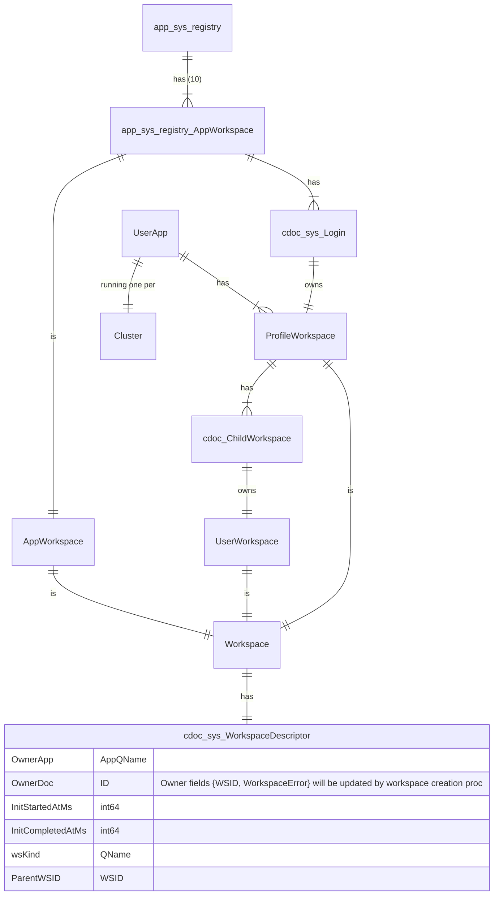
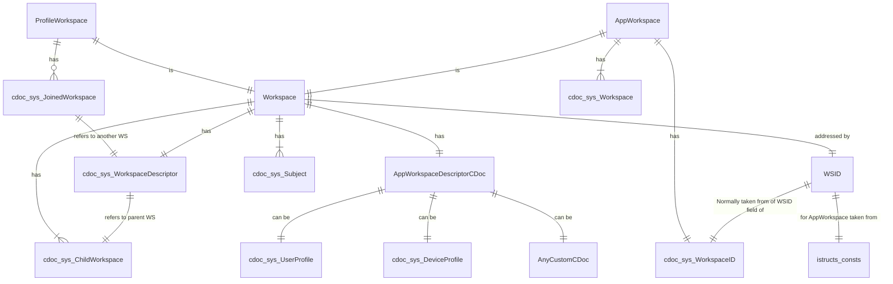

### Concepts

- [Principles](#principles)
- [Workspace Kinds](#workspace-kinds)
- [Ownership](#ownership)
- [Workspace-related Tables](#workspace-related-tables)
- [Invites](invites.md)
- [Child Workspaces](child-workspaces.md)

### Detailed design

- [Create Workspace v2](create-workspace-v2.md)
- [Deactivate Workspace](deactivate-workspace.md)

### Principles

- Workspace can be App Workspace, ProfileWorkspace or UserWorkspace
- ProfileWorkspace keeps Subject data, including list of UserWorkspace-s
  - "sys.UserProfile", "sys.DeviceProfile"
- UserWorkspace: "air.Restaurant" etc.
- Workspace has OwningDocument
- OwningDocument: a document whose fields {WSID, wsError} will be updated when workspace is ready
- Currently, OwningDocument kinds: CDoc[Login], CDoc[UserWorkspace]
- // TODO: Clearing the owner.error causes the workspace to be regenerated
- OwningDocument.error must NOT be published to CUD function (only System can update)

### Workspace Kinds

| English     | Russian     |
| ----------- | ----------- |
| Workspace| Рабочая область       |
| AppWorkspace   |Рабочая область приложения|
| ProfileWorkspace   | Профиль        |
| UserWorkspace   |Пользовательская рабочая область|

### Owninig Document

> "Doc from App owns Workspace" means that Workspace.Docs[sys.WorkspaceDescriptor].Owner = Doc.ID AND Workspace.Docs[sys.WorkspaceDescriptor].App = Record.App

## Workspace-related Tables

## See Also
- [Invites](./invites.md)
