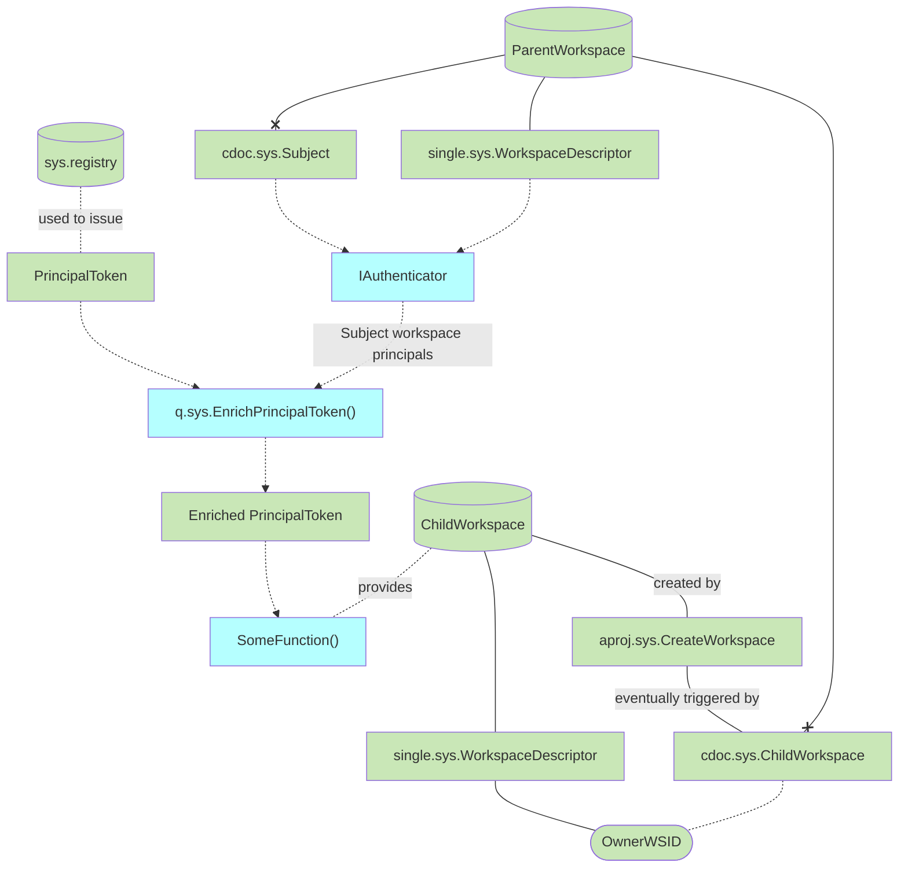

# Motivation

- Air: [Reseller Portal: Invite unTill Payments Users](https://dev.untill.com/projects/#!625718)
- launchpad: [Child Workspaces](https://dev.heeus.io/launchpad/#!25679)

# Concepts

## c.sys.EnrichPrincipalToken()

- AuthZ: role.sys.Subject
- Params
    - PrincipalToken
- Returns
    - PrincipalToken enriched with subject workspace principals

## Unclear
- Implicit roles like Owner?
