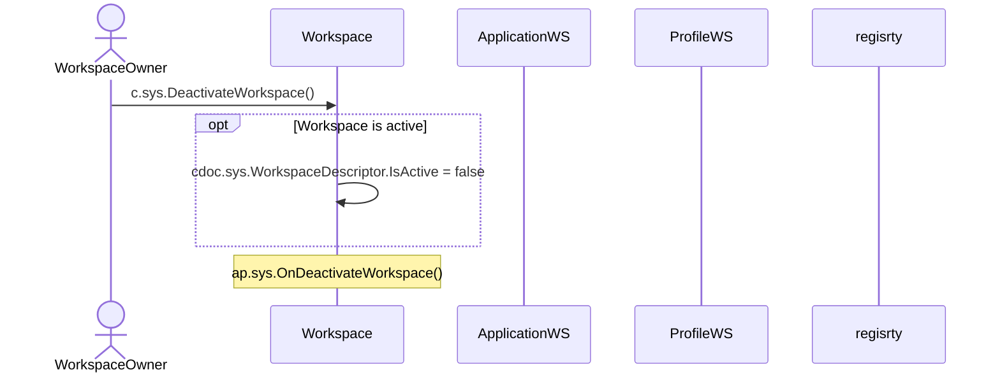
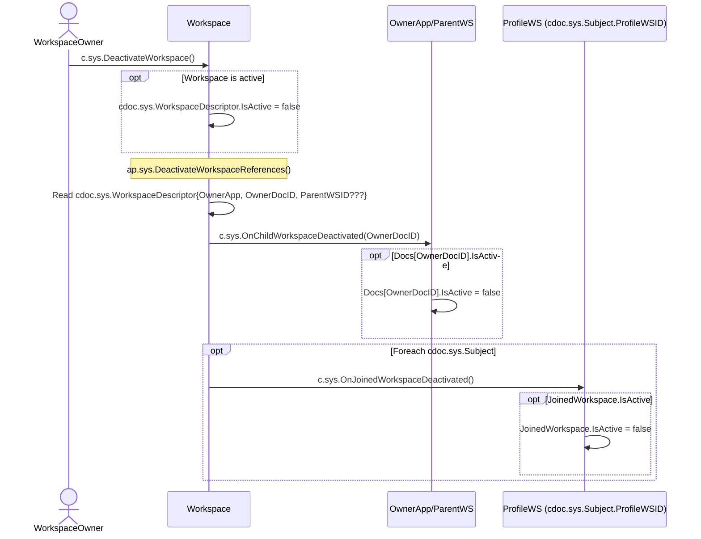

# Deactivate Workspace

## Motivation

- [Deactivate Workspace](https://github.com/voedger/voedger/issues/53)

## Principles

- Workspace with WorkspaceDescriptor.IsActive accepts only System token
- Workspace is (consistently) inactive if:
  - Workspace/WorkspaceDescriptor.IsActive == false
  - There is no active JoinedWorkspace which refers to the Workspace
    - Subject's are still active
  - AppWorkspace/WorkspaceID[Workspace].IsActive == true

## c.sys.DeactivateWorkspace()

- AuthZ: role.sys.WorkspaceOwner ???

## c.sys.DeactivateWorkspace()

- AuthNZ: System

