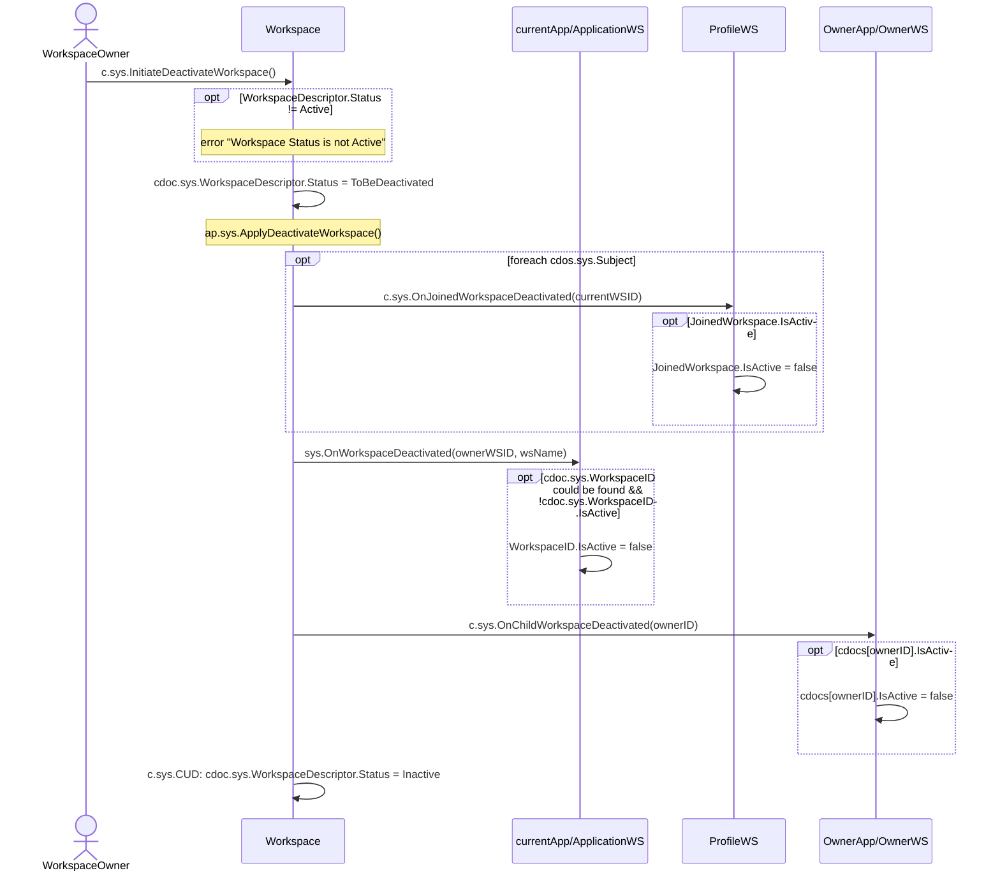

# Deactivate Workspace

## Motivation

- [Deactivate Workspace](https://github.com/voedger/voedger/issues/53)

## Principles

- Workspace with WorkspaceDescriptor.Status != Active accepts only System token. 403 forbidden otherwise
- Workspace is (consistently) inactive if:
  - Workspace/WorkspaceDescriptor.Status == Inactive
  - There is no any active JoinedWorkspace record which refers to the Workspace
  - Note that Workspace.Subject records are still active
  - AppWorkspace/WorkspaceID[Workspace].IsActive == false
- The following case is possible: `cdoc.sys.WorkspaceID.IsActive == true` but it is impossible to work there because `cdoc.sys.WorkspaceDescriptor.Status` != Active already. Consistency is gauranteed within a single partition only, here there are 2 different partitions
- Deactivating a previously created workspaces is possible but nothing will be made on `c.sys.OnJoinedWorkspaceDeactivated` beacuse:
  - there was no `sp.sys.WorkspaceIDIdx`
  - there was no field `view.sys.WorkspaceIDIdx.InvitingWorkspaceWSID`

## c.sys.InitiateDeactivateWorkspace()

- AuthZ: role.sys.WorkspaceOwner
- Params: none
- `cdoc.sys.WorkspaceID` existence in appWS is checked by `view.sys.WorkspaceIDIdx` but there was no this view before. So need to check the existence of the link to `cdoc.sys.WorkspaceID` before checking `cdoc.sys.WorkspaceID.IsActive`

