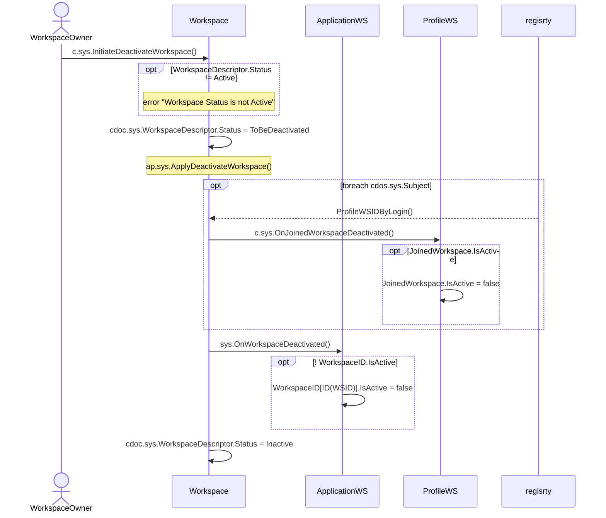

# Deactivate Workspace

## Motivation

- [Deactivate Workspace](https://github.com/voedger/voedger/issues/53)

## Principles

- Workspace with WorkspaceDescriptor.Status != Active accepts only System token
- Workspace is (consistently) inactive if:
  - Workspace/WorkspaceDescriptor.Status == Inactive
  - There is no any active JoinedWorkspace record which refers to the Workspace
  - Note that Workspace.Subject records are still active
  - AppWorkspace/WorkspaceID[Workspace].IsActive == false

## c.sys.InitiateDeactivateWorkspace()

???: Add ProfileWSD to Subject?

- AuthZ: role.sys.WorkspaceOwner ???
- Params: none

## c.sys.DeactivateWorkspace()

- AuthNZ: System

