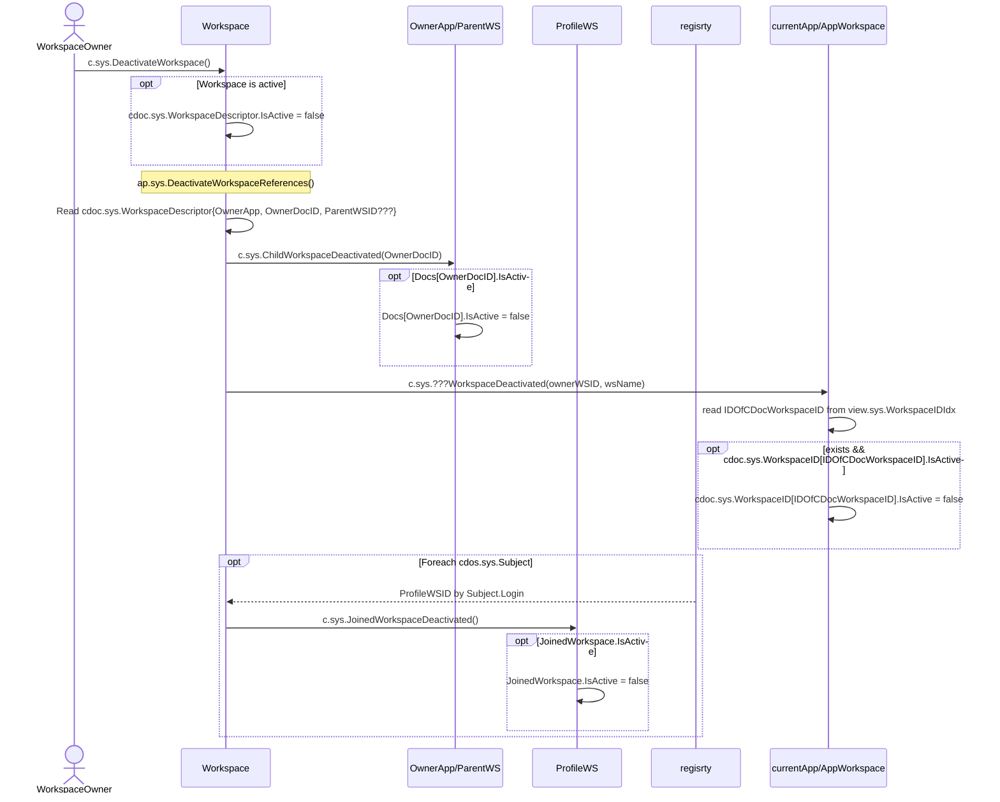

# Deactivate Workspace

## Motivation

- [Deactivate Workspace](https://github.com/voedger/voedger/issues/53)

## Principles

- If Workspace is not active it accepts only System??? token

## c.sys.DeactivateWorkspace()

- AuthZ: role.sys.WorkspaceOwner ???

