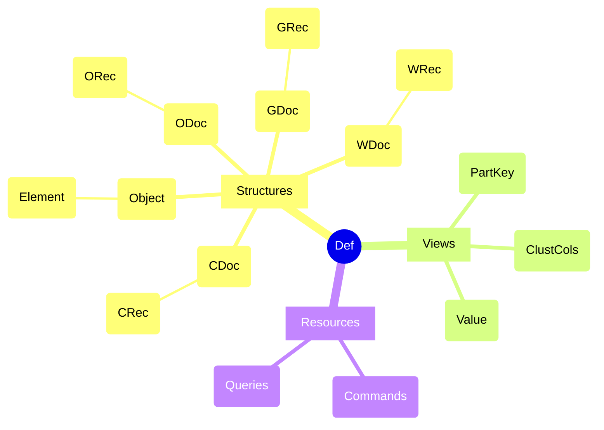
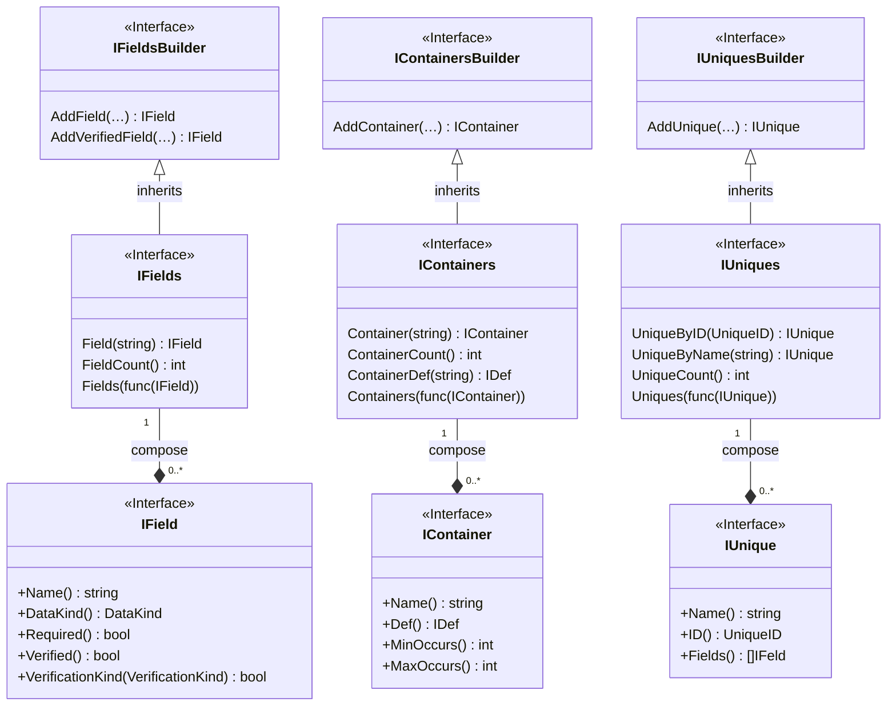
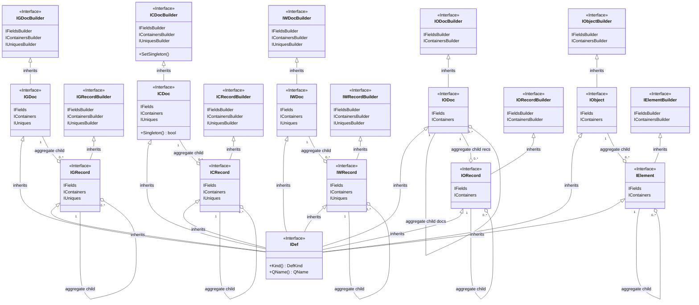
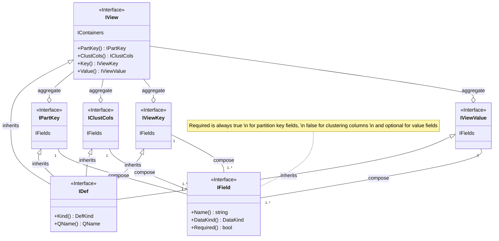

# Application Definition

[](https://codecov.io/gh/voedger/voedger/appdef)

## Definitions inheritance

### Overview



### Fields, Containers, Uniques



### Structures



### Views



## Restrictions

### Names

- Only letters (from `A` to `Z` and from `a` to `z`), digits (from `0` to `9`) and underscore symbol (`_`) are used.
- First symbol must be letter or underscore.
- Maximum length of name is 255.

Valid names examples:

```text
  Foo
  bar
  FooBar
  foo_bar
  f007
  _f00_bar
```

Invalid names examples:

```text
  Fo-o
  7bar
```

### Fields

- Maximum fields per definition is 65536.

### Containers

- Maximum containers per definition is 65536.

### Uniques

- Maximum fields per unique is 256
- Maximum uniques per definition is 100.
