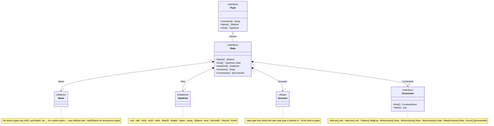

# Application Definition

## Types

### Types inheritance


### Types iterators


### Data types



### Structures

Structured (documents, records, objects) are those structural types that have fields and can contain containers with other structural types.

The inheritance and composing diagrams given below are expanded general diagrams of the types above.

### Structures inheritance


### Structures composing


### Fields, Containers, Uniques


### Views


### Extensions


*Rem*: In the above diagram the Param and Result of the function are `IType`, in future versions it will be changed to an array of `[]IParam` and renamed to plural (`Params`, `Results`).

### Roles and ACL


### Filters

### Tags

### Rates and Limits

### Workspaces

## Restrictions

### Names

- Only letters (from `A` to `Z` and from `a` to `z`), digits (from `0` to `9`) and underscore symbol (`_`) are used.
- First symbol must be letter or underscore.
- Maximum length of name is 255.
- Names are case sensitive.
- System level names can contains buck char (`$`).

Valid names examples:

```text
  Foo
  bar
  FooBar
  foo_bar
  f007
  _f00_bar
```

Invalid names examples:

```text
  Fo-o
  7bar
```

### Fields

- Maximum fields per structure is 65536.
- Maximum string and bytes field length is 65535.

### Containers

- Maximum containers per structure is 65536.

### Uniques

- Maximum fields per unique is 256
- Maximum uniques per structure is 100.

### Singletons

- Maximum singletons per application is 512.
