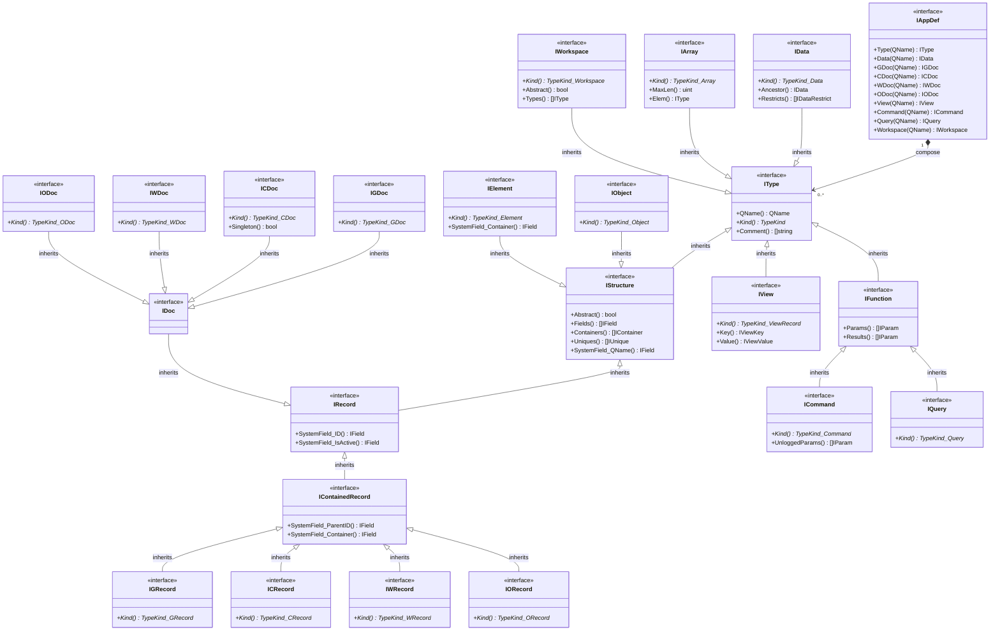
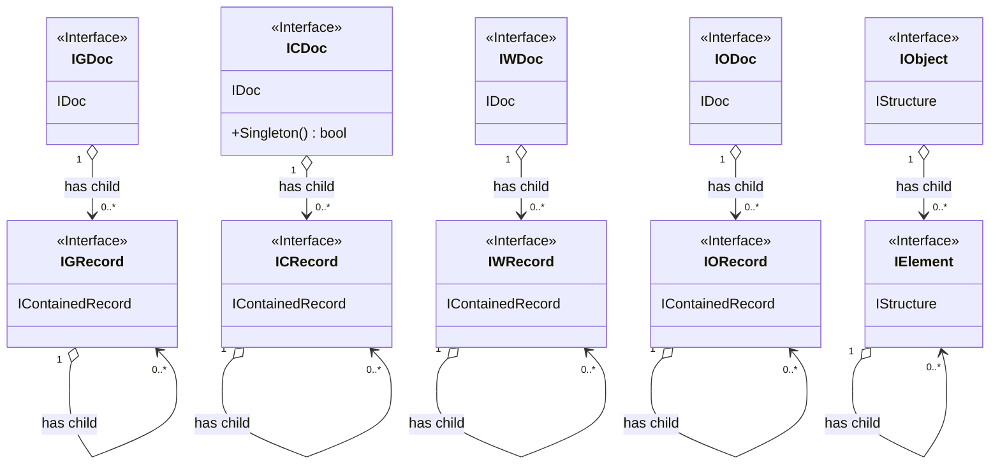
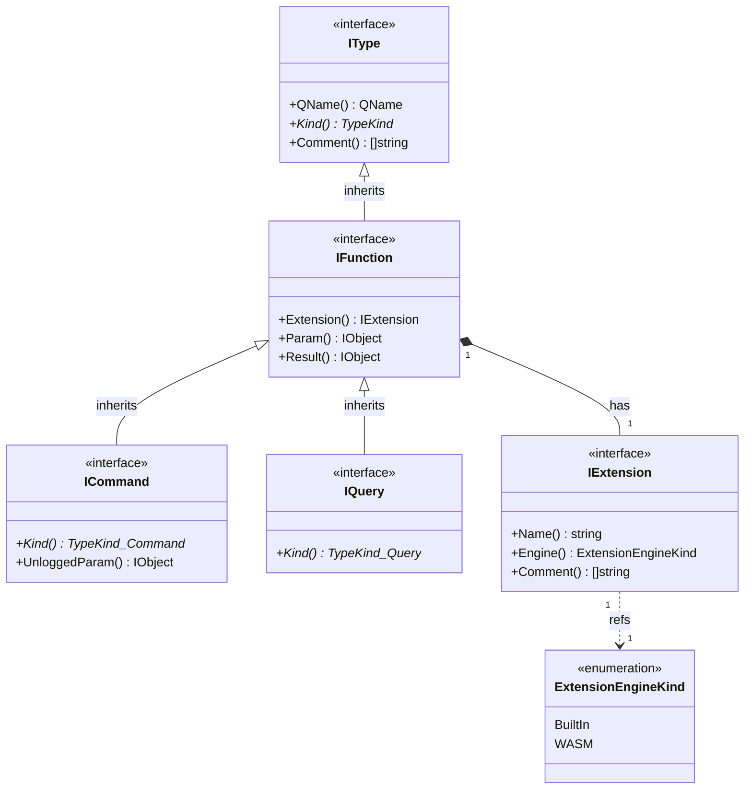

# Application Definition

[](https://codecov.io/gh/voedger/voedger/appdef)

## Types

### Types inheritance



### Types composing

```mermaid
classDiagram


    class IData {
        <<interface>>
        +Kind()* TypeKind_Data
        +Ancestor() IData
        +Restricts() []IDataRestrict
    }
    IData "1" ..> "0..1" IData : ancestor ref

    class IArray {
        <<interface>>
        +Kind()* TypeKind_Array
        +MaxLen() uint
        +Elem() IType
    }

    class IGDoc {
        <<interface>>
        +Kind()* TypeKind_GDoc
        +Abstract() bool
        +Fields() []IField
        +Containers() []IContainer
        +Uniques() []IUnique
    }
    IGDoc "1" o..> "0..*" IGRecord : contains

    class ICDoc {
        <<interface>>
        +Kind()* TypeKind_CDoc
        +Abstract() bool
        +Fields() []IField
        +Containers() []IContainer
        +Uniques() []IUnique
        +Singleton() bool
    }
    ICDoc "1" o..> "0..*" ICRecord : contains

    class IWDoc {
        <<interface>>
        +Kind()* TypeKind_WDoc
        +Abstract() bool
        +Fields() []IField
        +Containers() []IContainer
        +Uniques() []IUnique
    }
    IWDoc "1" o..> "0..*" IWRecord : contains
                    
    class IODoc {
        <<interface>>
        +Kind()* TypeKind_ODoc
        +Abstract() bool
        +Fields() []IField
        +Containers() []IContainer
    }
    IODoc "1" o..> "0..*" IODoc : contains
    IODoc "1" o..> "0..*" IORecord : contains

    class IGRecord {
        <<interface>>
        +Kind()* TypeKind_GRecord
        +Abstract() bool
        +Fields() []IField
        +Containers() []IContainer
        +Uniques() []IUnique
    }
    IGRecord "1" o..> "0..*" IGRecord : contains

    class ICRecord {
        <<interface>>
        +Kind()* TypeKind_CRecord
        +Abstract() bool
        +Fields() []IField
        +Containers() []IContainer
        +Uniques() []IUnique
    }
    ICRecord "1" o..> "0..*" ICRecord : contains

    class IWRecord {
        <<interface>>
        +Kind()* TypeKind_WRecord
        +Abstract() bool
        +Fields() []IField
        +Containers() []IContainer
        +Uniques() []IUnique
    }
    IWRecord "1" o..> "0..*" IWRecord : contains

    class IORecord {
        <<interface>>
        +Kind()* TypeKind_ORecord
        +Abstract() bool
        +Fields() []IField
        +Containers() []IContainer
    }
    IORecord "1" o..> "0..*" IORecord : contains

    class IObject {
        <<interface>>
        +Kind()* TypeKind_Object
        +Abstract() bool
        +Fields() []IField
        +Containers() []IContainer
    }
    IObject "1" o..> "0..*" IElement : contains

    class IElement {
        <<interface>>
        +Kind()* TypeKind_Element
        +Abstract() bool
        +Fields() []IField
        +Containers() []IContainer
    }
    IElement "1" o..> "0..*" IElement : contains

    class IView {
        <<interface>>
        +Kind()* TypeKind_ViewRecord
        +Key() IViewKey
        +Value() IViewValue
    }
    IView "1" *--> "1" IViewKey : compose
    IView "1" *--> "1" IViewValue : compose
            
    class IViewKey {
        <<interface>>
        +Fields() []IField
        +PartKey() IViewPartKey
        +ClustCols() IViewClustCols
    }
    IViewKey "1" *--> "1" IViewPartKey : compose
    IViewKey "1" *--> "1" IViewClustCols : compose

    class IViewPartKey {
        <<interface>>
        +Fields() []IField
    }

    class IViewClustCols {
        <<interface>>
        +Fields() []IField
    }

    class IViewValue {
        <<interface>>
        +Fields() []IField
    }

    class ICommand {
        <<interface>>
        +Kind()* TypeKind_Command
        +Params() []IParam
        +UnloggedParams() []IParam
        +Results() []IParam
    }

    class IQuery {
        <<interface>>
        +Kind()* TypeKind_Query
        +Params() []IParam
        +Results() []IParam
    }

    class IWorkspace {
        <<interface>>
        +Kind()* TypeKind_Workspace
        +Abstract() bool
        +Types() []IType
    }

```



### Structures

Structured (documents, records, objects, elements) are those structural types that have fields and can contain containers with other structural types.

The inheritance and composing diagrams given below are expanded general diagrams of the types above.

### Structures inheritance


### Structures composing



### Fields, Containers, Uniques


### Views


### Functions, commands and queries



*Rem*: In the above diagram the Param and Result of the function are `IObject`, in future versions it will be changed to an array of `[]IParam` and renamed to plural (`Params`, `Results`).

## Restrictions

### Names

- Only letters (from `A` to `Z` and from `a` to `z`), digits (from `0` to `9`) and underscore symbol (`_`) are used.
- First symbol must be letter or underscore.
- Maximum length of name is 255.

Valid names examples:

```text
  Foo
  bar
  FooBar
  foo_bar
  f007
  _f00_bar
```

Invalid names examples:

```text
  Fo-o
  7bar
```

### Fields

- Maximum fields per structure is 65536.
- Maximum string field length is 1024.

### Containers

- Maximum containers per structure is 65536.

### Uniques

- Maximum fields per unique is 256
- Maximum uniques per structure is 100.
