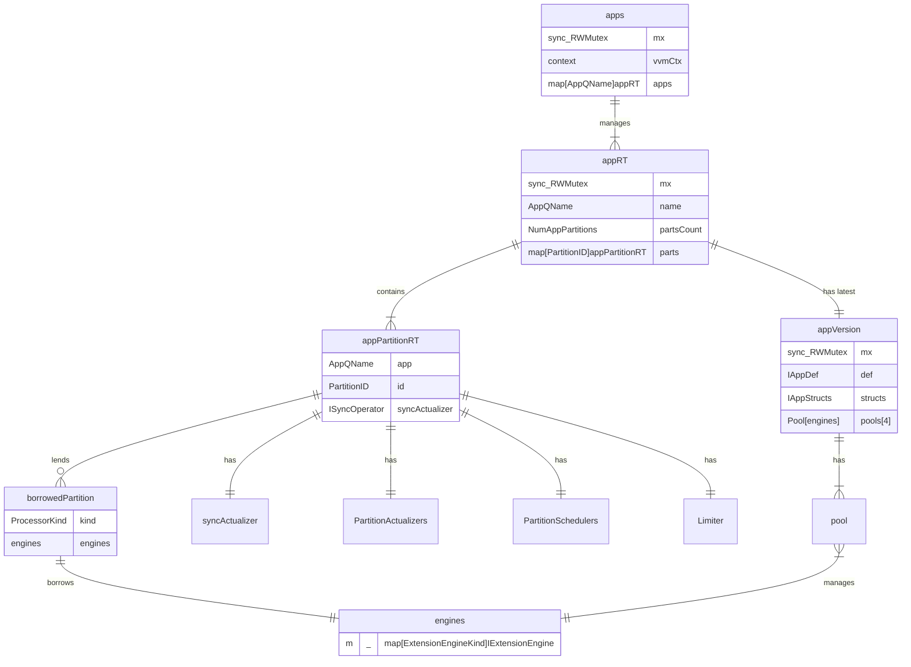

# Application Partitions

Application partitions are a way to split up the application into smaller storage and processing units. This is useful for large applications that need to be split up into smaller parts to make it easier to deploy and update.

## Components

