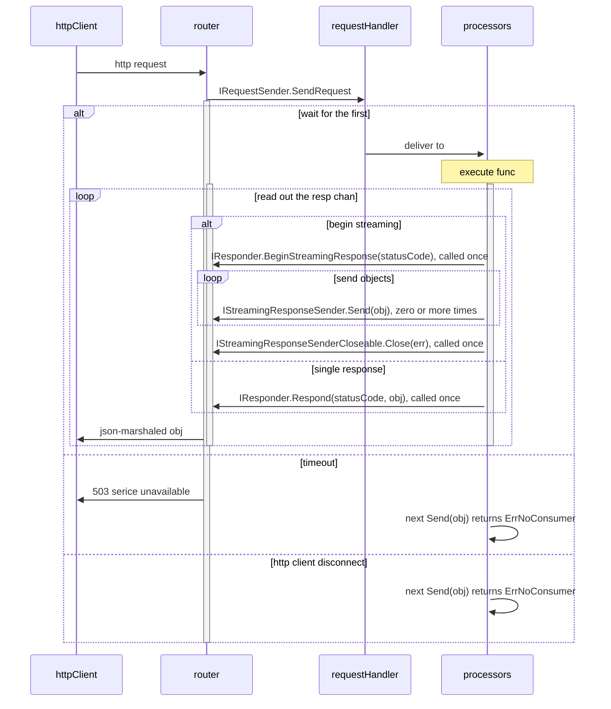
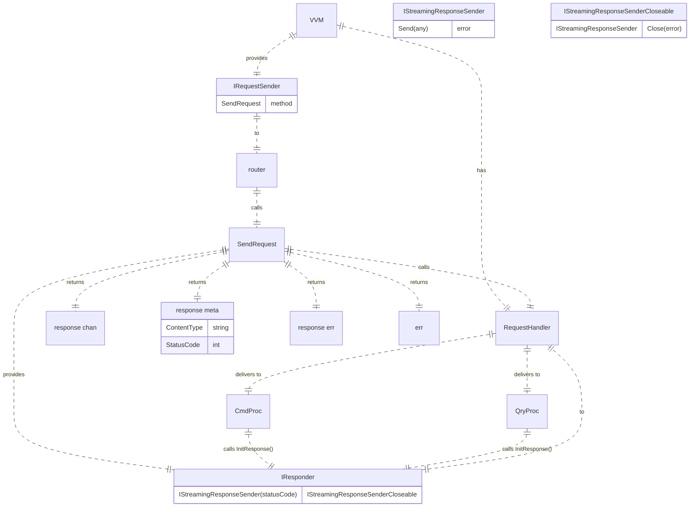

# Overview

## Streaming Response

```mermaid
sequenceDiagram
  participant httpClient
  participant router
  participant requestHandler
  participant processors
  httpClient ->> router: http request
  router ->> requestHandler: IRequestSender.SendRequest
  activate router
    alt wait for the first
      requestHandler->>+processors: deliver to
      note over processors: execute func
      activate processors
        activate router
          loop read out the resp chan
            alt begin streaming
              processors ->> router: IResponder.BeginStreamingResponse(statusCode), called once
              loop send objects
                processors ->> router: IStreamingResponseSender.Send(obj), zero or more times
              end
              processors ->> router: IStreamingResponseSenderCloseable.Close(err), called once
            else single response
              processors ->> router: IResponder.Respond(statusCode, obj), called once
            end
            router ->> httpClient: json-marshaled obj
          end

        deactivate router
      deactivate processors
    else timeout
      router ->> httpClient: 503 serice unavailable
      processors ->> processors: next Send(obj) returns ErrNoConsumer
    else http client disconnect
      processors ->> processors: next Send(obj) returns ErrNoConsumer
    end
  deactivate router
```

## Sending Request to the Bus

```mermaid
erDiagram
  VVM ||..|| IRequestSender: provides
  VVM ||..|| RequestHandler: has
  IRequestSender ||..|| router: "to"
  router ||..|| SendRequest: calls
  SendRequest ||..|| "response chan": returns
  SendRequest ||..|| "response meta": returns
  SendRequest ||..|| "response err": returns
  SendRequest ||..|| "err": returns
  SendRequest ||..|| RequestHandler: calls
  SendRequest ||..|| IResponder: provides
  IResponder ||..|| RequestHandler: "to"
  RequestHandler ||..|| CmdProc: "delivers to"
  RequestHandler ||..|| QryProc: "delivers to"
  CmdProc ||..|| IResponder: "calls InitResponse()"
  QryProc ||..|| IResponder: "calls InitResponse()"
  "response meta" {
    ContentType string
    StatusCode int
  }
  IRequestSender {
    SendRequest method
  }
  IResponder {
    IStreamingResponseSender(statusCode) IStreamingResponseSenderCloseable
  }

  IStreamingResponseSender {
    Send(any) error
  }

  IStreamingResponseSenderCloseable {
    IStreamingResponseSender
    Close(error)
  }
```
