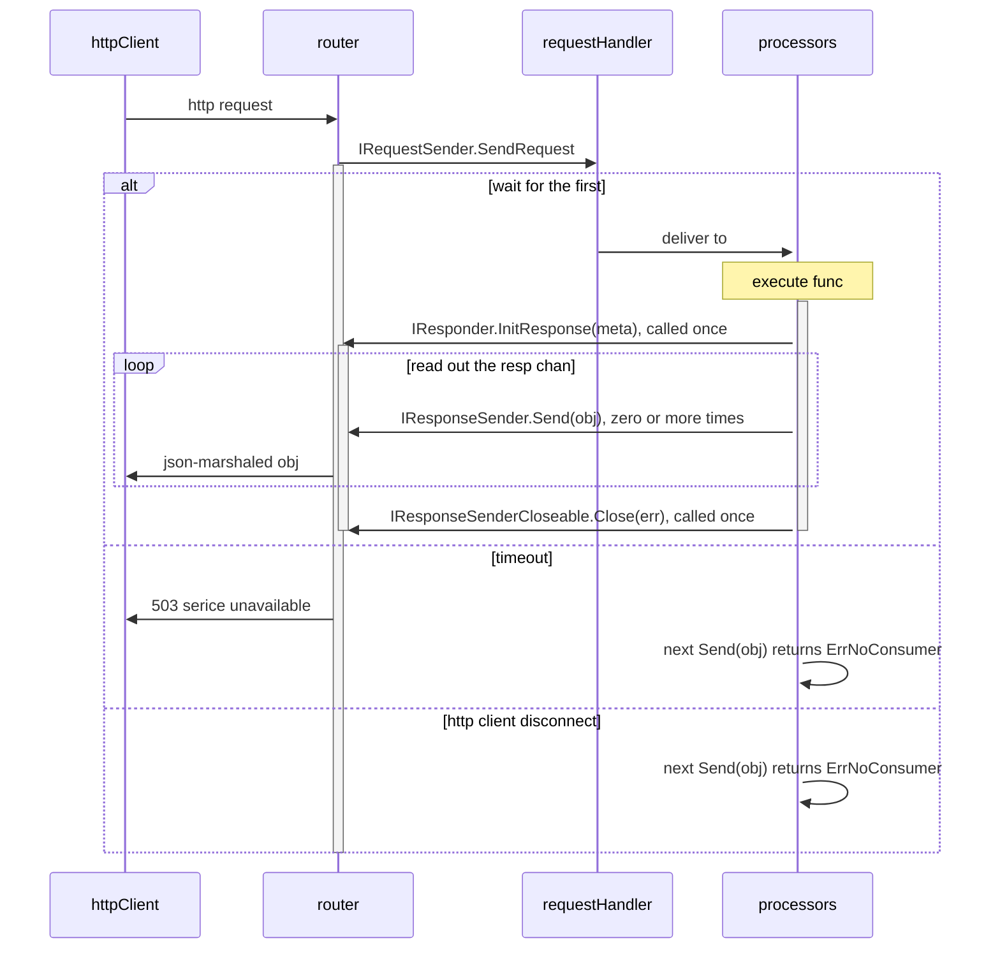
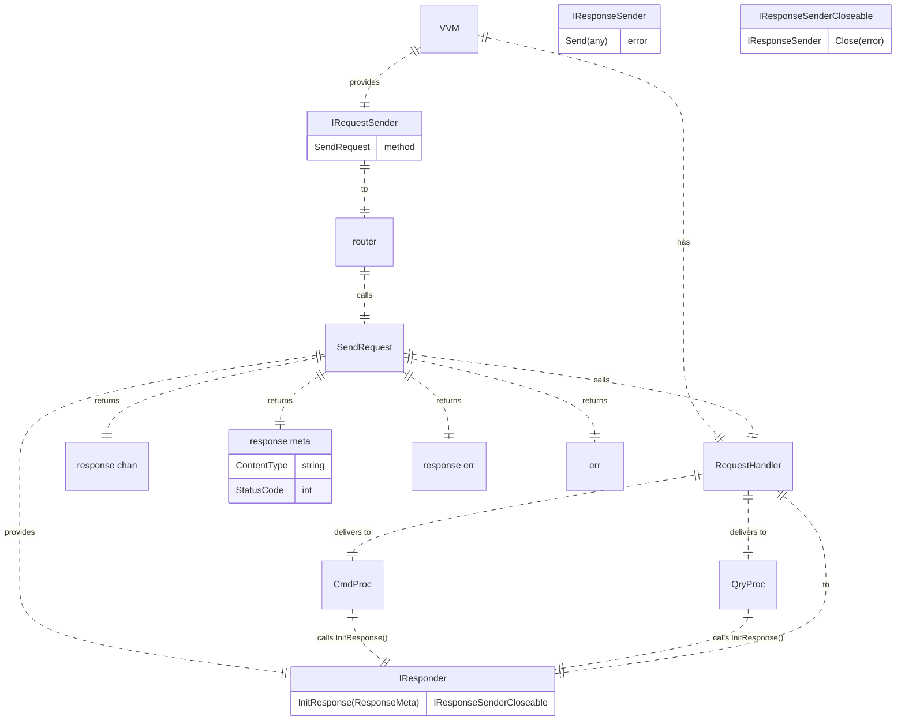

```mermaid
sequenceDiagram
	participant httpClient
	participant router
	participant requestHandler
	participant processors
	httpClient ->> router: http request
	router ->> requestHandler: IRequestSender.SendRequest
	activate router
		alt wait for the first
			requestHandler->>+processors: deliver to
			note over processors: execute func
			activate processors
				processors ->> router: IResponder.InitResponse(meta), called once
				activate router
					loop read out the resp chan
						processors ->> router: IResponseSender.Send(obj), zero or more times
						router ->> httpClient: json-marshaled obj
					end
						processors ->> router: IResponseSenderCloseable.Close(err), called once
				deactivate router
			deactivate processors
		else timeout
			router ->> httpClient: 503 serice unavailable
			processors ->> processors: next Send(obj) returns ErrNoConsumer
		else http client disconnect
			processors ->> processors: next Send(obj) returns ErrNoConsumer
		end
	deactivate router
```

```mermaid
erDiagram
	VVM ||..|| IRequestSender: provides
	VVM ||..|| RequestHandler: has
	IRequestSender ||..|| router: "to"
	router ||..|| SendRequest: calls
	SendRequest ||..|| "response chan": returns
	SendRequest ||..|| "response meta": returns
	SendRequest ||..|| "response err": returns
	SendRequest ||..|| "err": returns
	SendRequest ||..|| RequestHandler: calls
	SendRequest ||..|| IResponder: provides
	IResponder ||..|| RequestHandler: "to"
	RequestHandler ||..|| CmdProc: "delivers to"
	RequestHandler ||..|| QryProc: "delivers to"
	CmdProc ||..|| IResponder: "calls InitResponse()"
	QryProc ||..|| IResponder: "calls InitResponse()"
	"response meta" {
		ContentType string
		StatusCode int
	}
	IRequestSender {
		SendRequest method
	}
	IResponder {
		InitResponse(ResponseMeta) IResponseSenderCloseable
	}

	IResponseSender {
		Send(any) error
	}

	IResponseSenderCloseable {
		IResponseSender
		Close(error)
	}
```
