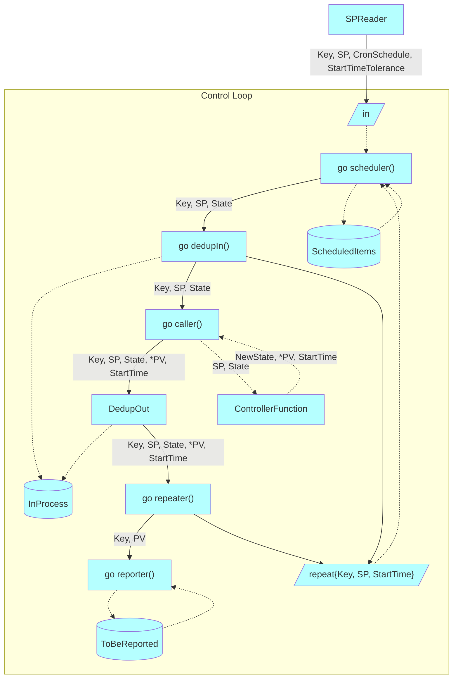

# Control Loops

Multiple set-points control loop

## Motivation

- heeus: [edger: better control loop](https://dev.heeus.io/launchpad/#!26742)
  - Control loop which can be used in edger, HTTPController, AppPartitionController, ctool

## Concepts

> A **control loop** is the fundamental building block of control systems in general industrial control systems and industrial control systems in particular. It consists of the process sensor, the **controller function**, and the **final control element** (FCE) which controls the process necessary to automatically adjust the value of a measured **process variable** (PV) to equal the value of a **desired set-point (SP)**.
>
> https://en.wikipedia.org/wiki/Control_loop

- control loop: [Контур управления](https://studfile.net/preview/4200137/page:7/)
- set-point (SP): [Опорное значение](https://studfile.net/preview/4200137/page:7/)
- process variable (PV): [Текущее значение](https://studfile.net/preview/4200137/page:7/)

## Principles

- Each SP kind has its own ControlLoop
  - E.g. if Edge Node has to process set-points for docker stacks and commands, then `DockerStack_ControlLoop`, `Command_ControlLoop` will be created

## Technical Design

### Potential deadlock in the scheduler() function

- Deadlock is possible since scheduler() writes to the dedupIn() input channel and dedupIn() writes to the scheduler() input channel
- To avoid deadlock scheduler() uses [non-blocking `send`](https://gobyexample.com/non-blocking-channel-operations) to dedupIn() input channel
- `repeat` channel will be eventually read since "fairness" guarantee:

> If one or more of the communications can proceed, a single one that can proceed is chosen via a uniform pseudo-random selection.
> https://go.dev/ref/spec#Select_statements