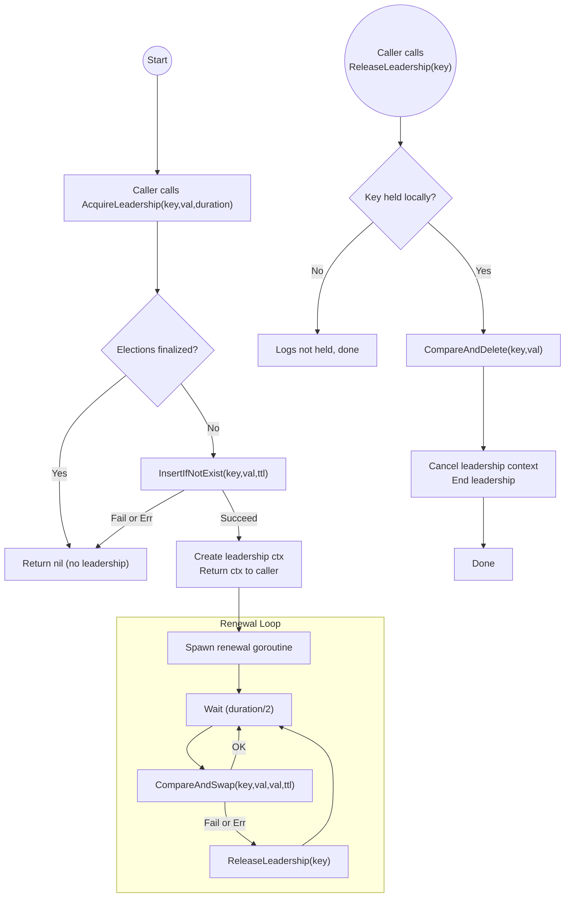

# Elections Package



The **elections** package provides a simple, pluggable **leader election** mechanism using:

- **`ITTLStorage`**: A time-to-live (TTL) based storage interface for storing and refreshing leadership claims.
- **`IElections`**: The core interface offering leader acquisition and release functionality.

This design allows clean injection of custom storage implementations (e.g., in-memory, Redis, etc.) and custom time abstractions (for tests or production environments).

## Table of Contents

- [Installation](#installation)
- [Interfaces](#interfaces)
    - [ITTLStorage](#ittlstorage)
    - [IElections](#ielections)
- [Usage](#usage)
    - [Providing the Elections Implementation](#providing-the-elections-implementation)
    - [Acquiring and Releasing Leadership](#acquiring-and-releasing-leadership)
    - [Performing Cleanup](#performing-cleanup)

---

## Installation

```bash
go get github.com/voedger/voedger/pkg/elections
```

## Interfaces

### ITTLStorage

```go
type ITTLStorage[K comparable, V any] interface {
    InsertIfNotExist(key K, val V, duration time.Duration) (bool, error)
    CompareAndSwap(key K, oldVal V, newVal V, duration time.Duration) (bool, error)
    CompareAndDelete(key K, val V) (bool, error)
}
```

- InsertIfNotExist: tries to insert (key, val) with a TTL only if key does not exist.
- CompareAndSwap: checks if the current value for `key` is `oldVal`. If it matches, sets it to `newVal` and updates the TTL to `ttl`.
- CompareAndDelete: compares the current value for `key` with `val` and if they match, deletes the key, returning (true, nil). Otherwise, (false, nil).

### IElections

```go
type IElections[K comparable, V any] interface {
    AcquireLeadership(key K, val V, duration time.Duration) context.Context
    ReleaseLeadership(key K)
}
```

- AcquireLeadership: tries to become leader for key with value val. If successful, returns a live context.Context that stays active until leadership is lost or explicitly released. If unsuccessful (storage insert fails or the system has been cleaned up), it immediately returns nil.
- ReleaseLeadership: removes leadership for key, stops the background renewal goroutine, and calls CompareAndDelete on the underlying storage.

## Usage

### Providing the Elections Implementation

```go
// Provide returns an IElections[K, V] interface plus a cleanup function.
func Provide[K comparable, V any](storage ITTLStorage[K, V], clock ITime) (IElections[K, V], func()) {
    // ...
}
```

- storage is your implementation of ITTLStorage.
- clock is your ITime implementation.
- Returns
  - 1. An IElections[K, V] object for acquiring and releasing leadership.
  - 2. A func() that cleans up all background routines (see Performing Cleanup).

### Acquiring and Releasing Leadership

```go
elector, cleanup := elections.Provide(myStorage, myClock)

// Acquire leadership
ctx := elector.AcquireLeadership("myKey", "myValue", 5*time.Second)
select {
case <-ctx.Done():
    fmt.Println("Failed to acquire leadership or it ended unexpectedly.")
default:
    fmt.Println("Successfully acquired leadership! (ctx active)")
}

// Perform your leader tasks...
// If you want to stop being leader:
elector.ReleaseLeadership("myKey")
```

1.	AcquireLeadership("myKey", "myValue", 5 * time.Second) tries to insert "myKey" into storage with the value "myValue".
2. If it succeeds, a renewal goroutine starts in the background, periodically re-affirming leadership via CompareAndSwap.
3.	The returned ctx remains active while leadership is held. Once leadership is lost (or you call ReleaseLeadership), ctx.Done() becomes triggered.
4.	ReleaseLeadership("myKey") manually releases leadership for that key.

### Performing Cleanup

```go
// At the end of your application's lifecycle or when you no longer need elections:
cleanup()
```

- The second return value from Provide(...), which we are calling cleanup(), stops all renewal goroutines and disallows any future calls to AcquireLeadership.
- Any existing leadership contexts will be canceled.