# Performance Testing Results

## Overview

This document presents the results of performance testing conducted on the GoLang package `github.com/voedger/voedger/pkg/goutils/set`.

Scenarios were tested for the `Set`, `Map`, and `Slice` implementations. The target of testing is to compare the speed of scenarios when using different implementation for set of uint8-numbers:

- `Set` - `set.Set[uint8]` from this package implementation
- `Map` - `map[uint8]struct{}` implementation
- `Slice` - `[]uint8` implementation

### System Information

- **Operating System:** Windows
- **Architecture:** amd64
- **CPU:** Intel(R) Core(TM) i5-3570 CPU @ 3.40GHz

## Benchmark Results

### Benchmark_BasicUsage

Basic usage scenarios include adding 256 elements into set, retrieving them as sorted array and checking.

#### Benchmark_BasicUsage/Set

- **Number of Iterations:** 6,902
- **Time per Operation (ns/op):** 179,405 ns/op
- **Bytes Allocated per Operation (B/op):** 2,856 B/op
- **Memory Allocations per Operation (allocs/op):** 10 allocs/op

#### Benchmark_BasicUsage/Map

- **Number of Iterations:** 4,820
- **Time per Operation (ns/op):** 215,296 ns/op
- **Bytes Allocated per Operation (B/op):** 6,570 B/op
- **Memory Allocations per Operation (allocs/op):** 33 allocs/op

#### Benchmark_BasicUsage/Slice

- **Number of Iterations:** 4,959
- **Time per Operation (ns/op):** 202,429 ns/op
- **Bytes Allocated per Operation (B/op):** 2,608 B/op
- **Memory Allocations per Operation (allocs/op):** 5 allocs/op

#### Benchmark_BasicUsage results

```mermaid
xychart-beta
  title "Performance Testing Results: Basic usage"
  x-axis [Set, Map, Slice]
  y-axis "ns/op" 0 --> 250000

  bar "Benchmark_BasicUsage" [179405, 215296, 202429]
  bar "Benchmark_BasicUsage" [179405, 215296, 202429]
```

### Benchmark_WithClear

With Clear scenarios include adding 256 elements into set, removing odd values, retrieving them as sorted array and checking.

#### Benchmark_WithClear/Set

- **Number of Iterations:** 13,220
- **Time per Operation (ns/op):** 89,835 ns/op
- **Bytes Allocated per Operation (B/op):** 2,600 B/op
- **Memory Allocations per Operation (allocs/op):** 9 allocs/op

#### Benchmark_WithClear/Map

- **Number of Iterations:** 8,185
- **Time per Operation (ns/op):** 128,832 ns/op
- **Bytes Allocated per Operation (B/op):** 6,444 B/op
- **Memory Allocations per Operation (allocs/op):** 34 allocs/op

#### Benchmark_WithClear/Slice

- **Number of Iterations:** 9,315
- **Time per Operation (ns/op):** 120,536 ns/op
- **Bytes Allocated per Operation (B/op):** 2,608 B/op
- **Memory Allocations per Operation (allocs/op):** 5 allocs/op

#### Benchmark_WithClear results

```mermaid
xychart-beta
  title "Performance Testing Results: With clear"
  x-axis [Set, Map, Slice]
  y-axis "ns/op" 0 --> 150000

  bar "Benchmark_BasicUsageWithClear" [89835, 128832, 120536]
  bar "Benchmark_BasicUsageWithClear" [89835, 128832, 120536]
```

## Summary

All benchmarks passed successfully, and the package `github.com/voedger/voedger/pkg/goutils/set` was tested in 5.475 seconds.

The best performance was achieved with the `Set` implementation, followed by the `Slice` implementation. The `Map` implementation was the slowest. The results could be more impressive if the preparation source data and the code testing results are removed from a fragment of performance testing.But in general, test results show that the implementation of `set` from the `github.com/voedger/voedger/pkg/goutils/set` package has the best performance compared to `Map` and `Slice` implementations.
