# Performance Testing Results

## Overview

This document presents the results of performance testing conducted on the GoLang package `github.com/voedger/voedger/pkg/goutils/set`.

Scenarios were tested for the `Set`, `Map`, and `Slice` implementations. The target of testing is to compare the speed of scenarios when using different implementation for set of uint8-numbers:

- `Set` - `set.Set[uint8]` from this package implementation
- `Map` - `map[uint8]struct{}` implementation
- `Slice` - `[]uint8` implementation

### System Information

- **Operating System:** Windows
- **Architecture:** amd64
- **CPU:** Intel(R) Core(TM) i5-3570 CPU @ 3.40GHz

## Benchmark Results

### Benchmark_BasicUsage

Basic usage scenarios include adding 256 elements into set, retrieving them as sorted array and checking.

#### Benchmark_BasicUsage/Set

- **Number of Iterations:** 359,284
- **Time per Operation (ns/op):** 2,883 ns/op
- **Bytes Allocated per Operation (B/op):** 512 B/op
- **Memory Allocations per Operation (allocs/op):** 6 allocs/op

#### Benchmark_BasicUsage/Map

- **Number of Iterations:** 24,834
- **Time per Operation (ns/op):** 51,520 ns/op
- **Bytes Allocated per Operation (B/op):** 4,220 B/op
- **Memory Allocations per Operation (allocs/op):** 30 allocs/op

#### Benchmark_BasicUsage/Slice

- **Number of Iterations:** 32,883
- **Time per Operation (ns/op):** 36,395 ns/op
- **Bytes Allocated per Operation (B/op):** 256 B/op
- **Memory Allocations per Operation (allocs/op):** 5 allocs/op

#### Benchmark_BasicUsage results

```mermaid
xychart-beta
  title "Performance Testing Results: Basic usage"
  x-axis [Set, Map, Slice]
  y-axis "ns/op" 0 --> 60000

  bar "1" [2883, 51520, 36395]
  bar "2" [2883, 51520, 36395]
  bar "3" [2883, 51520, 36395]
```

### Benchmark_WithClear

With Clear scenarios include adding 256 elements into set, removing odd values, retrieving them as sorted array and checking.

#### Benchmark_WithClear/Set

- **Number of Iterations:** 394,605
- **Time per Operation (ns/op):** 3,999 ns/op
- **Bytes Allocated per Operation (B/op):** 256 B/op
- **Memory Allocations per Operation (allocs/op):** 5 allocs/op

#### Benchmark_WithClear/Map

- **Number of Iterations:** 26,335
- **Time per Operation (ns/op):** 49,318 ns/op
- **Bytes Allocated per Operation (B/op):** 4,091 B/op
- **Memory Allocations per Operation (allocs/op):** 340 allocs/op

#### Benchmark_WithClear/Slice

- **Number of Iterations:** 38,739
- **Time per Operation (ns/op):** 28,409 ns/op
- **Bytes Allocated per Operation (B/op):** 256 B/op
- **Memory Allocations per Operation (allocs/op):** 1 allocs/op

#### Benchmark_WithClear results

```mermaid
xychart-beta
  title "Performance Testing Results: With clear"
  x-axis [Set, Map, Slice]
  y-axis "ns/op" 0 --> 60000

  bar "1" [3999, 49318, 28409]
  bar "2" [3999, 49318, 28409]
  bar "3" [3999, 49318, 28409]
```

## Summary

All benchmarks passed successfully, and the package `github.com/voedger/voedger/pkg/goutils/set` was tested in 192.125 seconds.

The best performance was achieved with the `Set` implementation, followed by the `Slice` implementation. The `Map` implementation was the slowest.
