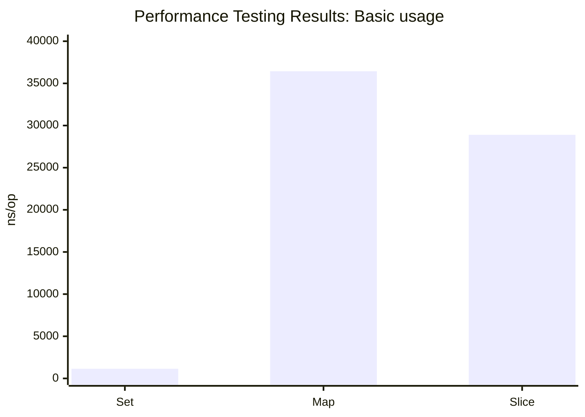
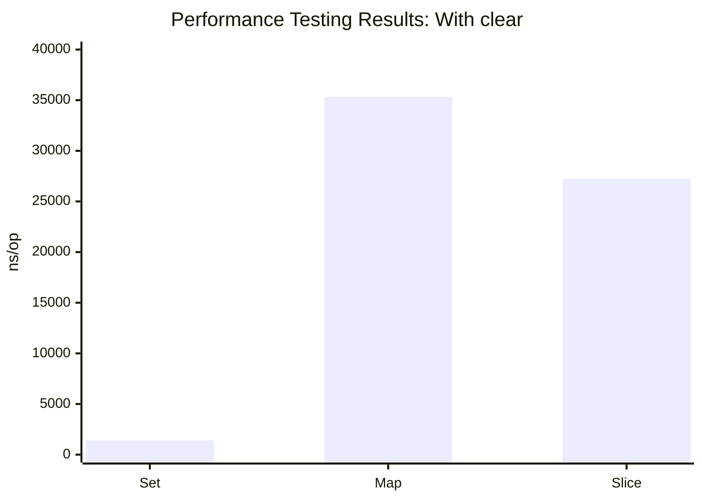

# Performance Testing Results

## Overview

This document presents the results of performance testing conducted on the GoLang package `github.com/voedger/voedger/pkg/goutils/set`.

Scenarios were tested for the `Set`, `Map`, and `Slice` implementations. The target of testing is to compare the speed of scenarios when using different implementation for set of uint8-numbers:

- `Set` - `set.Set[uint8]` from this package implementation
- `Map` - `map[uint8]any` implementation
- `Slice` - `[]uint8` implementation

### System Information

- **Operating System:** Windows
- **Architecture:** amd64
- **CPU:** Intel(R) Core(TM) i5-3570 CPU @ 3.40GHz

## Benchmark Results

### Benchmark_BasicUsage

Basic usage scenarios include adding 256 elements into set and retrieving them as sorted array.

#### Benchmark_BasicUsage/Set

- **Number of Iterations:** 976,988
- **Time per Operation (ns/op):** 1,149 ns/op
- **Bytes Allocated per Operation (B/op):** 504 B/op
- **Memory Allocations per Operation (allocs/op):** 6 allocs/op

#### Benchmark_BasicUsage/Map

- **Number of Iterations:** 38,864
- **Time per Operation (ns/op):** 36,442 ns/op
- **Bytes Allocated per Operation (B/op):** 4,219 B/op
- **Memory Allocations per Operation (allocs/op):** 30 allocs/op

#### Benchmark_BasicUsage/Slice

- **Number of Iterations:** 44,234
- **Time per Operation (ns/op):** 28,899 ns/op
- **Bytes Allocated per Operation (B/op):** 0 B/op
- **Memory Allocations per Operation (allocs/op):** 0 allocs/op

#### Benchmark_BasicUsage results

### Benchmark_WithClear

With Clear scenarios include adding 256 elements into set, removing odd values and retrieving result as sorted array.

#### Benchmark_WithClear/Set

- **Number of Iterations:** 836,334
- **Time per Operation (ns/op):** 1,427 ns/op
- **Bytes Allocated per Operation (B/op):** 248 B/op
- **Memory Allocations per Operation (allocs/op):** 5 allocs/op

#### Benchmark_WithClear/Map

- **Number of Iterations:** 33,382
- **Time per Operation (ns/op):** 35,328 ns/op
- **Bytes Allocated per Operation (B/op):** 4,093 B/op
- **Memory Allocations per Operation (allocs/op):** 30 allocs/op

#### Benchmark_WithClear/Slice

- **Number of Iterations:** 45,151
- **Time per Operation (ns/op):** 27,237 ns/op
- **Bytes Allocated per Operation (B/op):** 0 B/op
- **Memory Allocations per Operation (allocs/op):** 0 allocs/op

#### Benchmark_WithClear results

## Summary

All benchmarks passed successfully, and the package `github.com/voedger/voedger/pkg/goutils/set` was tested in 5.475 seconds.

The best performance was achieved with the `Set` implementation, followed by the `Slice` implementation. The `Map` implementation was the slowest.
