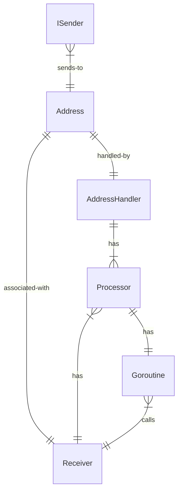
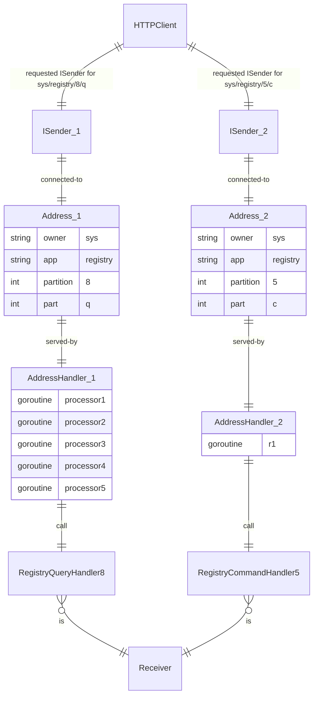

Cleaned. We do not use it yet, also there is a problem. ref https://github.com/voedger/voedger/issues/740

It existed at:

- https://github.com/voedger/voedger/tree/73c8437bf07f7f2a7a87ea403ed79f08115ecf6e/pkg/ibus
- https://github.com/voedger/voedger/tree/73c8437bf07f7f2a7a87ea403ed79f08115ecf6e/pkg/ibusmem

### Bus

- Bus connects system services
  - E.g.: HTTP Server, EMail Gateway, App Partition Query Handler
- For CE/SE services are located in the same process

### Principles

- Limited number of concurrent requests: maxNumOfConcurrentRequests
  - Example: million of http connections but 1000 concurrent requests
  - "ibus.ErrBusUnavailable" (503) is returned if the number of concurrent requests is exceeded
- Sender and Receiver both respect timeouts: readWriteTimeout
  - E.g. 5 seconds, by (weak) analogy with [FoundationDB, Long-running read/write transactions](https://apple.github.io/foundationdb/anti-features.html)
- Result of QuerySender can be used even if AddressHandler has not been found - Sender will return `ErrReceiverNotFound` error

### Components

### How it works with Commands and Queries

