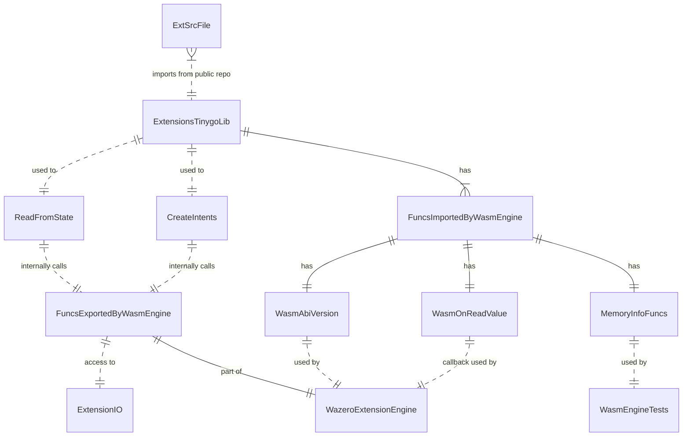

# iextenginewasm

## Basic Usage
See [Basic Usage Test](./impl_test.go)

## Design


### Principles: No Garbage Collection & Restore Memory
[Benchmarks show](https://github.com/heeus/core/blob/fdf52bcc6384657f214a492e8afac12c2bbaeaf6/iextenginewasm/impl_benchmark_test.go#L83) that tinygo garbage collection performance is extremely slow. Instead of making garbage collection, it is more effective to restore engine memory state when the heap is over ([benchmark1](https://github.com/heeus/core/blob/fdf52bcc6384657f214a492e8afac12c2bbaeaf6/iextenginewasm/impl_benchmark_test.go#L158), [benchmark2](https://github.com/heeus/core/blob/fdf52bcc6384657f214a492e8afac12c2bbaeaf6/iextenginewasm/impl_benchmark_test.go#L198)). 
We are allowed to do this since extensions are pure functions by design.

Technical solution:
- `ExtBuildFile` compiles TinyGo sources to WASM with garbage collection [disabled (gc=leaking)](https://tinygo.org/docs/reference/usage/important-options/)
- the `exttinygo` library is developed to minimize heap allocations
- after WazeroExtensionEngine is initialized, the memory backup is saved internally;
- after ANY error engine automatically restores it's memory from backup

Restore benchmarks
```
goos: linux
goarch: amd64
pkg: github.com/heeus/core/iextenginewazero
cpu: 12th Gen Intel(R) Core(TM) i7-12700
Benchmark_Recover/2Mib-1%-20         	  491917	      2041 ns/op	       0 B/op	       0 allocs/op
Benchmark_Recover/2Mib-50%-20        	   17457	     68422 ns/op	       0 B/op	       0 allocs/op
Benchmark_Recover/2Mib-100%-20       	   18838	     64025 ns/op	       0 B/op	       0 allocs/op
Benchmark_Recover/8Mib-100%-20       	    5707	    204310 ns/op	       7 B/op	       0 allocs/op
Benchmark_Recover/100Mib-70%-20      	    6247	    192577 ns/op	      12 B/op	       0 allocs/op
```

### Memory Overflow
On memory overflow Invoke returns error like:
```
wasm error: unreachable
wasm stack trace:
	.runtime.runtimePanic(i32,i32)
	.runtime.alloc(i32) i32
	.arrAppend()
	.arrAppend.command_export()
```

## Benchmarks
### Extensions Code
```go
//export oneGetOneIntent5calls
func oneGetOneIntent5calls() {
	ext.GetValue(ext.KeyBuilder(ext.StorageEvent, ext.NullEntity))
	mail := ext.NewValue(ext.KeyBuilder(ext.StorageSendmail, ext.NullEntity))
	mail.PutString("from", "test@gmail.com")
}

//export oneGetNoIntents2calls
func oneGetNoIntents2calls() {
	ext.GetValue(ext.KeyBuilder(ext.StorageEvent, ext.NullEntity))
}

//export oneGetLongStr3calls
func oneGetLongStr3calls() {
	value := ext.GetValue(ext.KeyBuilder(StorageTest, ext.NullEntity))
	value.AsString("500c")
}

//export doNothing
func doNothing() {
}

//export oneKey1call
func oneKey1call() {
	ext.KeyBuilder(StorageTest2, ext.NullEntity)
}
```
### Results
```
goos: linux
goarch: amd64
pkg: github.com/heeus/core/iextenginewasm
cpu: 12th Gen Intel(R) Core(TM) i7-12700
Benchmark_Extensions_NoGc/oneGetOneIntent5calls-20         	  882313	      1292 ns/op	    2108 B/op	      25 allocs/op
Benchmark_Extensions_NoGc/oneGetNoIntents2calls-20         	 1685337	       678.3 ns/op	    1248 B/op	      13 allocs/op
Benchmark_Extensions_NoGc/oneGetLongStr3calls-20           	 1682310	       682.9 ns/op	    1368 B/op	      13 allocs/op
Benchmark_Extensions_NoGc/oneKey1call-20                   	 4534441	       253.6 ns/op	     280 B/op	       5 allocs/op
Benchmark_Extensions_NoGc/doNothing-20                     	17558064	        62.54 ns/op	       0 B/op	       0 allocs/op
PASS
```
