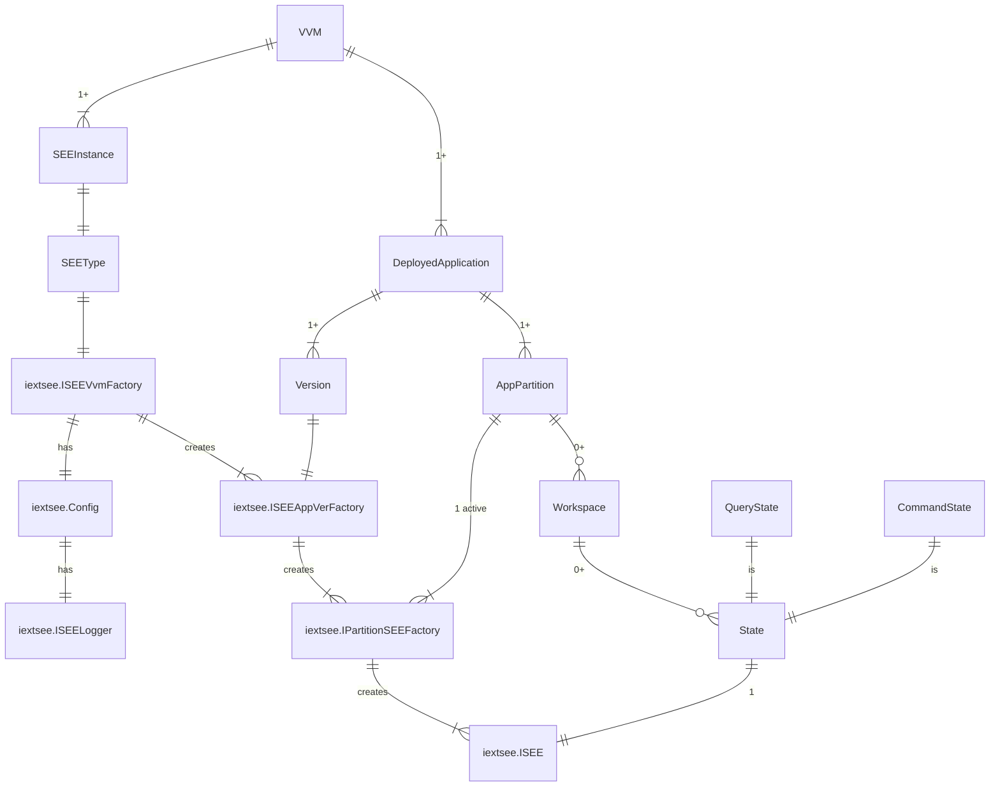

# iextsee

see: State Storage Extension Engines

- [server/storage-extensions.md](https://github.com/voedger/voedger-internals/blob/main/server/storage-extensions.md)

## Use cases

- Handle communication using proprietary SCADA protocol
- Handle communication using proprietary SCADA protocol

## Key components

