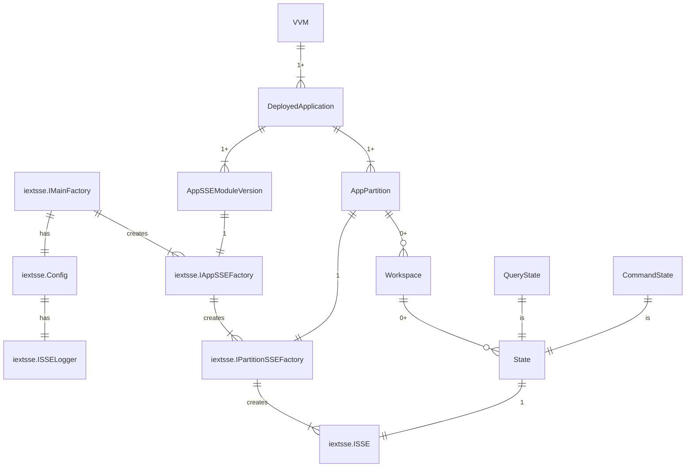

# iextsse

- [server/vsql-select-update.md](https://github.com/voedger/voedger-internals/blob/main/server/vsql-select-update.md)

## Key components

```mermaid
erDiagram
    %% Entities


    %% Relationships
    "iextsse.IMainFactory" ||--|| "iextsse.Config" : "has"
    "iextsse.Config" ||--|| "iextsse.ISSELogger" : "has"
    "iextsse.IMainFactory" ||--|{ "iextsse.IAppSSEFactory" : "creates"
    "iextsse.IAppSSEFactory" ||--|{ "iextsse.IPartitionSSEFactory" : "creates"
    "iextsse.IPartitionSSEFactory" ||--|{ "iextsse.ISSE" : "creates"


    VVM ||--|{ DeployedApplication : "1+"
    DeployedApplication ||--|{ AppSSEModuleVersion : "1+"
    AppSSEModuleVersion ||--|| "iextsse.IAppSSEFactory": "1"

    DeployedApplication ||--|{ AppPartition : "1+"

    AppPartition ||--|| "iextsse.IPartitionSSEFactory" : "1"

    AppPartition ||--o{ Workspace : "0+"

    Workspace ||--o{ "State" : "0+"

    State ||--|| "iextsse.ISSE" : "1"

    QueryState ||--|| State : "is"
    CommandState  ||--|| State : "is"


```