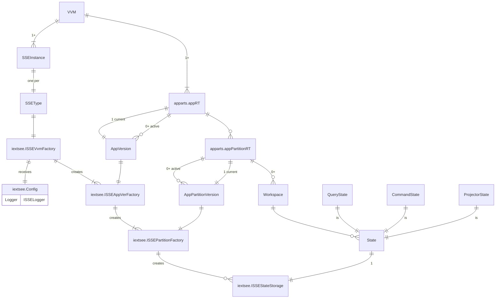

# iextsee

Status: Frozen

see: State Storage Extension Engines

- [server/storage-extensions.md](https://github.com/voedger/voedger-internals/blob/main/server/storage-extensions.md)

## Motivation

- https://github.com/voedger/voedger/issues/2653

## Key components

