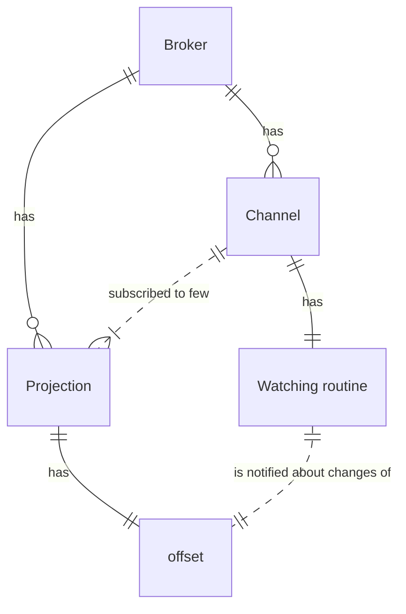
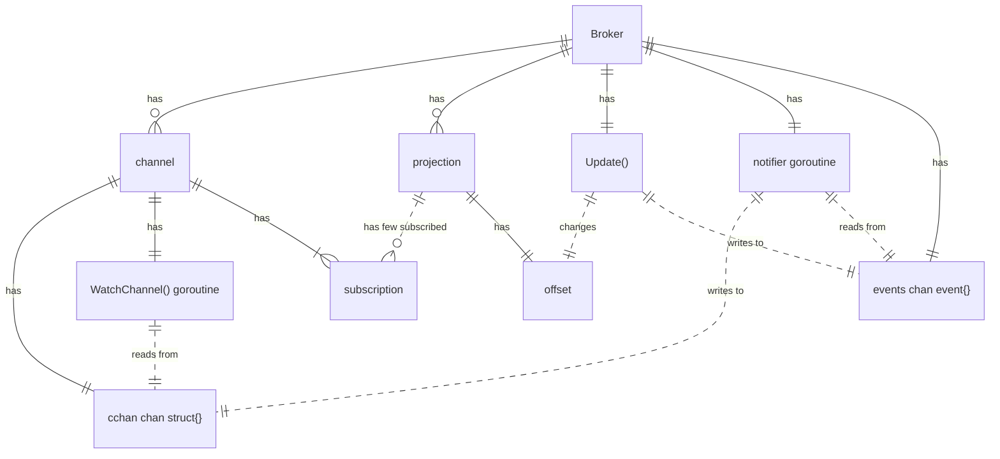

## Concepts

```mermaid
erDiagram

    Broker ||--o{ Channel : has
    Broker ||--o{ "Projection" : has
    Channel ||--|| "Watching routine" : has

    Channel ||..|{ Projection : "subscribed to few"

    Projection ||--|| "offset" : has

    "Watching routine" ||..|| "offset" : "is notified about changes of"

```

## Technical Design

```mermaid
erDiagram

    Broker ||--o{ "channel" : has
    Broker ||--o{ projection : has
    Broker ||--|| "Update()" : has
    Broker ||--|| "notifier goroutine" : has
    Broker ||--|| "events chan event{}" : has    

    projection ||..o{ "subscription" : "has few subscribed"
    projection ||--|| "offset" : has

    channel ||--|| "cchan chan struct{}" : has
    channel ||--|| "WatchChannel() goroutine" : has
    channel ||--|{ "subscription" : has

    "WatchChannel() goroutine" ||..|| "cchan chan struct{}" : "reads from"

    "Update()" ||..|| "offset" : "changes"
    "Update()" ||..|| "events chan event{}" : "writes to"

    "notifier goroutine" ||..|| "cchan chan struct{}" : "writes to"
    "notifier goroutine" ||..|| "events chan event{}" : "reads from"	

```
