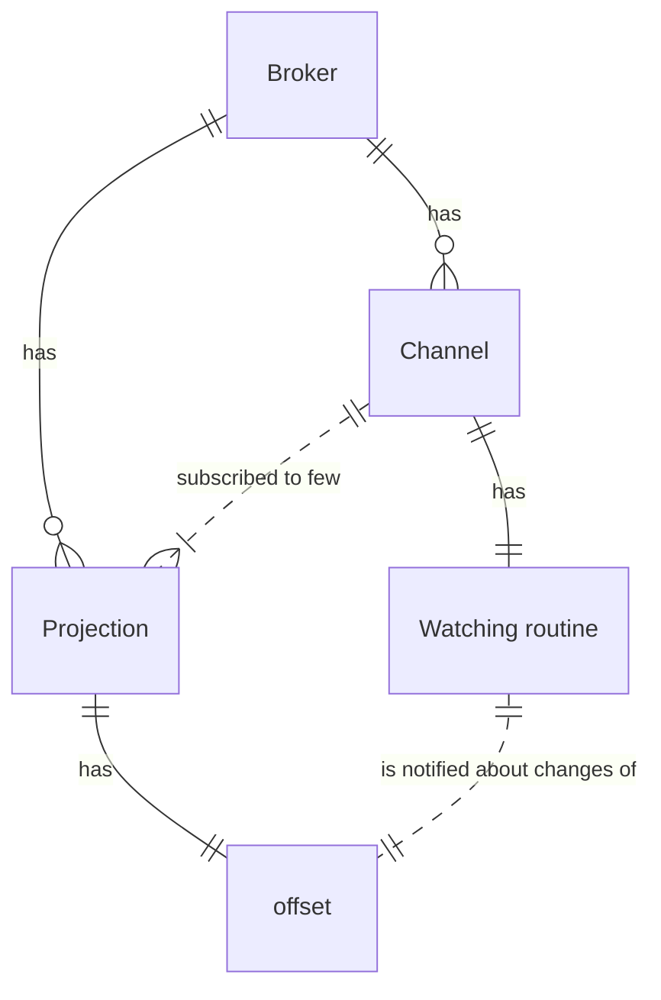
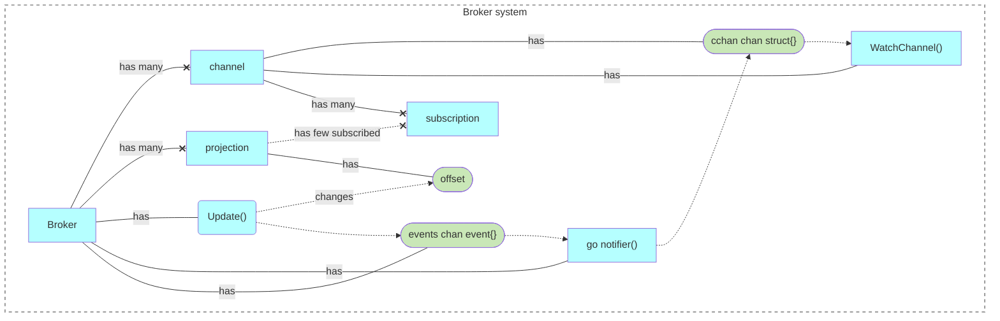

# in10nmem: implementation of in10n interface

## Concepts

## Architecture

## History

- [Before removing the inv, v1 folders](https://github.com/voedger/voedger/blob/e79b37d3644a626f9cef03e17a5904c638e293b5/pkg/in10nmem/README.md)
