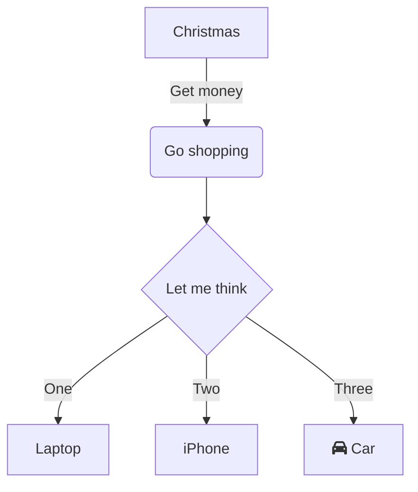

## Versions

- v1: timers
- v2: Each Consumer has its own chan, notifier goroutine writes to all chans
- v3: Each Producer (projection key) has an associated value, sigchan is closed when the offset is updated, Watchers use sigchan to wait for the update
```go
type projectionValue struct {
	offset  istructs.Offset
	sigchan chan struct{}
}
```

## 100.000 publishers * 100 subscribers


Freezes, 32GB RAM is full

## 100.000 publishers * 10 subscribers

const numAttackers = 500
const numPartitions = 100.000
const numProjectorsPerPartition = 10
const eventsPerSeconds = 100

|             | rps | latency,ns | CPU | RAM (32GB) |
| ----------- | ----------- | ----------- | ----------- |---|
| v1          | Freezes       |        |     |
| v2          | 45.000        | 2.8E6        | 28% | 66% |
| v3          | 45.000        | 6E5        | 7% | 53% |


version, numAttackers, rps, latency, CPU, RAM (32GB)
v2, 1, 68,


## 10.000 publishers * 100 subscribers

const numAttackers = 500
const numPartitions = 10.000
const numProjectorsPerPartition = 100
const eventsPerSeconds = 100


|             | rps | latency,ns | CPU | RAM (32GB) |
| ----------- | ----------- | ----------- | ----------- |---|
| v1          | Freezes       |        |     |
| v2          | 10.000        | 4E7        | 41% | 66% |
| v3          | 40.000        | 1E5        | 100% | 62% |


## 1.000 publishers * 1.000 subscribers

const numAttackers = 500
const numPartitions = 1000
const numProjectorsPerPartition = 1000
const eventsPerSeconds = 100


|             | rps | latency,ns | CPU | RAM (32GB) |
| ----------- | ----------- | ----------- | ----------- |---|
| v1          | Freezes       |        |     |
| v2          | 1500   | 3.3E8        | 41% | 60% |
| v3          | 2300     | 2E8        | 83% | 57% |


## 100 publishers * 10.000 subscribers

const numAttackers = 500
const numPartitions = 100.000
const numProjectorsPerPartition = 10
const eventsPerSeconds = 100

|             | rps | latency,ns | CPU | RAM (32GB) |
| ----------- | ----------- | ----------- | ----------- |---|
| v1          | Freezes       |        |     |
| v2          | 48        | 7E9        | 50% | 65% |
| v3          | 19    | 4E8-1.4E10      | 100% | 53% |

v3 latency grows!


## Wrap up

- v1 is not usable for large number of subscribers/publishers
- v3 is not usable for large number of subscribers
  - v3 performance is the best for small number of subscribers
- v2 is the only solution which works for large number of subscribers


