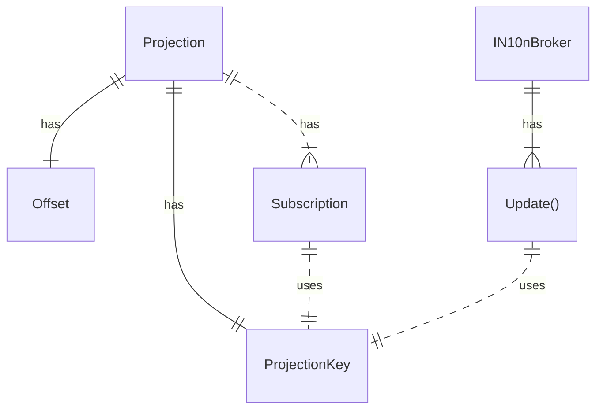
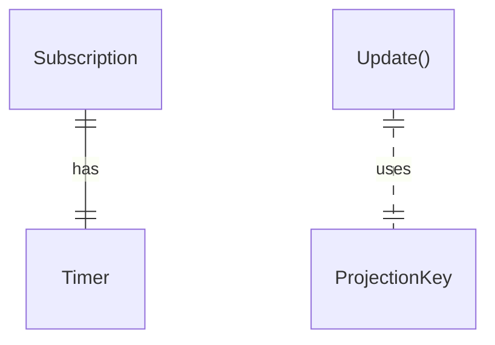
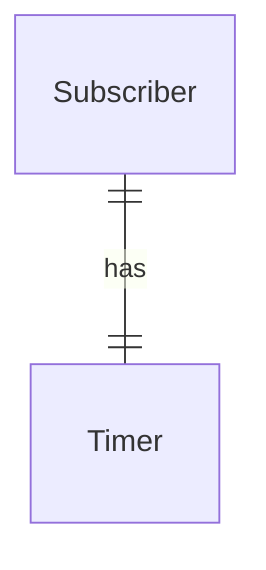
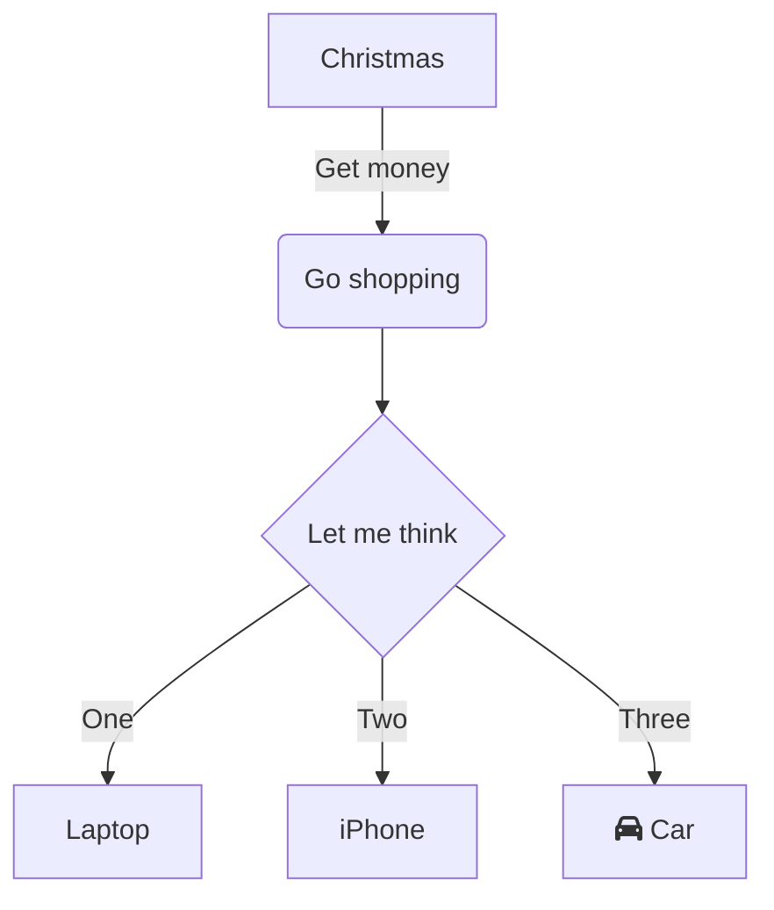

# inv

Notifiers perfomance investigation

## Versions

### General



### v1: Timers



- v1: timers. Each Subscriber has a timer (300 ms) and checks if offset is changed
- v2: Each Subscriber has its own chan, notifier goroutine writes to all subscribed chans
- v3: Each Producer (projection key) has an associated value with `sigchan`. `sigchan` is closed when the offset is updated, Subscribers use `sigchan` to wait for the update
  - Limitation: One Subscriber can have only one Subscription




### v3 details

```go
type projectionValue struct {
	offset  istructs.Offset
	sigchan chan struct{}
}


// Update:

	oldvalue := prj.value.Load().(projectionValue)
	prj.value.Store(projectionValue{offset: offset, sigchan: make(chan struct{})})
	close(oldvalue.sigchan)


// Watcher:
forctx:
	for ctx.Err() == nil {
		v := channel.pvalue.Load().(projectionValue)
		if v.offset > reportedOffset {
			notifySubscriber(channel.pkey, v.offset)
			reportedOffset = v.offset
		}
		select {
		case <-ctx.Done():
			break forctx
		case <-v.sigchan:
		}

	}
```


## Environment

Must be run on ubuntu like this:
```
cd /mnt/c/workspaces/work/voedger/pkg/in10nmem/inv
go run main.go v1
go run main.go v2
go run main.go v3
```

## 100_000 subscribers

- v2NumNotifiers:  1
- v1TimerDuration: 300ms
- vCPU: 20

### By Metric

|Part x Projections | Metric | v1 | v2 | v3|
|-| - | - | - | - |
|10 x 10000 | RPS			|18010|181|35768|
|100 x 1000 | RPS			|17308|818|25558|
|1000 x 100 | RPS			|15627|8908|21966|
|10000 x 10 | RPS			|19269|24897|18706|
||||
|10 x 10000 | Latency, ns	|4322|5E6|12403|
|100 x 1000 | Latency, ns	|5554|1E6|20931|
|1000 x 100 | Latency, ns	|3744|50184|11392|
|10000 x 10 | Latency, ns	|5651|1591|2363|
||||
|10 x 10000 | N10n Rate, %	|0.18|35|0.88|
|100 x 1000 | N10n Rate, %	|1.9|96|11|
|1000 x 100 | N10n Rate, %	|21|99|99|
|10000 x 10 | N10n Rate, %	|77|99|99|
||||
|10 x 10000 | CPU, %		|5|22|56|
|100 x 1000 | CPU, %		|5.9|24|58|
|1000 x 100 | CPU, %		|5.2|14|12|
|10000 x 10 | CPU, %		|5.1|3.2|1.8|
||||
|10 x 10000 | RAM, MB		|167|274|121|
|100 x 1000 | RAM, MB		|167|284|108|
|1000 x 100 | RAM, MB		|168|269|99|
|10000 x 10 | RAM, MB		|169|266|104|

### By Part x Projections

|Part x Projections | Metric | v1 | v2 | v3|
|-| - | - | - | - |
|10 x 10000 | RPS			|18010|181|35768|
|10 x 10000 | Latency, ns	|4322|5E6|12403|
|10 x 10000 | N10n Rate, %	|0.18|35|0.88|
|10 x 10000 | CPU, %		|5|22|56|
|10 x 10000 | RAM, MB		|167|274|121|
||||
|100 x 1000 | RPS			|17308|818|25558|
|100 x 1000 | Latency, ns	|5554|1E6|20931|
|100 x 1000 | N10n Rate, %	|1.9|96|11|
|100 x 1000 | CPU, %		|5.9|24|58|
|100 x 1000 | RAM, MB		|167|284|108|
||||
|1000 x 100 | RPS			|15627|8908|21966|
|1000 x 100 | Latency, ns	|3744|50184|11392|
|1000 x 100 | N10n Rate, %	|21|99|99|
|1000 x 100 | CPU, %		|5.2|14|12|
|1000 x 100 | RAM, MB		|168|269|99|
||||
|10000 x 10 | RPS			|19269|24897|18706|
|10000 x 10 | Latency, ns	|5651|1591|2363|
|10000 x 10 | N10n Rate, %	|77|99|99|
|10000 x 10 | CPU, %		|5.1|3.2|1.8|
|10000 x 10 | RAM, MB		|169|266|104|

## 1_000_000 subscribers

- 10x100000
- 100x10000
- 1000x1000
- 10000x100
- 100000x10


| | v1 | v2 | v3|
| - | - | - | - |
| Latency, ns, 10x10000|Freezes|||
| CPU, %, 10x10000|Freezes|||
| RAM, MB, 10x10000|Freezes|||


## 100.000 publishers * 100 subscribers


Freezes, 32GB RAM is full

## 100.000 publishers * 10 subscribers

const numAttackers = 500
const numPartitions = 100.000
const numProjectorsPerPartition = 10
const eventsPerSeconds = 100

|             | rps | latency,ns | CPU | RAM (32GB) |
| ----------- | ----------- | ----------- | ----------- |---|
| v1          | Freezes       |        |     |
| v2          | 45.000        | 2.8E6        | 28% | 66% |
| v3          | 45.000        | 6E5        | 7% | 53% |


version, numAttackers, rps, latency, CPU, RAM (32GB)
v2, 1, 68,


## 10.000 publishers * 100 subscribers

const numAttackers = 500
const numPartitions = 10.000
const numProjectorsPerPartition = 100
const eventsPerSeconds = 100


|             | rps | latency,ns | CPU | RAM (32GB) |
| ----------- | ----------- | ----------- | ----------- |---|
| v1          | Freezes       |        |     |
| v2          | 10.000        | 4E7        | 41% | 66% |
| v3          | 40.000        | 1E5        | 100% | 62% |


## 1.000 publishers * 1.000 subscribers

const numAttackers = 500
const numPartitions = 1000
const numProjectorsPerPartition = 1000
const eventsPerSeconds = 100


|             | rps | latency,ns | CPU | RAM (32GB) |
| ----------- | ----------- | ----------- | ----------- |---|
| v1          | Freezes       |        |     |
| v2          | 1500   | 3.3E8        | 41% | 60% |
| v3          | 2300     | 2E8        | 83% | 57% |


## 100 publishers * 10.000 subscribers

const numAttackers = 500
const numPartitions = 100.000
const numProjectorsPerPartition = 10
const eventsPerSeconds = 100

|             | rps | latency,ns | CPU | RAM (32GB) |
| ----------- | ----------- | ----------- | ----------- |---|
| v1          | Freezes       |        |     |
| v2          | 48        | 7E9        | 50% | 65% |
| v3          | 19    | 4E8-1.4E10      | 100% | 53% |

v3 latency grows!


## Wrap up

- v1 is not usable for large number of subscribers/publishers
- v3 is not usable for large number of subscribers
  - v3 performance is the best for small number of subscribers
- v2 is the only solution which works for large number of subscribers


