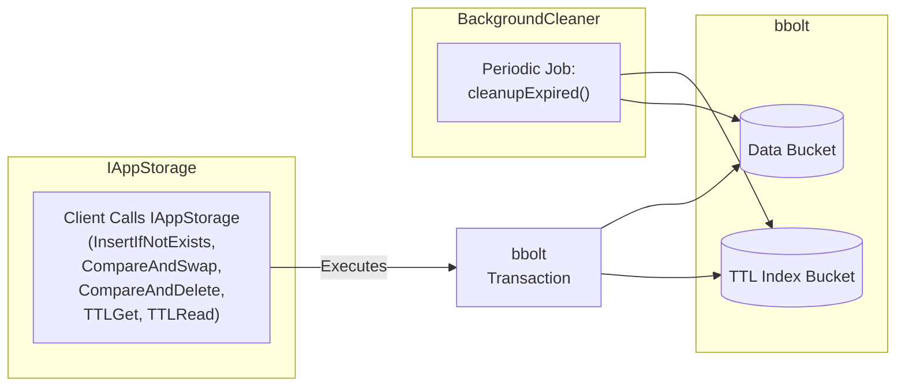

1. Buckets Layout

One common approach for TTL-based data in bbolt is to use two buckets:
1.	Data Bucket: Stores the actual key-value records.
2.	TTL Index Bucket: An index sorted by expiration times.

1.1 Data Bucket
•	Key: A concatenation (or encoding) of pKey + cCols.
•	Value: A blob that contains the user’s value plus (optionally) TTL metadata.
•	Some implementations store the expiration timestamp inline with the value. Others store no metadata here and rely solely on the TTL index bucket.

1.2 TTL Index Bucket
•	Key: Typically (expirationTime | pKey | cCols) or (expirationTime | randomSuffix) if you want to avoid collisions.
•	Ordering by expiration time as the leading bytes is important, because it allows efficient iteration of expired records in ascending order.
•	Value: Could store the “real” key (pKey + cCols) or store no value at all if you embed everything in the key.

Example: If you store expiration time in Unix seconds as a 64-bit big-endian integer, your TTL bucket keys might look like:
```
[8 bytes of big-endian expiration] + [pKey] + [cCols]
```

Then the value is either empty (nil) or a small structure referencing the real record.

---

2. Writing Records with TTL

When inserting or updating with TTL:
1.	Compute expiration time: expireAt = currentUnixTime + ttlSeconds.
2.	Write the record to the Data Bucket under key = [pKey + cCols].
3.	Write an entry to the TTL Index Bucket keyed by [expireAt + pKey + cCols].

If ttlSeconds == 0, then skip writing an entry in the TTL Index Bucket.

Important: For atomic-like semantics (e.g. “Insert if not exists,” “Compare-and-swap”), you’ll do everything in a single bbolt transaction (i.e., db.Update(...)) so that either:
•	You insert both data bucket entry and TTL index entry, or
•	You fail altogether (if the condition is not met or an error occurs).

---

3. Reading Records with TTL

When you do TTLGet() or TTLRead(), you have two basic strategies for TTL checking:
1.	Eager Check: On every TTLGet() or TTLRead(), verify the expiration time of each record. If the record is expired, treat it as nonexistent, and optionally delete it immediately.
2.	Background Cleanup (or “lazy removal”): Rely on a background goroutine or scheduled job that periodically scans the TTL Index and removes expired records. Then a simple get does not need to check expiration, because guaranteed-expired items should already have been deleted.

If you want the caller to see “real-time” TTL behavior (records become invisible the moment they expire), you may need to do an eager check (quick enough for your latency requirements). If approximate behavior is acceptable, you can do strictly background cleanup.

3.1 Eager Check
•	Store the expiration time in the Data Bucket value.
•	When you do TTLGet(pKey, cCols), look up the record in the data bucket, decode the stored expiration time, and check if expireAt <= now. If expired, delete from the data bucket (and TTL index bucket, if present) and return ok = false. Otherwise, return ok = true.

3.2 Background Cleanup
•	Don’t check expiration on read. Simply return whatever is there.
•	A background job periodically does:
1.	Start a read-write transaction.
2.	Iterate the TTL Index Bucket in ascending order of expiration times up to now.
3.	For each item found expired, remove the corresponding key from the Data Bucket and remove the entry from the TTL index.
•	This makes “expired” data effectively invisible after the background job runs, but an immediate read might see a just-expired record if the cleanup hasn’t happened yet.

Often you’ll mix both approaches or do a partial eager check for reads that truly must be correct to the second.

---



