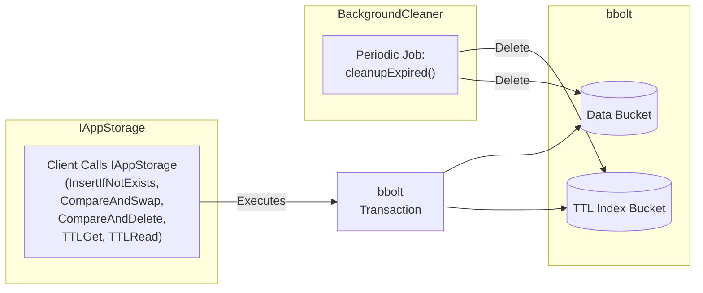

// TODO: describe structure of the key in the TTL Index Bucket 

```mermaid
flowchart LR
    subgraph IAppStorage
    direction TB
    A["Client Calls IAppStorage<br>(InsertIfNotExists,<br>CompareAndSwap,<br>CompareAndDelete,<br>TTLGet, TTLRead)"]
    end

    A -->|Executes| B[bbolt<br>Transaction]

    subgraph bbolt
    direction TB
    C[(Data Bucket)]
    D[(TTL Index Bucket)]
    end

    B --> C
    B --> D

    subgraph BackgroundCleaner
    direction TB
    E["Periodic Job:<br>cleanupExpired()"]
    end

    E -->|Delete| D
    E -->|Delete| C

    click A "#iappstorage-interface" "IAppStorage interface methods"
    click C "#data-bucket" "Data Bucket for storing key/value"
    click D "#ttl-index-bucket" "TTL Bucket sorted by expiration"
    click E "#background-cleaner" "Scans TTL Index & removes expired records"
```    
