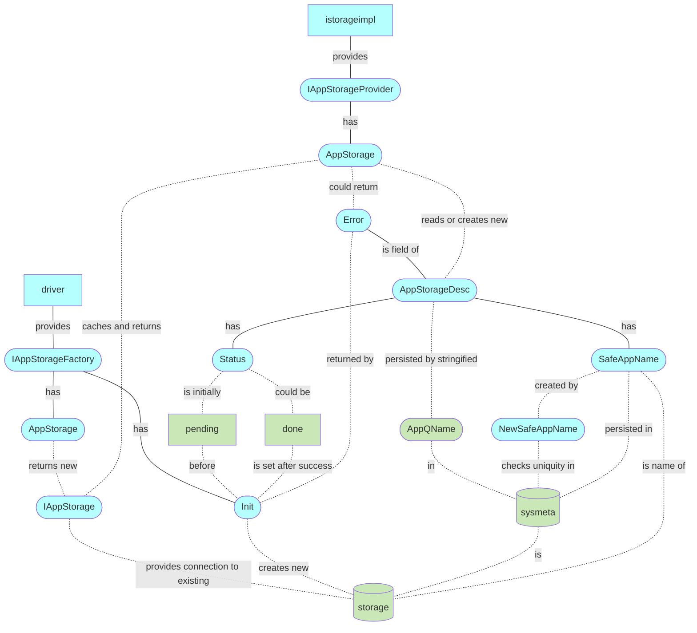

### TODO
- SafeAppName uniquity is gauranted for SE only. Need to implement another angorythm to get SafeAppName in Entrprise Edition

```mermaid
flowchart TD
  istorageimpl[istorageimpl]:::S
  driver[driver]:::S
  IAppStorageFactory([IAppStorageFactory]):::S
  IAppStorageProvider([IAppStorageProvider]):::S
  IAppStorage([IAppStorage]):::S
  AppQName([AppQName]):::H
  AppStorageDesc([AppStorageDesc]):::S
  pending[pending]:::H
  done[done]:::H
  sysmeta[(sysmeta)]:::H
  storage[(storage)]:::H
  Init([Init]):::S
  AppStorageQ([AppStorage]):::S
  AppStorageS([AppStorage]):::S
  ASStatus([Status]):::S
  SafeAppName([SafeAppName]):::S
  NewSafeAppName([NewSafeAppName]):::S
  ASError([Error]):::S

  classDef G fill:#FFFFFF,stroke:#000000, stroke-width:1px, stroke-dasharray: 5 5
  classDef B fill:#FFFFB5,color:#333
  classDef S fill:#B5FFFF
  classDef H fill:#C9E7B7

  driver --- |provides| IAppStorageFactory
  IAppStorageFactory --- |has| Init
  IAppStorageFactory --- |has| AppStorageS
  IAppStorage -.provides connection to existing.- storage
  AppStorageS -.returns new.- IAppStorage
  Init -. creates new .- storage
  istorageimpl --- |provides| IAppStorageProvider
  IAppStorageProvider --- |has| AppStorageQ
  AppStorageQ -.caches and returns.- IAppStorage
  sysmeta -.is.- storage

  AppStorageDesc -.persisted by stringified.- AppQName
  AppQName -.in.- sysmeta
  AppStorageDesc --- |has| ASStatus
  ASStatus -.is initially.- pending
  pending -.before.- Init
  ASStatus -.could be.- done
  done -.is set after success.- Init
  AppStorageDesc --- |has| SafeAppName
  SafeAppName -.is name of.- storage
  SafeAppName -.created by.- NewSafeAppName
  NewSafeAppName -.checks uniquity in.- sysmeta
  SafeAppName -.persisted in.- sysmeta
  ASError --- |is field of| AppStorageDesc
  AppStorageQ -.reads or creates new.- AppStorageDesc
  ASError -.returned by.- Init
  AppStorageQ -.could return.- ASError
```
