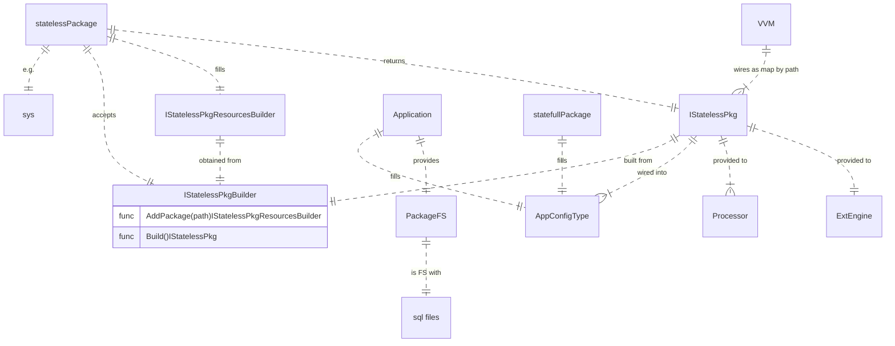
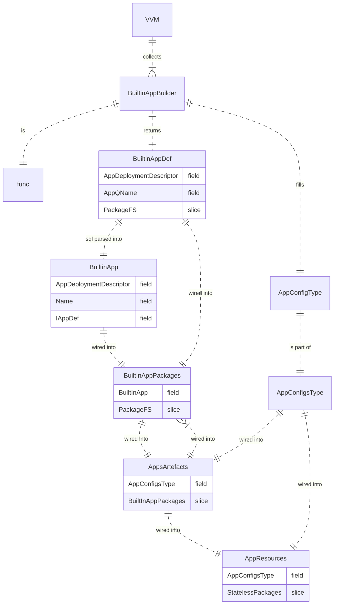

# Events

- `istructsmem.eventType`
  * Represents event builders (IRawEventBuilder and IRawEventBuilder)  and events (IAbstractEvent, IDbEvent and other)

- `istructsmem.appEventsType`
  * Represents IEvents

  * `appEventsType.GetSyncRawEventBuilder`
    + Returns Synced raw event builder

  * `appEventsType.PutPlog`
    + Saves IRawEvent and return IPLogEvent
    + Argument is cloned and saved

  * `appEventsType.PutPlog`
    + Saves IPLogEvent and return IWLogEvent
    + Event entities are cloned and saved

  * `appEventsType.ReadPLog`
    + Reads PLog from specified offset to specified event count by callback function

  * `appEventsType.ReadWLog`
    + Reads WLog from specified offset to specified event count by callback function

# Records
- `istructsmem.recordType`
  * represents IRecord and other records

- `istructsmem.appRecordsType`
  * represents IRecords

  * `appRecordsType.Apply`
    + Saves IPLogEvent CUDs records and returns IRecords by callback function
  * `appRecordsType.Read`
    + Reads record from storage by specified ID and returns IRecord

# Views

- `istructsmem.viewRecordType`
  * represents IKeyBuilder

- `istructsmem.appViewRecordsType`
  * represents IViewRecords

  * `appViewRecordsType.KeyBuilder`
    + Returns new key builder for specified view
  * `appViewRecordsType.NewValueBuilder`
    + Returns new empty view value builder for specified view
  * `appViewRecordsType.UdateValueBuilder`
    + Returns new view value builder for specified view assigned from specified exists view value

  * `appViewRecordsType.Put`
    + Puts view record (key and value) into the storage

  * `appViewRecordsType.Read`
    + Reads view records (key and value) for specified key from the storage by calling callback function.
    + Key may be build partially. In this case all view records, witch keys starts with specified key, will be reads

