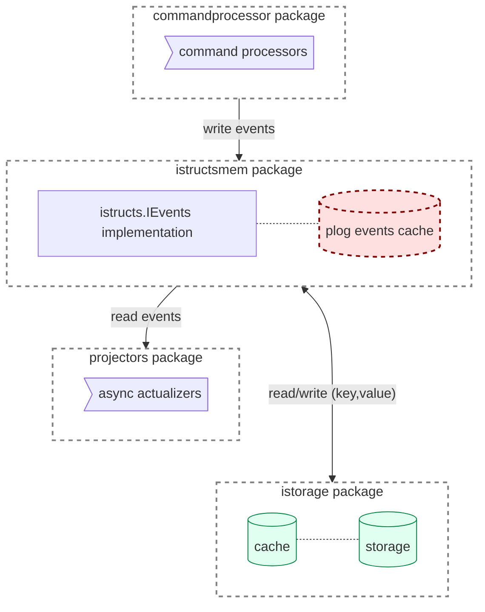

# `plogcache` from `istructsmem` internal package

PLog events cache.

## Motivation

[performance: istructsmem: PLog Events cache](https://github.com/voedger/voedger/issues/455)

## Design

```mermaid
flowchart

  processors:::Group
  subgraph processors [commandprocessor package]
    cp>command processors]
  end

  projectors:::Group
  subgraph projectors [projectors package]
    actualizers>async actualizers]
  end

  istructsmem:::Group
  subgraph istructsmem [istructsmem package]
    IEvents[istructs.IEvents implementation]
    eventsCache[(plog events cache)]:::NEW
    IEvents -.- eventsCache
  end

  istorage:::Group
  subgraph istorage [istorage package]
    storageCache[(cache)]:::Green
    storage[(storage)]:::Green
    storageCache -.- storage
  end

  processors -->|write events| istructsmem
  istructsmem -->|read events| projectors
  istructsmem <--->|"read/write (key,value)"| istorage


  classDef NEW fill:#FFE0E0,stroke:#800000, stroke-width:2px, stroke-dasharray: 5 5
  classDef Green fill:#E0FFF0,stroke:#008040
  classDef Group fill:#FFFFFF, stroke:#808080, stroke-width:2px, stroke-dasharray: 5 5
```
