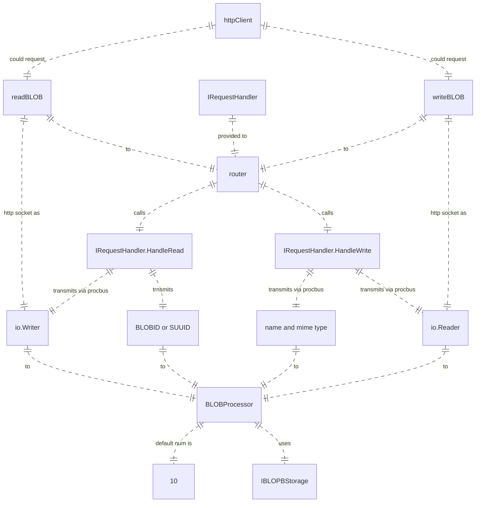

```mermaid
erDiagram
	httpClient ||..|| readBLOB: "could request"
	IRequestHandler ||..|| router: "provided to"
	httpClient ||..|| writeBLOB: "could request"
	readBLOB ||..|| "io.Writer": "http socket as"
	readBLOB ||..|| router: "to"
	writeBLOB ||..|| router: "to"
	writeBLOB ||..|| "io.Reader": "http socket as"
	router ||..|| "IRequestHandler.HandleRead": calls
	router ||..|| "IRequestHandler.HandleWrite": calls
	"IRequestHandler.HandleRead" ||..|| "io.Writer": "transmits via procbus"
	"IRequestHandler.HandleRead" ||..|| "BLOBID or SUUID": trnsmits
	"IRequestHandler.HandleWrite" ||..|| "name and mime type": "transmits via procbus"
	"IRequestHandler.HandleWrite" ||..|| "io.Reader": "transmits via procbus"
	"io.Reader" ||..|| BLOBProcessor: "to"
	"io.Writer" ||..|| BLOBProcessor: "to"
	"BLOBID or SUUID" ||..|| BLOBProcessor: "to"
	"name and mime type" ||..|| BLOBProcessor: "to"
	BLOBProcessor ||..|| "10": "default num is"
	BLOBProcessor ||..|| "IBLOPBStorage": uses
```
