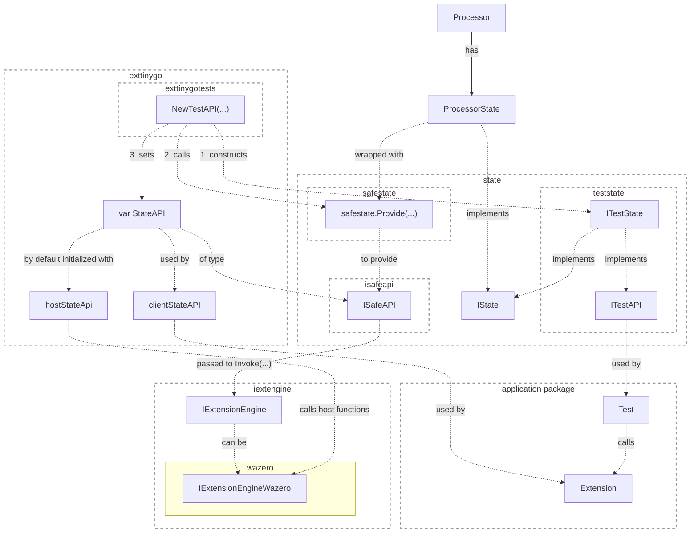

```mermaid
flowchart TD
    exttinygo:::G
    exttinygotests:::G
    state:::G
    isafeapi:::G
    safestate:::G
    teststate:::G
    iextengine:::G
    application:::G
    subgraph exttinygo
        internal.State["var StateAPI"]
        hostAPI["hostStateApi"]
        clientStateAPI["clientStateAPI"]
        subgraph exttinygotests
            NewTestAPI["NewTestAPI(...)"]
        end
    end
    subgraph state
        IState
        subgraph isafeapi
            ISafeAPI["ISafeAPI"]
        end
        subgraph teststate
            ITestState["ITestState"]
            ITestAPI["ITestAPI"]
        end
        subgraph safestate
            safestate.Provide["safestate.Provide(...)"]
        end
    end
    subgraph application["application package"]
        Test
        Extension   
    end
    subgraph iextengine
        subgraph wazero
            IExtensionEngineWazero["IExtensionEngineWazero"]
        end

        IExtensionEngine["IExtensionEngine"]
    end
    
    internal.State -.-> |by default initialized with| hostAPI
    internal.State -.-> |of type| ISafeAPI
    internal.State -.-> |used by| clientStateAPI

    NewTestAPI -.-> |1. constructs| ITestState
    NewTestAPI -.-> |2. calls| safestate.Provide
    NewTestAPI -.-> |3. sets| internal.State
    ITestState -.-> |implements| ITestAPI
    ITestState -.-> |implements| IState
    ProcessorState -.-> |implements| IState
    ITestAPI -.-> |used by| Test
    safestate.Provide -.-> |to provide| ISafeAPI

    hostAPI -.-> |calls host functions| IExtensionEngineWazero
    IExtensionEngine -.-> |can be| IExtensionEngineWazero


    Processor --> |has| ProcessorState
    ProcessorState -.-> |wrapped with| safestate.Provide
    ISafeAPI -.-> |"passed to Invoke(...)"| IExtensionEngine

    Test -.-> |calls| Extension
    clientStateAPI -.-> |used by|Extension

classDef G fill:#ffffff15, stroke:#999, stroke-width:2px, stroke-dasharray: 5 5

```
