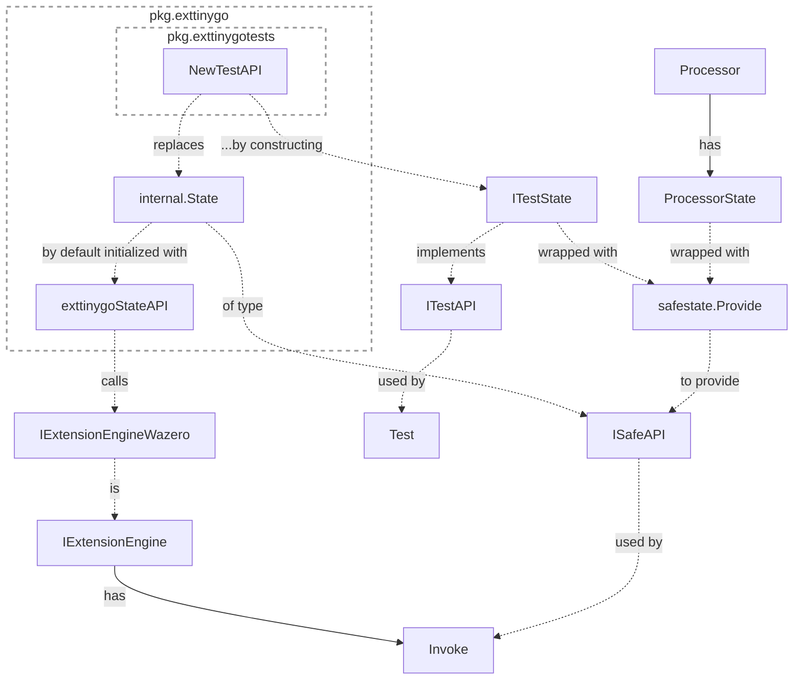

# Version 2

```mermaid
flowchart TD
    pkg.exttinygo:::G
    pkg.exttinygotests:::G
    subgraph pkg.exttinygo
        internal.State
        exttinygoStateAPI
        subgraph pkg.exttinygotests
            NewTestAPI
        end
    end
    
    internal.State -.-> |by default initialized with| exttinygoStateAPI
    internal.State -.-> |of type| ISafeAPI
    ITestState -.-> |wrapped with| safestate.Provide
    NewTestAPI -.-> |...by constructing| ITestState
    ITestState -.-> |implements| ITestAPI
    ITestAPI -.-> |used by| Test
    NewTestAPI -.-> |replaces| internal.State
    safestate.Provide -.-> |to provide| ISafeAPI

    exttinygoStateAPI -.-> |calls| IExtensionEngineWazero
    IExtensionEngineWazero -.-> |is| IExtensionEngine
    IExtensionEngine --> |has| Invoke

    Processor --> |has| ProcessorState
    ProcessorState -.-> |wrapped with| safestate.Provide
    ISafeAPI -.-> |used by| Invoke

classDef G fill:#ffffff15, stroke:#999, stroke-width:2px, stroke-dasharray: 5 5

```
