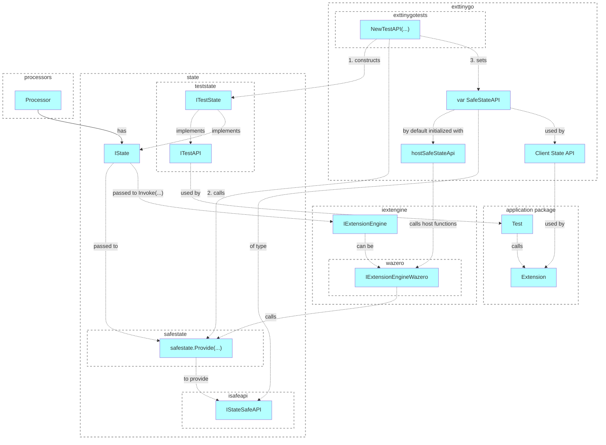

## Principles
- SafeStateAPI is a low-level API for State which implements the following principles:
    - used by extension engines
    - automatically converts package paths (extensions work with full paths)
    - Keys, Values, Key- and Value-Builders are represented with numbers, to be transferred between Host and Extension environments.

## Design

