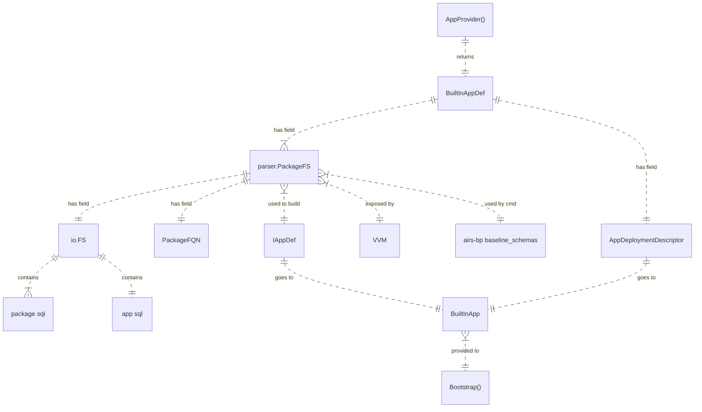

```mermaid
erDiagram
	"AppProvider()" ||..|| BuiltInAppDef: returns
	BuiltInAppDef ||..}| "parser.PackageFS": "has field"
	BuiltInAppDef ||..|| AppDeploymentDescriptor: "has field"
	"parser.PackageFS" ||..|| "io.FS": "has field"
	"parser.PackageFS" ||..|| PackageFQN: "has field"
	"io.FS" ||..}| "package sql": contains
	"io.FS" ||..|| "app sql": contains
	"parser.PackageFS" |{..|| IAppDef: "used to build"
	IAppDef ||..|| BuiltInApp: "goes to"
	AppDeploymentDescriptor ||..|| BuiltInApp: "goes to"
	BuiltInApp |{..|| "Bootstrap()": "provided to"
	"parser.PackageFS" |{..|| VVM: "exposed by"
	"parser.PackageFS" |{..|| "airs-bp baseline_schemas": "used by cmd"
```

```mermaid
erDiagram
	"AppProvider()" ||..|| BuiltInAppDef: returns
	BuiltInAppDef ||..}| "parser.PackageFS": "has field"
	BuiltInAppDef ||..|| AppDeploymentDescriptor: "has field"
	"parser.PackageFS" ||..|| "io.FS": "has field"
	"parser.PackageFS" ||..|| PackageFQN: "has field"
	"io.FS" ||..}| "package sql": contains
	"io.FS" ||..|| "app sql": contains
	"parser.PackageFS" |{..|| IAppDef: "used to build"
	IAppDef ||..|| BuiltInApp: "goes to"
	AppDeploymentDescriptor ||..|| BuiltInApp: "goes to"
	BuiltInApp |{..|| "Bootstrap()": "provided to"
	"parser.PackageFS" |{..|| VVM: "exposed by"
	"parser.PackageFS" |{..|| "airs-bp baseline_schemas": "used by cmd"
```

