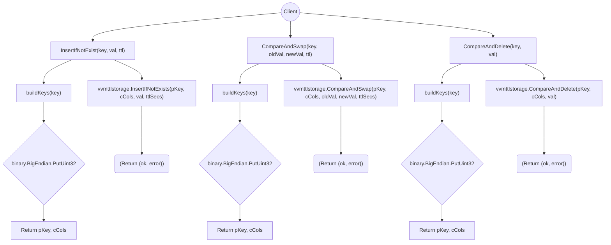

# ttlstorage

This package provides a TTL-based storage implementation that adapts the VVM App TTL Storage (IVVMAppTTLStorage) to the ITTLStorage interface. It allows storing (key, value) pairs with an explicit time-to-live (TTL) in seconds, supporting common operations:
- InsertIfNotExist: Inserts a key/value pair with a TTL only if the key does not already exist.
- CompareAndSwap: Atomically updates a value if the current stored value matches an expected old value, also resetting the TTL.
- CompareAndDelete: Removes a key/value pair if its current value matches the expected value.

## Flowchart

## Design Highlights

### 1.	Key Serialization
	- The package works with uint32 keys, serialized to big-endian byte slices.
	- A user-defined PKeyPrefix (uint32) is also included as part of the primary key.
### 2.	Underlying Storage
	- Uses IVVMAppTTLStorage for the actual reads/writes and for applying TTL.
	- Translates time.Duration to integer seconds.
### 3.	Functionality
	- Useful for leader-election or similar patterns requiring TTL guarantees.
	- Allows safe concurrency patterns via compare-and-swap/delete.

## Folder Structure
- provide.go
Exports the New() function, returning an ITTLStorage[TTLStorageImplKey, string].
- types.go
Defines TTLStorageImplKey and PKeyPrefix.
- impl.go
Contains the core implementation for ITTLStorage methods.
- impl_test.go
Unit tests using testify/require and a mock IVVMAppTTLStorage.

This design makes it easy to substitute or mock the underlying storage logic while providing a uniform TTL-based interface for higher-level election protocols or distributed locks.