# How: Improve maintainLeadership with retry and scheduled killer

## Approach

- Introduce unexported `killerScheduler` struct in `pkg/ielections/types.go` with `scheduleKiller(deadline time.Time)` — computes duration via `deadline.Sub(clock.Now())`, cancels previous killer goroutine, spawns a new one that calls `os.Exit(1)` on timer fire
- Use isolated time for test safety: `newKillerScheduler(clock)` detects `NewIsolatedTime()` on `IMockTime` in `pkg/goutils/testingu/mocktime.go` and stores an independent clock instance, so advancing global `MockTime` never triggers the killer — no injectable kill function needed
- Create killer internally in `AcquireLeadership` in `pkg/ielections/impl.go` — capture `leadershipStartTime`, schedule killer at `leadershipStartTime + 0.8 × TTL` as absolute `time.Time` deadline, pass killer to `maintainLeadership`
- Rewrite the `maintainLeadership` loop in `pkg/ielections/impl.go`: shorten the ticker from `TTL/2` to `TTL/4`, add a CAS retry loop (up to 3 total attempts with `TTL/20` sleep between retries), reschedule killer at `leadershipStartTime + 0.8 × TTL` on CAS success
- Remove the reactive `killerRoutine` from `leadershipMonitor` in `pkg/vvm/impl_orch.go` — the proactive killer from `maintainLeadership` already covers the termination guarantee
- Update `vvm-orch--arch.md` with new timing constants, CAS retry logic, and proactive killer scheduling semantics

References:

- [pkg/ielections/types.go](../../../pkg/ielections/types.go)
- [pkg/ielections/impl.go](../../../pkg/ielections/impl.go)
- [pkg/ielections/impl_testsuite.go](../../../pkg/ielections/impl_testsuite.go)
- [pkg/goutils/testingu/mocktime.go](../../../pkg/goutils/testingu/mocktime.go)
- [pkg/vvm/impl_orch.go](../../../pkg/vvm/impl_orch.go)
- [uspecs/specs/prod/apps/vvm-orch--arch.md](../../specs/prod/apps/vvm-orch--arch.md)

## Key flows

### Leadership maintenance with CAS retry

```mermaid
sequenceDiagram
    participant ML as 🎯maintainLeadership
    participant KS as 🎯killerScheduler
    participant S as 📁TTL Storage

    Note over ML: sleep(TTL/4)
    ML->>ML: leadershipStartTime = now()
    loop up to 3 attempts
        ML->>S: CompareAndSwap(key, val, TTL)
        alt success
            S-->>ML: ok=true
        else error
            S-->>ML: err
            ML->>ML: sleep(TTL/20) if retries left
        end
    end
    alt ok
        ML->>KS: scheduleKiller(startTime + 0.8×TTL)
        KS->>KS: cancel previous goroutine
        KS->>KS: spawn killer with deadline
    else !ok
        ML->>ML: releaseLeadership()
    end
```

