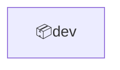
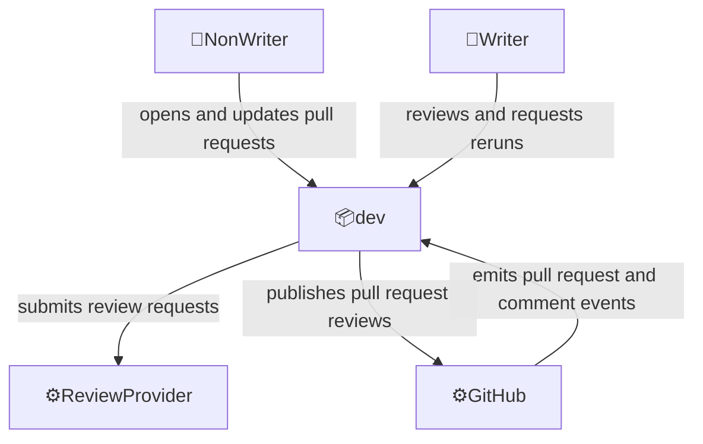

# Domain: Voedger engineering operations

Development, review, delivery, and maintenance workflows used to change and operate the Voedger repository.

## Overview

Scope:

- NonWriter and Writer workflows around repository changes
- Automated checks and review support that run before changes are merged
- Repository automation that improves engineering feedback without changing the Voedger production runtime

Key features:

- Development workflow automation
- CI and validation workflows
- Engineering rules and guidance for human developers and AI agents

## External actors

Roles:

- 👤NonWriter
  - User below Write repository permission who can open and update pull requests, but cannot request automated review
- 👤Writer
  - User with Write or higher repository permission who reviews pull requests, requests additional automated review, and decides whether changes can be merged

Systems:

- ⚙️GitHub
  - Hosts the repository, pull requests, comments, secrets, and workflow execution
- ⚙️ReviewProvider
  - Provides automated review of pull request changes using repository context and rules

---

## Concepts

- `Pull Request`
  - A proposed repository change submitted for automated and human review before merge

- `Review`
  - Feedback attached to a pull request, including summary findings and inline comments

- `Review Command`
  - A pull request comment from a user with Write or higher repository permission that requests another automated review

- `Repository Rule`
  - Versioned guidance stored in the repository and supplied to automation or agents during review

- `Repository Secret`
  - Secret value managed by GitHub Actions and used by trusted workflows without committing credentials to the repository

---

## Contexts

- **dev**
  - Development workflow automation, including pull request review triggers and Writer-requested review reruns

### Context map

### dev

Relationships:

