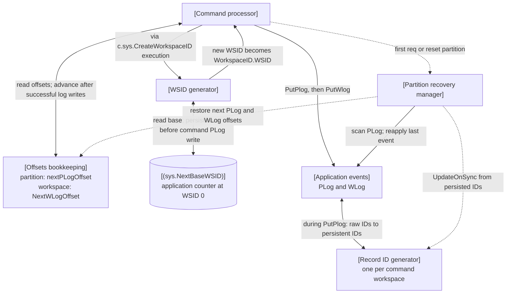
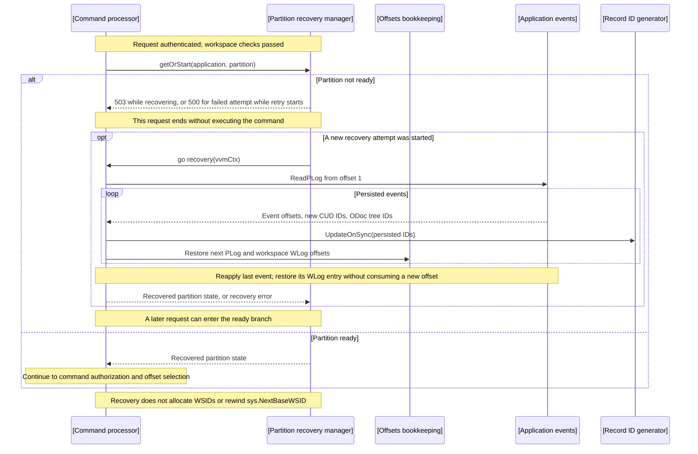
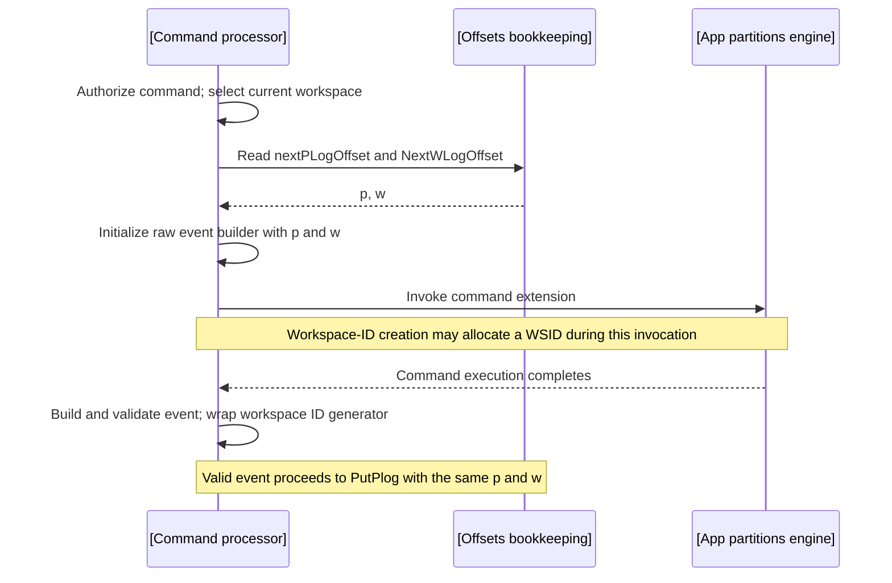
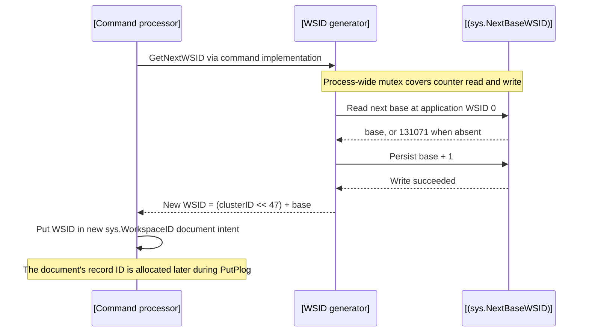
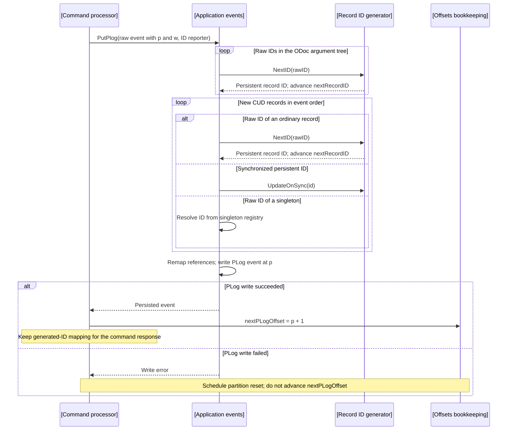
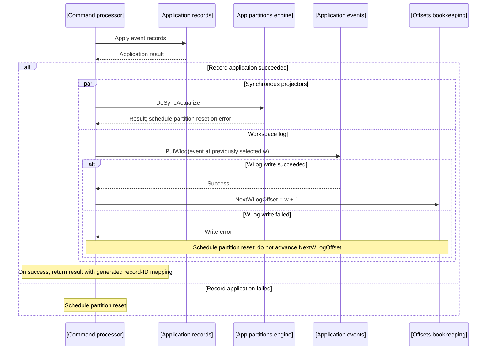
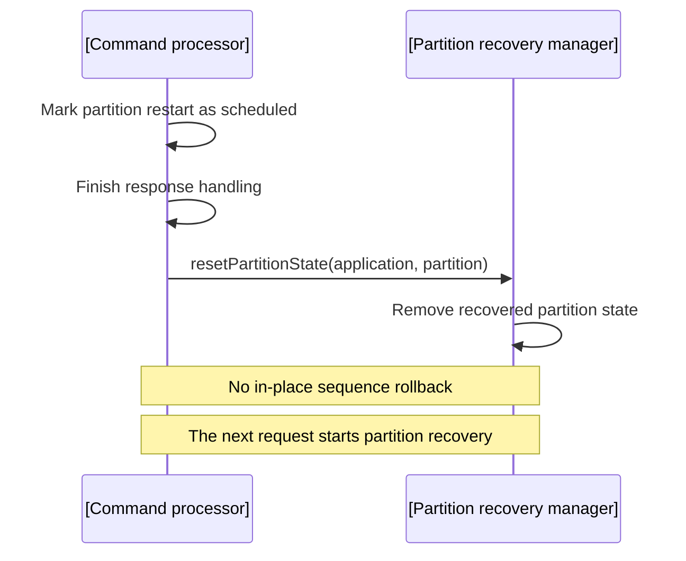

# Context subsystem architecture: prod/apps/sequences

Sequence allocation and recovery in the [apps context](./arch.md). The Command Processor keeps record-ID generators and PLog/WLog offsets in memory and rebuilds them from the PLog. Workspace creation allocates WSIDs separately, using a persistent application-level counter in `sys.NextBaseWSID`.

## External actors

Systems:

- `*Client`
  - Invokes application commands through the request processing pipeline.

## Components

### Layers

```text
External actors
    |
    +-- *Client
    |
    v
Command sequencing
    |
    +-- [Command processor]
    +-- [Partition recovery manager]
    +-- [Offsets bookkeeping]
    +-- [Record ID generator]
    +-- [WSID generator]
    |
    v
Application operations
    |
    +-- [Application events]
    +-- [Application records]
    +-- [App partitions engine]
    +-- [(sys.NextBaseWSID)]
```

#### Allocation and recovery relationships

- Solid: calls and data flow
- Dashed: recovery triggers and restoration of in-memory state.



The generated WSID is a field of a new `sys.WorkspaceID` document. That document also receives a separate record ID from the generator in the **current command workspace**. Its PLog and WLog offsets likewise belong to the current command's partition/workspace, not the newly allocated workspace.

The WSID counter is written directly before the command event is persisted, so a later command failure can leave a gap in allocated WSIDs. Partition recovery restores record-ID and offset state from events; it does not rebuild or roll back the WSID counter.

### Command sequencing

- `[Command processor]`
  - Owns the command pipeline, `[Offsets bookkeeping]`, and `[Record ID generator]` instances. General command execution is described in [Processing](./arch-processing.md).
  - The ID reporter wraps the workspace generator to collect raw-to-persistent IDs for the command response.
  - impl: [pkg/processors/command/provide.go](../../../../pkg/processors/command/provide.go)
  - impl: [pkg/processors/command/impl.go](../../../../pkg/processors/command/impl.go)

- `[Partition recovery manager]`
  - Owns partition states keyed by application QName and partition ID: absent, recovering, recovered, or failed. A mutex protects lookup/publication/reset; a worker wait group is joined before the command service closes its pipelines.
  - A workpiece associated with the received command is detached from the command and sent to the re-apply-last-event sub-pipeline, then is released after the attempt. If an error occurs on a `Put*Log` or `ApplyRecords` stage, the partition is removed from the map of recovered partitions and the next request schedules recovery.
  - Recovery logs use `sys._Recovery`, `partid`, and the platform VApp attributes. They include `cp.partition_recovery.start`, `cp.partition_recovery.complete`, and read/reapply error events; the completion entry includes the next PLog offset and workspace WLog offsets. A scheduled reset emits a warning. Log conventions are defined in [Logging](./logging--td.md).
  - decl: [pkg/processors/command/types.go](../../../../pkg/processors/command/types.go)
  - impl: [pkg/processors/command/impl.go](../../../../pkg/processors/command/impl.go)
  - Evidence: `TestRecovery` and `TestAsynchronousRecovery` in [command tests](../../../../pkg/processors/command/impl_test.go).

- `[Offsets bookkeeping]`
  - The Command Processor's in-memory fields, rather than a separate service: `appPartition.nextPLogOffset` is per application/partition; `workspace.NextWLogOffset` is per application/workspace. Both start at 1.
  - Values are copied into the raw event before command execution. A successful PLog write increments the partition offset; a successful WLog write increments the workspace offset. Recovery restores both from event offsets plus 1.
  - impl: [pkg/processors/command/provide.go](../../../../pkg/processors/command/provide.go)
  - impl: [pkg/processors/command/impl.go](../../../../pkg/processors/command/impl.go)

- `[Record ID generator]`
  - One incrementing generator per workspace serves all ordinary record kinds. `NextID` returns the current next ID and increments it. `UpdateOnSync(id)` advances to `id + 1` only when `id` is at least the current next value.
  - Singleton IDs come from the application singleton registry, bypassing this ordinary allocation sequence.
  - impl: [pkg/istructsmem/idgenerator.go](../../../../pkg/istructsmem/idgenerator.go)
  - impl: [pkg/istructsmem/internal/singletons/impl.go](../../../../pkg/istructsmem/internal/singletons/impl.go)
  - Evidence: `TestIDGenerator` in [ID generator tests](../../../../pkg/istructsmem/idgenerator_test.go).

- `[WSID generator]`
  - `workspace.GetNextWSID` is called from the `c.sys.CreateWorkspaceID` command implementation, invoked through `[App partitions engine]` during command execution.
  - Under the process-wide `nextWSIDGlobalLock`, reads `[(sys.NextBaseWSID)]`, uses `FirstBaseUserWSID` (131071) when absent, and persists base + 1 before returning `(ClusterID << 47) + base`. The cluster ID comes from the command workspace.
  - The counter lock is process-local; the implementation explicitly leaves coordination across multiple VVMs unresolved.
  - impl: [pkg/sys/workspace/impl.go](../../../../pkg/sys/workspace/impl.go)
  - impl: [pkg/sys/workspace/utils.go](../../../../pkg/sys/workspace/utils.go)
  - WSID layout and starting value: [istructs utilities](../../../../pkg/istructs/utils.go), [istructs constants](../../../../pkg/istructs/consts.go).

#### Active numbering state

| Value | Scope | Initial next value | Advancement |
| --- | --- | --- | --- |
| PLog offset | Application and partition | 1 | Successful PLog write; recovered event offset + 1 |
| WLog offset | Application and workspace | 1 | Successful WLog write; recovered WLog offset + 1 |
| Ordinary record ID | Application and workspace | 200001 | Each generated ID; synchronized/recovered ID can advance the generator |
| Base WSID | Application, persisted under WSID 0 | 131071 | Direct view write of base + 1 during workspace-ID creation |

Record ID ranges are defined in [istructs constants](../../../../pkg/istructs/consts.go):

| Range | Meaning |
| --- | --- |
| 0 | Null ID |
| 1–65535 | Raw IDs to be replaced before persistence |
| 65536–200000 | Reserved IDs |
| 65536–66047 | Singleton IDs within the reserved range |
| 66048 | `NonExistingRecordID` test sentinel |
| 200001 onward | Ordinary generated IDs |

These are scoped identifiers, not globally unique numbers across applications or workspaces.

### Application operations

- `[Application events]`
  - Implements PLog/WLog storage through `IEvents`. Before persisting a valid event, regenerates raw IDs in document arguments and CUDs; records already persisted are read back during recovery. Owns the event side of sequence trust enforcement.
  - decl: [pkg/istructs/interface.go](../../../../pkg/istructs/interface.go)
  - impl: [pkg/istructsmem/impl.go](../../../../pkg/istructsmem/impl.go)
  - impl: [pkg/istructsmem/event-types.go](../../../../pkg/istructsmem/event-types.go)

- `[Application records]`
  - Applies CUDs and enforces the record side of sequence trust. The event reapplier uses the same record application path in reapply mode, and overwrites the last event's WLog entry.
  - impl: [pkg/istructsmem/impl.go](../../../../pkg/istructsmem/impl.go)

- `[App partitions engine]`
  - Supplies the borrowed partition, invokes command extensions through `Invoke`, and executes synchronous projectors through `DoSyncActualizer`.
  - decl: [pkg/appparts/interface.go](../../../../pkg/appparts/interface.go)
  - impl: [pkg/appparts/impl.go](../../../../pkg/appparts/impl.go)
  - impl: [pkg/appparts/impl_app.go](../../../../pkg/appparts/impl_app.go)
  - Projector processing details: [Processing](./arch-processing.md).

- `[(sys.NextBaseWSID)]`
  - One persistent next-base counter per application, accessed through `IAppStructs.ViewRecords()` at `NullWSID` (0), with both dummy key fields set to 1. This view stores WSID allocation state independently of the Command Processor's recovered workspace state.
  - decl: [pkg/appdef/sys/sys.go](../../../../pkg/appdef/sys/sys.go)
  - impl: [pkg/sys/workspace/utils.go](../../../../pkg/sys/workspace/utils.go)

#### Active write policy

`VVMConfig.SequencesTrustLevel` defaults to level 0. [VVM wiring](../../../../pkg/vvm/wire_gen.go) passes it through [the application structs provider](../../../../pkg/vvm/provide.go) to `istructsmem`; see [configuration defaults](../../../../pkg/vvm/impl_cfg.go).

| Trust level | Ordinary PLog/WLog writes | New table records | Existing table records |
| --- | --- | --- | --- |
| 0 | `InsertIfNotExists` | `InsertIfNotExists` | `Put` |
| 1 | `InsertIfNotExists` | `PutBatch` | `PutBatch` |
| 2 | `Put` | `PutBatch` | `PutBatch` |

A conditional-write collision returns `ErrSequencesViolation`; invalid trust-level values panic. Events marked `sys.Corrupted` use `Put` regardless of level. Last-event reapplication uses unconditional record batch writes and a WLog `Put`, allowing replay of data that may already have been applied. It does not allocate a new PLog offset.

Evidence: `TestSequencesTrustLevel` and `TestEventReapplier` in [write-policy tests](../../../../pkg/istructsmem/impl_seqtrust_test.go).

## Scenarios

### Allocate and persist a command

This flow starts with a recovered partition. Recovery admission is described in the next scenario; general authorization and extension execution remain in [Processing](./arch-processing.md).

```text
*Client
  -> [Command processor]: command for application, partition, workspace
      - select workspace; snapshot next PLog and WLog offsets into raw event
      - execute and validate command
      -> [Application events]: PutPlog(raw event, ID reporter)
          -> [Record ID generator]: allocate raw argument and CUD IDs
          - remap record references; persist event
      - on successful PLog write: increment nextPLogOffset
      -> [Application records]: apply event CUDs
      - fork after record application:
          -> [App partitions engine]: DoSyncActualizer
          -> [Application events]: PutWlog
              - on success: increment workspace.NextWLogOffset
      -> *Client: command result with generated ID mapping
```

ODoc IDs are regenerated recursively before CUD IDs. Raw IDs and references within each structure are replaced using its regeneration map. New CUDs with supplied persistent IDs call `UpdateOnSync`; raw singleton CUD IDs resolve through the singleton registry instead of consuming the workspace generator. During recovery, ODoc root and descendant IDs also advance the generator, as described below.

A PLog write failure sets the partition restart flag; record-application, synchronous-projector, and WLog failures do likewise. After handling the command, the processor removes that partition's recovered state so the next request starts recovery. Sequence allocation is not an independently committed transaction that can be rolled back in place.

Implementation: [command pipeline](../../../../pkg/processors/command/provide.go), [allocation and PLog handling](../../../../pkg/processors/command/impl.go), [ID regeneration](../../../../pkg/istructsmem/event-types.go).

### Recover a partition and admit commands

Authentication and workspace checks precede recovery-state lookup. Command authorization follows recovery admission; starting recovery does not grant permission to execute a command.

```text
*Client
  -> [Command processor]: command
      - authenticate and check workspace
      -> [Partition recovery manager]: getOrStart(application, partition)
          - absent: transfer borrowed partition to worker; start recovery; return 503
          - recovering: return 503
          - failed: capture failure; start a retry worker; return prior failure as 500
          - recovered: return sequence state; continue command pipeline

[Partition recovery manager]: background worker, service context
  -> [Command processor]: recovery callback; initialize empty partition state
      -> [Application events]: ReadPLog(FirstOffset, ReadToTheEnd)
          -> [Record ID generator]: UpdateOnSync for new CUDs and ODoc tree IDs
          - workspace.NextWLogOffset = event.WLogOffset + 1
          - partition.nextPLogOffset = event.PLogOffset + 1
      - if a last event exists: select its workspace; decrement NextWLogOffset
          -> [Application records]: reapply last event's records
          - fork:
              -> [App partitions engine]: reapply synchronous projectors
              -> [Application events]: overwrite last WLog entry
                  - on success: increment NextWLogOffset
  - release borrowed partition; record error or publish recovered state
```

The first admissible request receives `503 "partition N is recovering"` even when the PLog is empty. After a failed attempt, the triggering retry request receives `500 "partition N recovery failed: ..."`; subsequent requests receive 503 until the new attempt finishes. Recovery is not retried on a background timer.

While a partition state is recovering, additional requests reuse that attempt instead of scheduling another worker. Other partitions can recover and process commands while it runs. Request cancellation does not cancel recovery: the scan and synchronous reapplication use the service/VVM context. Service shutdown waits for workers; cancellation is checked before publishing success. Recovery reconstructs every encountered workspace and reapplies only the partition's last PLog event after the scan.

Evidence: [command recovery tests](../../../../pkg/processors/command/impl_test.go) and [ID generation after a VVM restart](../../../../pkg/sys/it/impl_recovery_test.go).

## Sequence diagrams

Each diagram isolates one part of the command lifecycle. Offset and record-ID lifelines represent state owned by the Command Processor.

### Partition recovery and command admission

This is the prerequisite for command execution. A request that starts recovery finishes without executing its command; a later request can use the recovered state.



### Command offset selection

This starts after recovery admission. The selected offsets accompany the event through execution and persistence; selecting them does not advance either counter.



### WSID allocation during workspace creation

This occurs inside `c.sys.CreateWorkspaceID` execution when a new workspace ID is needed. The counter is persisted before the command's PLog write, so a later command failure can leave a gap.



### Record-ID allocation and PLog commit

This starts with a valid event and the previously selected offsets `p` and `w`. ID allocation occurs inside `PutPlog`, before the storage write.



### WLog commit after record application

This follows a successful PLog write. The WLog branch runs alongside synchronous projectors after record application succeeds.



### Partition reset after persistence or application failure

PLog, record-application, synchronous-projector, and WLog failures converge here. Recovery reconstructs record-ID and offset state from persisted events; the independently persisted WSID counter stays advanced.



## Cross-cutting concerns

### Operational invariants

- Every command scenario uses the command service's recovered partition/workspace state; background recovery follows the service lifetime.
- Every WSID allocation uses the process-wide counter lock described under `[WSID generator]`; this does not provide coordination across VVM processes.
- Every offset, record ID, and base WSID is interpreted in the scope and storage lifetime shown in the numbering table.
- Every recovery description distinguishes state reconstructed from PLog events from the independently persisted WSID counter.
- Every command scenario retains the surrounding processing pipeline's authentication and authorization gates.
- Every application event/record write uses the active trust-level policy described above; that policy does not select the WSID counter's allocation mechanism.
- Every recovery status in these scenarios is tied to the recorded partition state.
- Every command recovery attempt uses the recovery log context described under `[Partition recovery manager]`; command and projector metrics follow the processing pipeline.
- Every in-memory numbering state belongs to a recovered application partition or one of its workspaces.
- Every documented allocation, recovery, and persistence scenario is traceable to the implementation links and existing behavior tests attached to its Components or Scenario.

Active recovery reads the full PLog and keeps workspace generators/offsets in memory until partition reset or service shutdown. Asynchronous execution permits progress on other partitions but does not reduce scan work.

Additional coverage: [ID remapping tests](../../../../pkg/istructsmem/event-types_test.go).

## Historical context

Both previous documents were last modified at commit `4899083997529915bf8397e5df9d7f07594da913` before this rewrite:

- [Previous sequence architecture](https://github.com/voedger/voedger/blob/4899083997529915bf8397e5df9d7f07594da913/uspecs/specs/prod/apps/arch-sequences.md)
- [Previous sequence redesign proposal](https://github.com/voedger/voedger/blob/4899083997529915bf8397e5df9d7f07594da913/uspecs/specs/prod/apps/arch2-sequences.md)

These snapshots preserve the former multiple-record-sequence design, proposed integration APIs, and historical performance measurements. Current behavior is described above.
