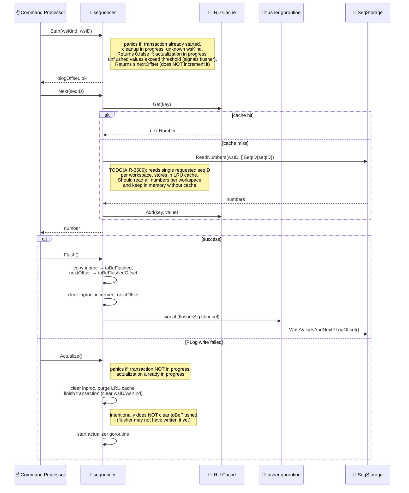
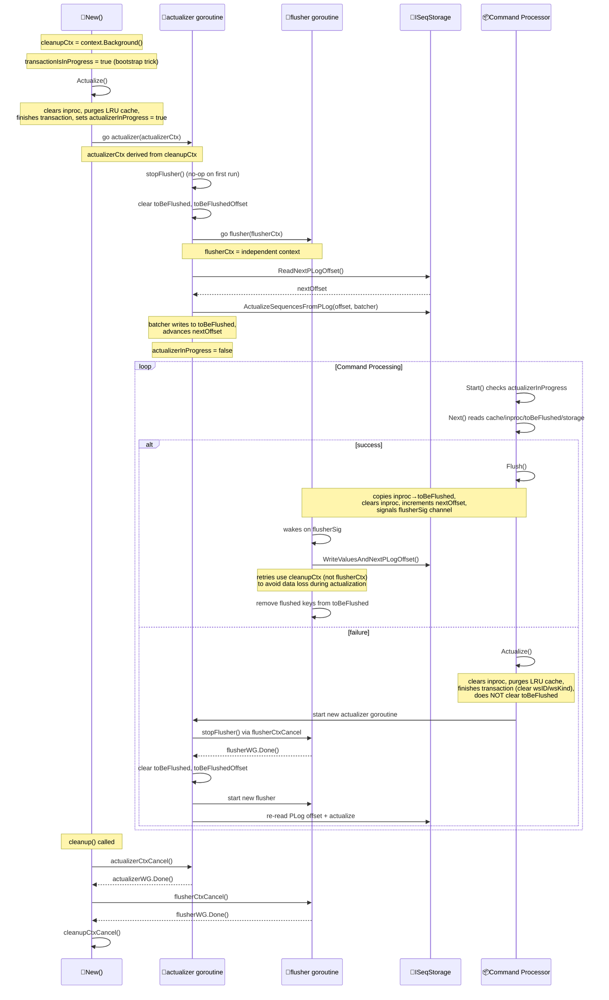

# Context subsystem architecture: Sequences

## Key components

Command processor components (active):

- [appPartition](../../../../pkg/processors/command/provide.go#L41): struct — per-partition state (workspace map, next PLog offset)
- [workspace](../../../../pkg/processors/command/provide.go#L28): struct — per-workspace state (WLog offset, ID generator)
- [implIIDGenerator](../../../../pkg/istructsmem/idgenerator.go#L12): struct — incrementing ID generator per workspace

ISequencer package (implemented, **not yet integrated** into command processor):

- [ISequencer](../../../../pkg/isequencer/interface.go#L47): interface — sequencing transaction API
  - [Start](../../../../pkg/isequencer/impl.go#L25), [Next](../../../../pkg/isequencer/impl.go#L194), [Flush](../../../../pkg/isequencer/impl.go#L270), [Actualize](../../../../pkg/isequencer/impl.go#L426)
- [sequencer](../../../../pkg/isequencer/types.go#L51): struct — implements ISequencer
  - [New](../../../../pkg/isequencer/provide.go#L18): constructor, starts actualizer goroutine
  - [actualizer](../../../../pkg/isequencer/impl.go#L368): goroutine — reads PLog, rebuilds state
  - [flusher](../../../../pkg/isequencer/impl.go#L119): goroutine — writes batched values to storage
  - [cleanup](../../../../pkg/isequencer/impl.go#L455): stops goroutines via context cancellation
- [ISeqStorage](../../../../pkg/isequencer/interface.go#L12): interface — storage abstraction for sequence numbers and PLog offsets
- [IVVMSeqStorageAdapter](../../../../pkg/isequencer/interface.go#L31): interface — low-level VVM storage access
- [Params](../../../../pkg/isequencer/types.go#L38): struct — sequencer configuration (cache size, flush limits, seq types)

ISequencer storage implementations (implemented, **not yet integrated**):

- [implISeqStorage](../../../../pkg/appparts/internal/seqstorage/type.go#L14): struct — implements ISeqStorage
  - [New](../../../../pkg/appparts/internal/seqstorage/provide.go#L14): constructor (per app, per partition)
- [implVVMSeqStorageAdapter](../../../../pkg/vvm/storage/impl_seqstorage.go#L16): struct — implements IVVMSeqStorageAdapter

## Data structures

```go path=pkg/processors/command/provide.go mode=EXCERPT
type appPartition struct {
	workspaces     map[istructs.WSID]*workspace
	nextPLogOffset istructs.Offset
}

type workspace struct {
	NextWLogOffset istructs.Offset
	idGenerator    istructs.IIDGenerator
}
```

```go path=pkg/istructsmem/idgenerator.go mode=EXCERPT
type implIIDGenerator struct {
	nextRecordID istructs.RecordID
	onNewID      func(rawID, storageID istructs.RecordID) error
}

func (g *implIIDGenerator) NextID(rawID istructs.RecordID) (storageID istructs.RecordID, err error) {
	storageID = g.nextRecordID
	g.nextRecordID++
	// ...
}
```

### Key constants

```go path=pkg/istructs/consts.go mode=EXCERPT
const NullRecordID = RecordID(0)
const MinRawRecordID = RecordID(1)
const MaxRawRecordID = RecordID(0xffff)  // 65535

const MinReservedRecordID = MaxRawRecordID + 1  // 65536
const MaxReservedRecordID = RecordID(200000)

const FirstSingletonID = MinReservedRecordID  // 65536
const MaxSingletonID = FirstSingletonID + 0x1ff  // 66047

const FirstUserRecordID = MaxReservedRecordID + 1  // 200001
```

## Key flows

### Initialization

On first access to a workspace:

```go path=pkg/processors/command/impl.go mode=EXCERPT
func (ap *appPartition) getWorkspace(wsid istructs.WSID) *workspace {
	ws, ok := ap.workspaces[wsid]
	if !ok {
		ws = &workspace{
			NextWLogOffset: istructs.FirstOffset,
			idGenerator:    istructsmem.NewIDGenerator(),
		}
		ap.workspaces[wsid] = ws
	}
	return ws
}
```

Initial values:

- `NextWLogOffset = istructs.FirstOffset` (1)
- `nextRecordID = istructs.FirstUserRecordID` (200001)

### Recovery

On partition restart, the entire PLog is scanned:

```go path=pkg/processors/command/impl.go mode=EXCERPT
cb := func(plogOffset istructs.Offset, event istructs.IPLogEvent) (err error) {
	ws := ap.getWorkspace(event.Workspace())

	for rec := range event.CUDs {
		if rec.IsNew() {
			ws.idGenerator.UpdateOnSync(rec.ID())
		}
	}
	// ... handle ODoc IDs ...
	ws.NextWLogOffset = event.WLogOffset() + 1
	ap.nextPLogOffset = plogOffset + 1
	// ...
}

err := cmd.appStructs.Events().ReadPLog(ctx, cmd.cmdMes.PartitionID(),
	istructs.FirstOffset, istructs.ReadToTheEnd, cb)
```

`UpdateOnSync` advances the generator past any persisted ID:

```go path=pkg/istructsmem/idgenerator.go mode=EXCERPT
func (g *implIIDGenerator) UpdateOnSync(syncID istructs.RecordID) {
	if syncID >= g.nextRecordID {
		g.nextRecordID = syncID + 1
	}
	// ...
}
```

### Command processing steps (active)

**1. Get workspace:**

```go path=pkg/processors/command/impl.go mode=EXCERPT
func (cmdProc *cmdProc) getWorkspace(_ context.Context, cmd *cmdWorkpiece) (err error) {
	cmd.workspace = cmd.appPartition.getWorkspace(cmd.cmdMes.WSID())
	return nil
}
```

**2. Build raw event with current offsets:**

```go path=pkg/processors/command/impl.go mode=EXCERPT
func (cmdProc *cmdProc) getRawEventBuilder(_ context.Context, cmd *cmdWorkpiece) (err error) {
	grebp := istructs.GenericRawEventBuilderParams{
		HandlingPartition: cmd.cmdMes.PartitionID(),
		Workspace:         cmd.cmdMes.WSID(),
		QName:             cmd.cmdQName,
		RegisteredAt:      istructs.UnixMilli(cmdProc.time.Now().UnixMilli()),
		PLogOffset:        cmd.appPartition.nextPLogOffset,
		WLogOffset:        cmd.workspace.NextWLogOffset,
	}
	// ...
}
```

**3. Generate IDs for new records:**

```go path=pkg/istructsmem/event-types.go mode=EXCERPT
func (cud *cudType) regenerateIDsPlan(generator istructs.IIDGenerator) (newIDs newIDsPlanType, err error) {
	plan := make(newIDsPlanType)
	for _, rec := range cud.creates {
		id := rec.ID()
		if !id.IsRaw() {
			generator.UpdateOnSync(id)
			continue
		}

		var storeID istructs.RecordID

		if singleton, ok := rec.typ.(appdef.ISingleton); ok && singleton.Singleton() {
			storeID, err = cud.appCfg.singletons.ID(rec.QName())
		} else {
			storeID, err = generator.NextID(id)  // <-- Simple increment
		}
		// ...
	}
	return plan, nil
}
```

**4. Write to PLog and increment offset:**

```go path=pkg/processors/command/impl.go mode=EXCERPT
func (cmdProc *cmdProc) putPLog(_ context.Context, cmd *cmdWorkpiece) (err error) {
	if cmd.pLogEvent, err = cmd.appStructs.Events().PutPlog(cmd.rawEvent, nil, cmd.idGeneratorReporter); err != nil {
		cmd.appPartitionRestartScheduled = true
	} else {
		cmd.appPartition.nextPLogOffset++
	}
	return
}
```

**5. Write to WLog and increment offset:**

```go path=pkg/processors/command/provide.go mode=EXCERPT
err = cmd.appStructs.Events().PutWlog(cmd.pLogEvent)
if err != nil {
	cmd.appPartitionRestartScheduled = true
} else {
	cmd.workspace.NextWLogOffset++
}
```

## ISequencer package internals (implemented, not yet integrated)

> `pkg/isequencer` is fully implemented and tested but not yet wired into the command processor pipeline.
> `IAppPartition` does not expose a `Sequencer()` method. The command processor uses `appPartition`/`workspace`/`implIIDGenerator` directly.

### Sequencing transaction (target flow)



### Goroutine lifecycle and interaction



### Goroutine hierarchy

```text
New()
├── actualizer goroutine [actualizerWG, actualizerCtx ← cleanupCtx]
│   └── flusher goroutine [flusherWG, flusherCtx ← independent]
└── cleanup() cancels all via context chain
```

### Synchronization primitives

- **cleanupCtx / cleanupCtxCancel**: top-level context; cancelled by cleanup() to terminate everything; also used by flusher retries (not flusherCtx) to avoid data loss during actualization
- **actualizerCtx / actualizerCtxCancel**: derived from cleanupCtx; one per Actualize() call; cancelled by cleanup() or next Actualize()
- **flusherCtx / flusherCtxCancel**: independent context; one per actualizer run; cancelled by actualizer on re-actualization or cleanup; controls flusher loop lifecycle but NOT retry scope
- **actualizerWG**: \*sync.WaitGroup (pointer type); tracks actualizer goroutine lifecycle
- **flusherWG**: WaitGroup (value type); tracks flusher goroutine lifecycle
- **flusherSig**: buffered channel [1]; non-blocking signal from Flush()/batcher to wake flusher
- **toBeFlushedMu**: RWMutex; protects toBeFlushed map and toBeFlushedOffset shared between command processor thread, flusher goroutine, and batcher (inside actualizer)
- **actualizerInProgress**: atomic.Bool; Start() returns false when actualization is in progress
- **transactionIsInProgress**: bool; set by Start(), cleared by Flush()/Actualize() via finishSequencingTransaction(); bootstrap: set to true in New() to allow initial Actualize()
- **iTime**: `timeu.ITime` abstraction over time; used by `batcher()` to create delay timers when `toBeFlushed` is full; injected via `New()` for testability
- **retrierCfg**: `retrier.Config`; exponential backoff (500ms base/max, `ResetDelayAfterMaxDelay`) for all storage operations (`ReadNumbers`, `WriteValuesAndNextPLogOffset`, `ReadNextPLogOffset`, `ActualizeSequencesFromPLog`)

## Current sequences

Only **2 sequences** remain:

- **QNameRecordIDSequence** — all record IDs (starts from 200001)
- **QNameWLogOffsetSequence** — WLog offsets (starts from 1)

PLog offset is managed per partition in `appPartition.nextPLogOffset`, not as a separate sequence.

## Summary

Active command processor behavior:

- **Single sequence for all records** (since April 2025) — starts from 200001, no collision risk
- **All workspace state is in memory** (map of workspaces per partition)
- **Simple increment** for ID generation via `implIIDGenerator`
- **Full PLog scan on recovery** to rebuild all workspace states
- **No persistent sequence storage** — everything derived from PLog
- **No batching or caching** — direct increment per request
- **Memory grows** with number of active workspaces per partition
- **Recovery time grows** with PLog size

ISequencer package (implemented, not yet integrated):

- **LRU cache** for sequence numbers to reduce storage reads
- **Batched writes** via flusher goroutine for persistence optimization
- **Persistent ISeqStorage** — stores sequence numbers and PLog offsets
- **Incremental recovery** via actualizer goroutine (reads PLog from last saved offset, not from beginning)
- **Pending integration** — `IAppPartition` does not yet expose `Sequencer()`, command processor does not call `ISequencer`

## Historical context

### Previous design (before April 2025)

The system previously used **multiple separate sequences** for different record types:

- **CRecordIDSequence** — for CRecords, started from `322685000131072`
- **OWRecordIDSequence** — for O/W Records, started from `322680000131072`
- **WLogOffsetSequence** — for WLog offsets, started from `1`
- **PLogOffsetSequence** — for PLog offsets, started from `1`

Record ID sequences could overlap — only 5 billion IDs between OWRecord and CRecord ranges.

### The change (April 29, 2025)

Commit `de5532b17a255f1eaac84bf72187283502d69bda` — PR `#3620` addressing issue `#3600`: one sequence for all records

- **QNameRecordIDSequence** replaces both CRecordIDSequence and OWRecordIDSequence
- Starts from `FirstUserRecordID = 200001`
- Human-readable IDs, no collision risk, simpler Command Processor
- Tradeoff: CRecords are not cached as efficiently
