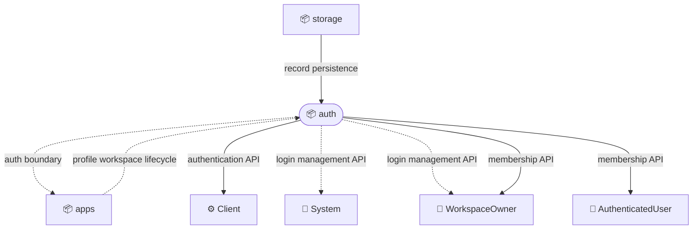
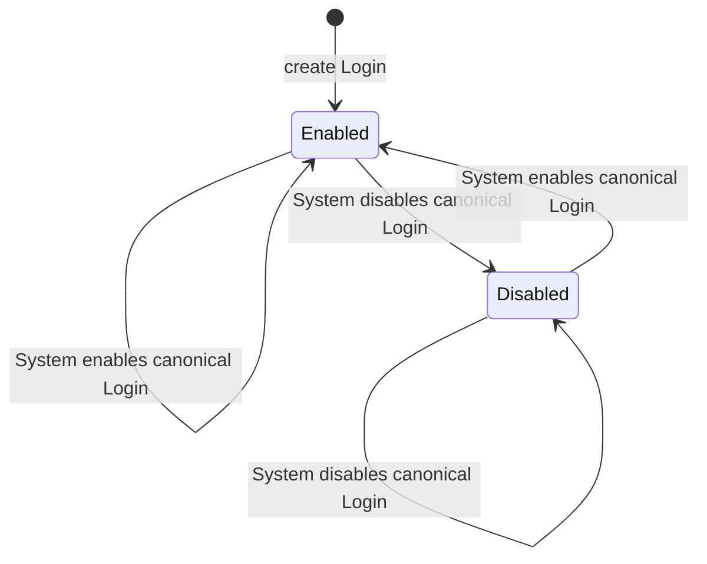
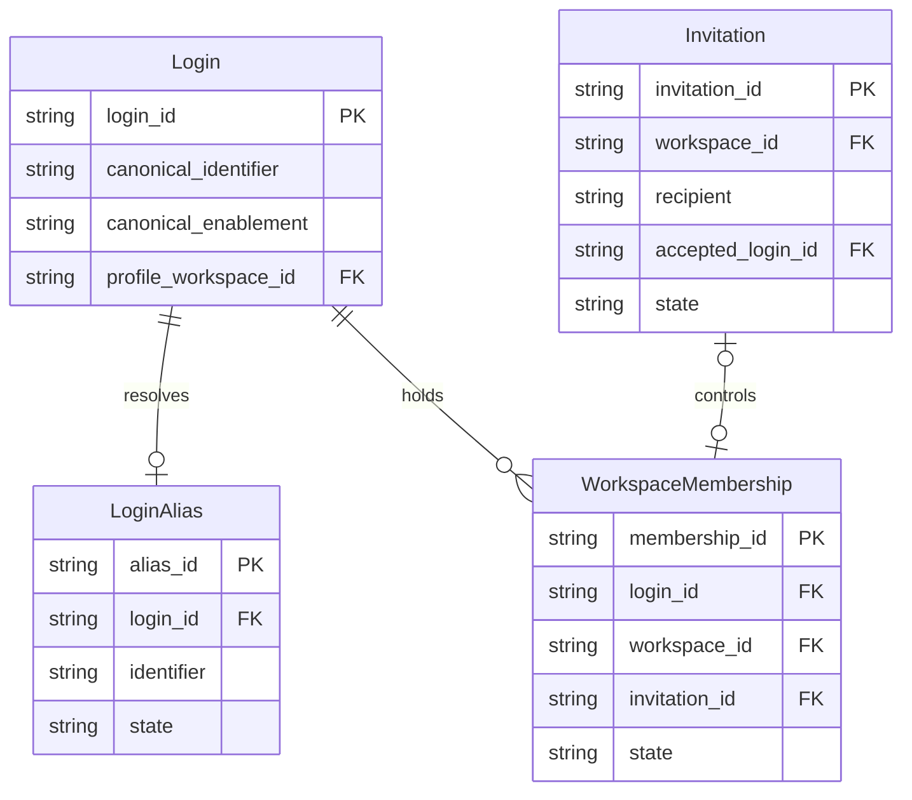

# Bounded Context: auth

## Overview

Auth establishes subject identity, controls access to credentials and tokens, composes principals for authorization, and associates canonical logins with workspace memberships.

Scope:

- Owns Login creation, canonical Login enablement, aliases, credentials, and sign-in eligibility
- Issues, renews, and validates PrincipalToken values and composes Principal values for authorization
- Maintains workspace memberships and their role grants under canonical Login identities
- Exposes trusted Login mutations to System-authorized callers and workspace-scoped Login CDoc reads to registry WorkspaceOwners

Out of scope:

- ProfileWorkspace creation and profile content, which belong to `apps`
- Durable record and event persistence, which belongs to `storage`
- HTTP routing and cluster selection, which belong to `routing`
- Application-specific business operations and ACL declarations

## External actors

Roles:

- 👤 AuthenticatedUser
  - Uses an authenticated identity to access workspaces and manage their own memberships
- 👤 System
  - Performs trusted Login, LoginAlias, role, and canonical enablement management
- 👤 WorkspaceOwner
  - Reads CDocs in owned workspaces and manages memberships in a workspace

Systems:

- ⚙️ Client
  - Creates user or device logins, signs in, manages credentials, and presents PrincipalToken values to Voedger APIs

## Relationships

### Service exposure

Arrows point upstream -> downstream. Edge style encodes the exposure pattern:

- `--->` solid: Open Host Service (ohs) - public, general-purpose contract for many consumers
- `-..->` dotted: Customer-Supplier (c/s) - contract tailored to one or a few known consumers

#### apps -> auth: profile workspace lifecycle (c/s)

Upstream:

- Creates ProfileWorkspace instances for new Login identities and reports their identifiers and readiness
- Supporting design: [application workspace architecture](../apps/arch.md)

Downstream:

- References the ProfileWorkspace from Login
- Requires ProfileWorkspace readiness before issuing the first PrincipalToken

#### storage -> auth: record persistence (ohs)

Upstream:

- Provides durable, workspace-scoped persistence for auth records and lifecycle events
- Supporting design: [structured storage architecture](../storage/structs--arch.md)

Downstream:

- Persists Login, LoginAlias, and WorkspaceMembership state without exposing storage concepts in auth contracts

#### auth: auth boundary (c/s)

Provider:

- Contract: validates a presented PrincipalToken and returns Principal values plus the ProfileWorkspace identifier
- Supporting design: [auth context architecture](./arch.md)

Consumers:

- 📦 apps
  - Uses the returned principals as inputs to application ACL evaluation

#### auth: authentication API (ohs)

Provider:

- Contract: Login creation, sign-in, credential recovery, PrincipalToken issue, and PrincipalToken renewal
- Behavior: [authentication scenarios](./authn.feature)

Consumers:

- ⚙️ Client
  - Establishes and renews user or device identity without learning whether a rejected canonical Login is disabled

#### auth: login management API (c/s)

Provider:

- Contract: trusted LoginAlias, role, and CanonicalLoginEnablement mutation plus full Login CDoc reads
- Authorization: System PrincipalToken for mutations; System or WorkspaceOwner of the target registry workspace for Login CDoc reads

Consumers:

- 👤 System
  - Reads and changes canonical Login state while public callers receive non-disclosing failures
- 👤 WorkspaceOwner
  - Reads the full Login CDoc, including canonical enablement and LoginAlias lifecycle state, only in the target registry workspace it owns

#### auth: membership API (ohs)

Provider:

- Contract: workspace invitation, acceptance, role update, removal, and leave operations
- Behavior: [workspace invitation scenarios](./invites.feature)

Consumers:

- 👤 AuthenticatedUser
  - Accepts invitations and leaves workspaces under their canonical Login identity
- 👤 WorkspaceOwner
  - Invites members, changes granted roles, and removes members

## Model specification

### Entities

#### Invitation (aggregate)

A workspace-scoped offer of roles to a recipient identified by a SignInIdentifier.

References: an inviting workspace and, after acceptance, the canonical `Login` and resulting `WorkspaceMembership`.

Fields:

| Field | Type | Description |
|-------|------|-------------|
| `invitation_id` | `string` | Stable identity of the Invitation |
| `workspace_id` | `string` | Workspace offering membership |
| `recipient` | `SignInIdentifier` | Canonical or alias identifier to which the Invitation is addressed |
| `roles` | `RoleSet` | Roles offered in the workspace |
| `state` | `enum(Pending, Joined, Cancelled, Left)` | Current invitation lifecycle state |
| `accepted_login_id` | `string?` | Canonical Login that accepted the Invitation |

Invariants:

- Only a Login whose canonical SignInIdentifier or active LoginAlias matches the recipient can accept an Invitation.
- Acceptance records the canonical Login identity even when the Invitation was addressed to an alias.
- One active WorkspaceMembership has exactly one controlling joined Invitation.
- Replacing the controlling Invitation preserves one WorkspaceMembership and retires the previous joined Invitation.

#### Login (aggregate)

The canonical registry identity through which a user or device authenticates in an application.

Embeds: `CanonicalLoginEnablement`, `Credential`.
References: an optional active `LoginAlias` and a ProfileWorkspace owned by `apps`.
Referenced by: `WorkspaceMembership`.

Fields:

| Field | Type | Description |
|-------|------|-------------|
| `login_id` | `string` | Stable internal identity of the Login |
| `canonical_identifier` | `SignInIdentifier` | Primary sign-in identifier, reserved while the Login remains active |
| `subject_kind` | `enum(User, Device)` | Kind of subject represented by the Login |
| `canonical_enablement` | `CanonicalLoginEnablement` | Reversible availability of the canonical SignInIdentifier, independent of registry activation |
| `credential` | `Credential` | Current authentication proof or verifier |
| `active_alias_id` | `string?` | Reference to the active LoginAlias, when one exists |
| `profile_workspace_id` | `string` | Reference to the subject's ProfileWorkspace |

Invariants:

- A newly created Login has `CanonicalLoginEnablement` set to `Enabled`.
- Only `👤 System` can disable or enable the canonical Login, and setting its current state again succeeds without another state change.
- `👤 System` or `👤 WorkspaceOwner` of the target registry workspace can read the full Login CDoc; ownership of another workspace does not grant access.
- A canonically `Disabled` Login remains active in the registry and continues to reserve its canonical `SignInIdentifier`.
- Disabling the canonical Login does not change its Credential, active LoginAlias, ProfileWorkspace reference, or WorkspaceMembership records.
- Issuing a PrincipalToken or initiating password reset through the canonical SignInIdentifier requires `CanonicalLoginEnablement` to be `Enabled`.
- An active LoginAlias remains usable for PrincipalToken issue and password reset regardless of `CanonicalLoginEnablement`.
- Password change, password-reset completion, PrincipalToken validation, and PrincipalToken renewal do not read `CanonicalLoginEnablement`.
- Public canonical sign-in and recovery-initiation contracts do not distinguish a canonically `Disabled` Login from an unknown Login or invalid Credential.

State transitions:

Registry deactivation is a separate lifecycle and is not represented by this enablement state machine.

#### LoginAlias (aggregate)

An alternative SignInIdentifier that resolves to one canonical Login.

References: `Login`.

Fields:

| Field | Type | Description |
|-------|------|-------------|
| `alias_id` | `string` | Stable identity of the LoginAlias record |
| `login_id` | `string` | Canonical Login resolved by the alias |
| `identifier` | `SignInIdentifier` | Alternative sign-in value |
| `state` | `enum(Active, Inactive)` | Whether the alias can resolve sign-in and recovery requests |

Invariants:

- A Login has at most one active LoginAlias.
- Canonical and alias SignInIdentifier values share one uniqueness namespace.
- Disabling the canonical Login does not deactivate its active LoginAlias or release the alias identifier.
- An active LoginAlias remains usable for sign-in and recovery while the canonical Login is `Disabled`; clearing the LoginAlias is the only way to disable alias operations.

#### WorkspaceMembership (aggregate)

A Login's role-bearing association with one workspace.

References: `Login` and a workspace owned by `apps`.
Controlled by: one joined `Invitation` while active.

Fields:

| Field | Type | Description |
|-------|------|-------------|
| `membership_id` | `string` | Stable identity of the membership |
| `login_id` | `string` | Canonical Login that holds the membership |
| `workspace_id` | `string` | Workspace in which roles are granted |
| `invitation_id` | `string` | Controlling joined Invitation |
| `roles` | `RoleSet` | Application roles granted in the workspace |
| `state` | `enum(Active, Inactive)` | Whether the membership contributes roles |

Invariants:

- One canonical Login has at most one active WorkspaceMembership in a workspace.
- Canonical Login disablement does not change membership state or roles.
- Access through an active LoginAlias or an existing PrincipalToken continues while the canonical Login is `Disabled`.
- Re-enabling the canonical Login restores its canonical entry operations without recreating memberships.

### ERD

### Value Objects

#### CanonicalLoginEnablement

The reversible availability state of a Login's canonical SignInIdentifier.

Values:

- `Enabled` - the canonical SignInIdentifier can issue a PrincipalToken and initiate password reset
- `Disabled` - those two canonical entry operations are rejected while active LoginAlias and all other Login operations remain unchanged

#### Credential

Authentication evidence or stored verifier associated with a Login; secret values are never exposed by public contracts.

Fields:

| Field | Type | Description |
|-------|------|-------------|
| `kind` | `enum(Password, VerifiedValue)` | Proof mechanism used by an authentication or recovery operation |
| `verifier` | `string` | Protected representation used to validate the presented proof |

#### Principal

An authenticated identity or role used as input to authorization.

Fields:

| Field | Type | Description |
|-------|------|-------------|
| `kind` | `enum(User, Device, Role, Host)` | Principal category |
| `name` | `string` | Login, role, or host name represented by the Principal |
| `workspace_id` | `string?` | Workspace scope when the Principal is workspace-specific |

#### PrincipalToken

An app-scoped bearer value carrying an immutable identity snapshot until expiration.

Fields:

| Field | Type | Description |
|-------|------|-------------|
| `canonical_login` | `SignInIdentifier` | Canonical Login captured when the token is issued |
| `alias` | `SignInIdentifier?` | Active LoginAlias captured when the token is issued |
| `subject_kind` | `enum(User, Device)` | Subject kind captured from Login |
| `profile_workspace_id` | `string` | ProfileWorkspace reference captured from Login |
| `workspace_roles` | `list<RoleGrant>` | Workspace-scoped roles captured or enriched into the token |
| `global_roles` | `RoleSet` | Roles applicable across workspaces |
| `api_token` | `boolean` | Whether restricted API-token principal composition applies |
| `expires_at` | `timestamp` | Normal expiration boundary |

Invariants:

- PrincipalToken validity depends on signature, application audience, and expiration, not a live Login lookup.
- PrincipalToken validation and renewal do not read `CanonicalLoginEnablement`.
- LoginAlias or canonical enablement changes do not rewrite an already-issued PrincipalToken.

#### RoleGrant

A role assignment scoped to one workspace.

Fields:

| Field | Type | Description |
|-------|------|-------------|
| `workspace_id` | `string` | Workspace in which the role applies |
| `role` | `string` | Qualified application role name |

#### RoleSet

An unordered, duplicate-free set of application role names.

#### SignInIdentifier

A validated value used as either a canonical Login identifier or LoginAlias identifier within one application-wide uniqueness namespace.

#### VerifiedValueToken

A short-lived, single-use Credential proving control of one verified value for a declared authentication or recovery purpose.

Fields:

| Field | Type | Description |
|-------|------|-------------|
| `value` | `string` | Verified value bound to the token |
| `purpose` | `string` | Operation for which the proof can be consumed |
| `expires_at` | `timestamp` | Expiration boundary of the proof |
