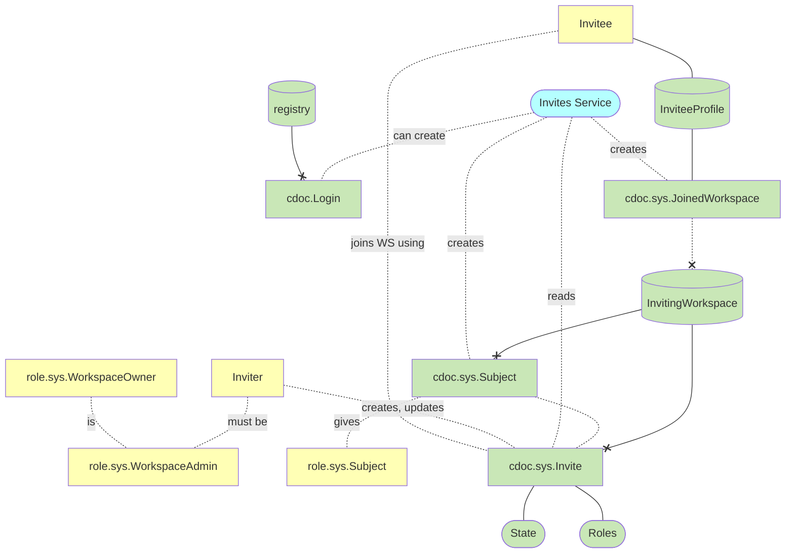
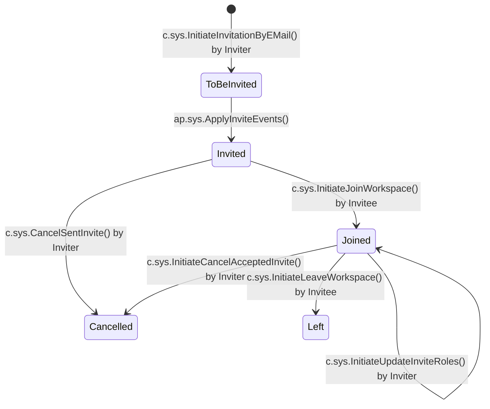
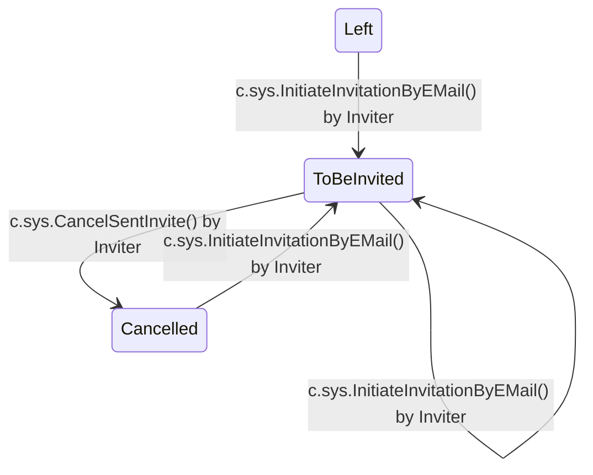

# Feature technical design: Invites

Invite users/devices to workspaces

## Use cases

- Invite to workspace
- As a workspace owner I want to change invited user's roles
- As a user, I want to see the list of my workspaces and roles, so that I know what I can work with
- As a user, I want to be able to leave the workspace I'm invited to
- As a workspace owner I want to ban a user so they no longer have access to my workspace

---

## Overview

Roles and permissions (from VSQL):

- `WorkspaceOwner`: manages invitations, roles, and membership (WorkspaceOwnerFuncTag)
- `AuthenticatedUser`: can join and leave workspaces (AllowedToAuthenticatedTag)

Key documents:

- `cdoc.sys.Invite`: tracks invitation status and metadata
- `cdoc.sys.Subject`: represents an invited user/device in the workspace
- `cdoc.sys.JoinedWorkspace`: records workspace membership in invitee's profile

Invitation management:

- `c.sys.InitiateInvitationByEMail`: creates new invitation (WorkspaceOwner)
  - Params: Email, Roles, ExpireDatetime, EmailTemplate, EmailSubject
- `c.sys.InitiateJoinWorkspace`: processes invite acceptance (AuthenticatedUser)
  - Params: InviteID, VerificationCode

Role management:

- `c.sys.InitiateUpdateInviteRoles`: updates member permissions (WorkspaceOwner)
  - Params: InviteID, Roles, EmailTemplate, EmailSubject

Membership termination:

- `c.sys.InitiateCancelAcceptedInvite`: owner removes joined member (WorkspaceOwner)
  - Params: InviteID
- `c.sys.InitiateLeaveWorkspace`: member voluntarily leaves (AuthenticatedUser)
  - No params (invite found by login from auth token)
- `c.sys.CancelSentInvite`: cancels pending invitation (WorkspaceOwner)
  - Params: InviteID

Internal commands (called by projectors via Federation):

- `c.sys.CreateJoinedWorkspace`: creates JoinedWorkspace record in invitee's profile
- `c.sys.UpdateJoinedWorkspaceRoles`: updates roles in invitee's JoinedWorkspace
- `c.sys.DeactivateJoinedWorkspace`: deactivates JoinedWorkspace when member removed

---

## Technical design

### Data

---

### Invite state diagram

Final states: Invited, Joined, Cancelled, Left (written by projector).
Transient state: ToBeInvited (written by command, transitioned to Invited by projector).
Dead states (ToBeJoined, ToUpdateRoles, ToBeCancelled, ToBeLeft) -- only in old data, no longer written.

`InitiateInvitationByEMail` writes State=ToBeInvited (CDoc must have a State on
creation; on re-invite it resets State so projector knows to send a new email).
All final state transitions are performed by `ap.sys.ApplyInviteEvents` projector.

Re-invite and recovery transitions:

---

### Single projector design

Commands do pre-validation (immediate 400 for invalid requests).
The projector re-validates actual state before applying transitions (source of truth).

`ap.sys.ApplyInviteEvents` is the sole writer of final states on `cdoc.sys.Invite`.
It triggers on all 6 invite commands and handles each event type:

- `InitiateInvitationByEMail`: ToBeInvited -> Invited, send invitation email
- `InitiateJoinWorkspace`: Invited -> Joined, create Subject, create JoinedWorkspace via federation
- `InitiateUpdateInviteRoles`: keep State=Joined, update Roles on Invite CDoc, update Subject/JoinedWorkspace roles via federation, send email
- `InitiateCancelAcceptedInvite`: Joined -> Cancelled, deactivate Subject/JoinedWorkspace via federation
- `InitiateLeaveWorkspace`: Joined -> Left, set IsActive=false, deactivate Subject/JoinedWorkspace via federation
- `CancelSentInvite`: Invited/ToBeInvited -> Cancelled

If actual state does not match the expected source state for the event, the projector skips the event (stale).

Projector gets InviteID from:

- `event.ArgumentObject().AsRecordID(field_InviteID)` for commands that have InviteID param
- `InitiateInvitationByEMail`: from event CUDs (command creates/updates Invite CDoc)
- `InitiateLeaveWorkspace`: from event CUDs. Command has no InviteID param and
  projector has no access to auth token, so command keeps a no-op CUD on the
  Invite CDoc (touch record, no meaningful field writes) as the only way to
  pass InviteID to the projector

Dead ToBe states in old data are treated as their source state:

- ToBeJoined -> treat as Invited (apply join)
- ToUpdateRoles -> treat as Joined (apply role update)
- ToBeCancelled -> treat as Joined (apply cancel)
- ToBeLeft -> treat as Joined (apply leave)

---

### Documents

#### cdoc.sys.Invite

- SubjectKind int32 // 1: User, 2: Device
- Login varchar NOT NULL // email address set by InitiateInvitationByEMail
- Email varchar NOT NULL // same as Login
- Roles varchar(1024)
- ExpireDatetime int64 // unix-timestamp
- VerificationCode varchar // set by ap.sys.ApplyInviteEvents
- State int32 NOT NULL // see state diagram; ToBeInvited by command, final states by projector
- Created int64 // unix-timestamp, set on creation
- Updated int64 NOT NULL // unix-timestamp, updated on every state change
- SubjectID ref // set by ap.sys.ApplyInviteEvents
- InviteeProfileWSID int64 // set by c.sys.InitiateJoinWorkspace
- ActualLogin varchar // invitee's login from token, set by c.sys.InitiateJoinWorkspace
- UNIQUEFIELD Email

#### cdoc.sys.Subject

- Login varchar NOT NULL // Invite.ActualLogin (invitee's login from token)
- SubjectKind int32 NOT NULL // 1: User, 2: Device
- Roles varchar(1024) NOT NULL // comma-separated
- ProfileWSID int64 NOT NULL
- UNIQUEFIELD Login

#### cdoc.sys.JoinedWorkspace

Stored in invitee's profile workspace.

- Roles varchar(1024) NOT NULL // comma-separated
- InvitingWorkspaceWSID int64 NOT NULL
- WSName varchar NOT NULL

---

## Decisions

### Single projector as sole writer of final states

Commands and projectors previously both wrote to the Invite CDoc, causing TOCTOU
races and requiring guards and validated commands (CompleteInvitation,
CompleteJoinWorkspace) as mitigation.

New design: a single projector (`ap.sys.ApplyInviteEvents`) is the sole writer
of final states (Invited, Joined, Cancelled, Left). It processes events in PLog
order -- serialized, no races.

`InitiateInvitationByEMail` writes transient State=ToBeInvited because the CDoc
must have a State on creation (and on re-invite, to signal the projector).
`InitiateJoinWorkspace` writes data fields from the auth token (InviteeProfileWSID,
SubjectKind, ActualLogin) but does not write State. `InitiateLeaveWorkspace`
keeps a no-op CUD to pass InviteID to the projector (no InviteID param, no auth
token in projector). All other commands do no CUD.

### Stale event handling

Between command pre-validation and projector execution, other events may change
the invite state. The projector re-validates actual state before applying
transitions. If the state no longer matches the expected source state for the
event, the projector skips it silently.

Example: user calls CancelSentInvite (pre-validates state=Invited, creates
event), then another command changes state before the projector runs. The
projector sees the new state, determines the cancel event is stale, and skips.

### Federation side effects and eventual consistency

`ApplyInviteEvents` makes federation calls (create Subject, create/update/
deactivate JoinedWorkspace) before writing the final state. If the projector
fails after federation calls but before state write, the calls are already
applied. On retry, the projector re-applies them (operations are idempotent).

If a cancel event arrives while a join is in progress, the join's side effects
(Subject, JoinedWorkspace) persist briefly. The cancel event's handler
eventually deactivates them, so the system converges to the correct state.
