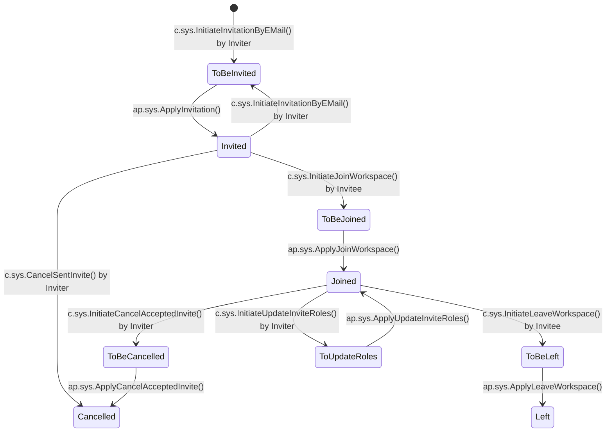
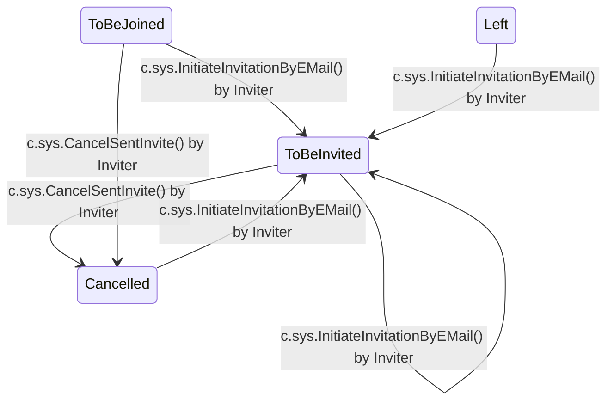

# Feature technical design: Invites

Invite users/devices to workspaces

## Use cases

- Invite to workspace
- As a workspace owner I want to change invited user's roles
- As a user, I want to see the list of my workspaces and roles, so that I know what am I available to work with
- As a user, I want to be able to leave the workspace I'm invited to
- As a workspace owner I want to ban user to he doesn't have access to my workspace anymore

---

## Overview

Roles and permissions (from VSQL):

- `WorkspaceOwner`: manages invitations, roles, and membership (WorkspaceOwnerFuncTag)
- `AuthenticatedUser`: can join and leave workspaces (AllowedToAuthenticatedTag)

Key documents:

- `cdoc.sys.Invite`: tracks invitation status and metadata
- `cdoc.sys.Subject`: represents an invited user/device in the workspace
- `cdoc.sys.JoinedWorkspace`: records workspace membership in invitee's profile

Invitation management:

- `c.sys.InitiateInvitationByEMail`: creates new invitation (WorkspaceOwner)
  - Params: Email, Roles, ExpireDatetime, EmailTemplate, EmailSubject
- `c.sys.InitiateJoinWorkspace`: processes invite acceptance (AuthenticatedUser)
  - Params: InviteID, VerificationCode

Role management:

- `c.sys.InitiateUpdateInviteRoles`: updates member permissions (WorkspaceOwner)
  - Params: InviteID, Roles, EmailTemplate, EmailSubject

Membership termination:

- `c.sys.InitiateCancelAcceptedInvite`: owner removes joined member (WorkspaceOwner)
- `c.sys.InitiateLeaveWorkspace`: member voluntarily leaves (AuthenticatedUser)
- `c.sys.CancelSentInvite`: cancels pending invitation (WorkspaceOwner)

Internal commands (called by projectors via Federation):

- `c.sys.CreateJoinedWorkspace`: creates JoinedWorkspace record in invitee's profile
- `c.sys.UpdateJoinedWorkspaceRoles`: updates roles in invitee's JoinedWorkspace
- `c.sys.DeactivateJoinedWorkspace`: deactivates JoinedWorkspace when member removed

---

## Technical design

### Data

```mermaid
    flowchart TD

    WorkspaceOwner["role.sys.WorkspaceOwner"]:::B
    WorkspaceAdmin["role.sys.WorkspaceAdmin"]:::B
    SubjectRole["role.sys.Subject"]:::B
    Inviter["Inviter"]:::B
    Invitee["Invitee"]:::B


    registry[(registry)]:::H
        Login["cdoc.Login"]:::H

    InviteeProfile[(InviteeProfile)]:::H
    JoinedWorkspace["cdoc.sys.JoinedWorkspace"]:::H


    InvitingWorkspace[(InvitingWorkspace)]:::H
        InvitingWorkspace --x Invite["cdoc.sys.Invite"]:::H
        Invite --- State(["State"]):::H
        Invite --- InviteRoles(["Roles"]):::H
        InvitingWorkspace --x Subject["cdoc.sys.Subject"]:::H

    InvitesService([Invites Service]):::S

    Subject -.- Invite
    Subject -.- |gives| SubjectRole

    InviteeProfile --- JoinedWorkspace

    InvitesService -.- |creates| Subject
    InvitesService -.- |reads| Invite
    InvitesService -.- |can create| Login
    InvitesService -.- |creates| JoinedWorkspace

    Inviter -.- |creates, updates| Invite
    Inviter -.- |must be| WorkspaceAdmin

    WorkspaceOwner -.- |is| WorkspaceAdmin

    registry --x Login

    Invitee x-.- |joins WS using| Invite
    Invitee --- InviteeProfile

    JoinedWorkspace -.-x InvitingWorkspace


    classDef G fill:#FFFFFF,color:#333,stroke:#000000, stroke-width:1px, stroke-dasharray: 5 5
    classDef B fill:#FFFFB5,color:#333
    classDef S fill:#B5FFFF,color:#333
    classDef H fill:#C9E7B7,color:#333

```



---

### Invite state diagram



**Extra** (re-invite and recovery transitions):



---

### Projector guards

Async projectors must check invite state before doing work. If state changed (recovery action happened), projector skips silently.

Guard rules:

- `ap.sys.ApplyInvitation`: skip unless `State == ToBeInvited`
- `ap.sys.ApplyJoinWorkspace`: skip unless `State == ToBeJoined`

Projectors use commands for final state transitions instead of direct CUD. Commands validate state and return error if state changed during projector execution:

- `c.sys.CompleteInvitation` (ToBeInvited -> Invited): called by `ap.sys.ApplyInvitation`
- `c.sys.CompleteJoinWorkspace` (ToBeJoined -> Joined): called by `ap.sys.ApplyJoinWorkspace`

Flow:

```text
Projector starts
  |-> Guard: check state == expected?
  |   |-> No: skip (return nil)
  |   |-> Yes: continue
  |-> Do work (send email, create subject)
  |-> Call command (validates state again)
      |-> State changed? Error -> projector fails -> reapplied -> guard skips
      |-> State still expected? Transition to final state
```

---

### Documents

#### cdoc.sys.Invite

- SubjectKind int32 // 1: User, 2: Device
- Login varchar NOT NULL // email address set by InitiateInvitationByEMail
- Email varchar NOT NULL // same as Login
- Roles varchar(1024)
- ExpireDatetime int64 // unix-timestamp
- VerificationCode varchar // set by ap.sys.ApplyInvitation
- State int32 NOT NULL // see state diagram
- Created int64 // unix-timestamp, set on creation
- Updated int64 NOT NULL // unix-timestamp, updated on every state change
- SubjectID ref // set by ap.sys.ApplyJoinWorkspace
- InviteeProfileWSID int64 // set by c.sys.InitiateJoinWorkspace
- ActualLogin varchar // invitee's login from token, set by c.sys.InitiateJoinWorkspace
- UNIQUEFIELD Email

#### cdoc.sys.Subject

- Login varchar NOT NULL // Invite.ActualLogin (invitee's login from token)
- SubjectKind int32 NOT NULL // 1: User, 2: Device
- Roles varchar(1024) NOT NULL // comma-separated
- ProfileWSID int64 NOT NULL
- UNIQUEFIELD Login

#### cdoc.sys.JoinedWorkspace

Stored in invitee's profile workspace.

- Roles varchar(1024) NOT NULL // comma-separated
- InvitingWorkspaceWSID int64 NOT NULL
- WSName varchar NOT NULL

---

## Decisions

### Accept TOCTOU window for projector side effects

There is a TOCTOU window between the projector guard and the final validated
command. If the invite is cancelled and re-invited during this window, the state
returns to `ToBeInvited` and the validated command succeeds against a stale
event.

`ApplyInvitation`: if the invite is cancelled and re-invited while the
projector is executing, `CompleteInvitation` succeeds (state is `ToBeInvited`
again), and a stale email is sent with the original event's template and
verification code. The re-invite's own `ApplyInvitation` then sees state
`Invited` and skips -- the re-invite email is never sent.

`ApplyJoinWorkspace` execution order:

```text
1. Guard: state == ToBeJoined? Yes -> continue
2. Federation call: create Subject (or reactivate existing)  <-- immediate HTTP call, takes effect NOW
3. Federation call: CreateJoinedWorkspace in invitee's profile  <-- immediate HTTP call, takes effect NOW
4. Federation call: CompleteJoinWorkspace (ToBeJoined -> Joined)  <-- validates state
```

Steps 2-3 are immediate HTTP requests, NOT intents. If `CancelSentInvite` runs
after step 1 but before step 4, the Subject and JoinedWorkspace are already
created in their respective workspaces. Step 4 rejects the transition (state is
`Cancelled`, not `ToBeJoined`), but the side effects remain. There is a brief
window where the user has workspace access they should not have. The cancel
flow's own projectors (`ApplyCancelAcceptedInvite`) eventually deactivate the
Subject and JoinedWorkspace, so the system converges to the correct state.

Side effects are benign:

- Stale invitation email: contains a verification code that leads to a valid join (state was re-set to `ToBeInvited` then transitioned to `Invited`)
- Subject/JoinedWorkspace: cleaned up by the cancel/leave projector that runs for the new state
- All operations are idempotent, so re-execution on projector retry is safe

For the simple cancel-only case (no re-invite), `CompleteInvitation` fails,
the projector returns an error, flush never runs, and the email is never sent.
`CompleteJoinWorkspace` similarly rejects the transition.

Eliminating the window would require distributed transactions or saga
compensation, which is disproportionate to the impact.
