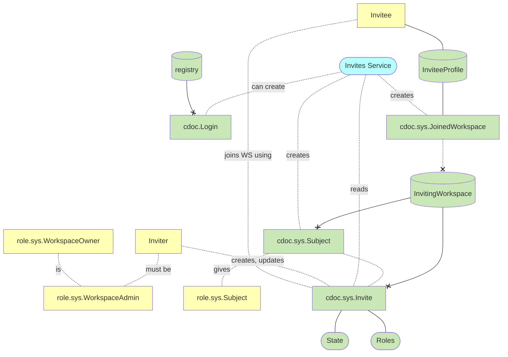
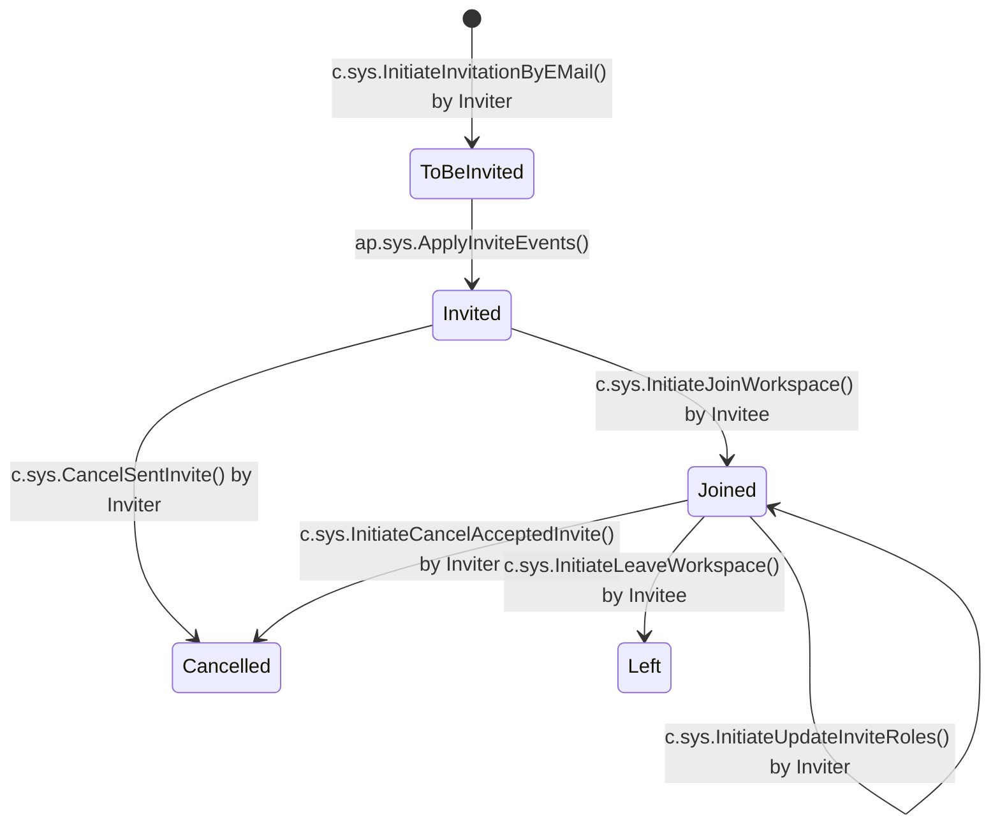
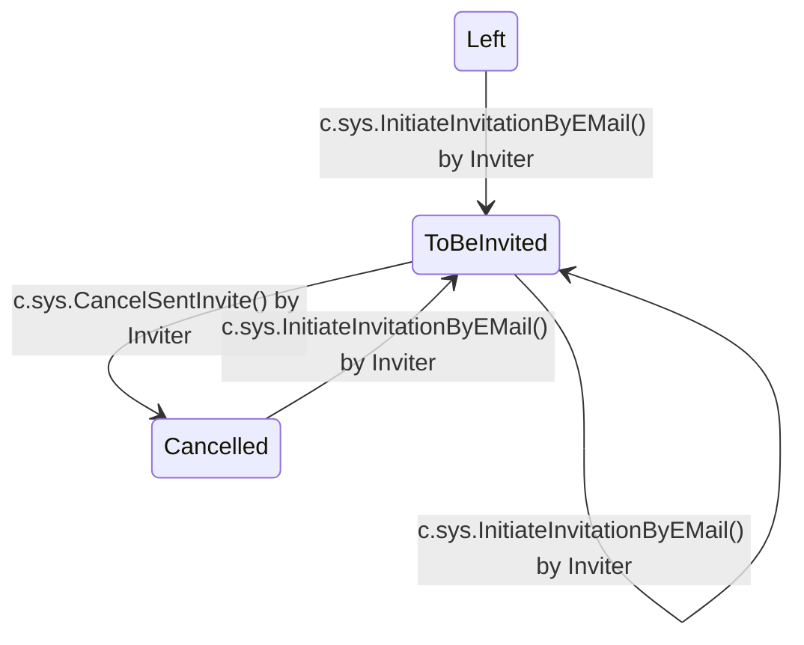

# Feature technical design: Invites

Invite users/devices to workspaces. The subsystem architecture for invite lifecycle, the subjects doc, joined-workspace records, role updates, and member removal is in [arch-membership.md](./arch-membership.md); how the resulting `[(cdoc.sys.Subject)]` is consumed on every request is in [arch-authz.md](./arch-authz.md); shared concepts (`[(cdoc.sys.Subject)]`, `[(registry.Login)]`) are defined in [arch.md](./arch.md#shared-concepts). This document adds per-scenario flows plus the projector-as-sole-writer design, the `Version` discriminator, dead-state handling, and decisions that are unique to this feature.

## Use cases

- Invite to workspace
- As a workspace owner I want to change invited user's roles
- As a user, I want to see the list of my workspaces and roles, so that I know what I can work with
- As a user, I want to be able to leave the workspace I'm invited to
- As a workspace owner I want to ban a user so they no longer have access to my workspace

---

## Overview

Roles, documents, and commands of the invite lifecycle (owner-side and invitee-side commands, projector-emitted internal commands, `[(cdoc.sys.Invite)]` / `[(cdoc.sys.Subject)]` / `[(cdoc.sys.JoinedWorkspace)]`) are catalogued in [arch-membership.md](./arch-membership.md#components). This document does not repeat them; the parameter lists and ACL bindings (`WorkspaceOwnerFuncTag`, `AllowedToAuthenticatedTag`) are kept inline with the corresponding VSQL in `pkg/sys/sys.vsql`.

---

## Technical design

### Data


```mermaid
    flowchart TD

    WorkspaceOwner["role.sys.WorkspaceOwner"]:::B
    WorkspaceAdmin["role.sys.WorkspaceAdmin"]:::B
    SubjectRole["role.sys.Subject"]:::B
    Inviter["Inviter"]:::B
    Invitee["Invitee"]:::B


    registry[(registry)]:::H
        Login["cdoc.Login"]:::H

    InviteeProfile[(InviteeProfile)]:::H
    JoinedWorkspace["cdoc.sys.JoinedWorkspace"]:::H


    InvitingWorkspace[(InvitingWorkspace)]:::H
        InvitingWorkspace --x Invite["cdoc.sys.Invite"]:::H
        Invite --- State(["State"]):::H
        Invite --- InviteRoles(["Roles"]):::H
        InvitingWorkspace --x Subject["cdoc.sys.Subject"]:::H

    InvitesService([Invites Service]):::S

    Subject -.- Invite
    Subject -.- |gives| SubjectRole

    InviteeProfile --- JoinedWorkspace

    InvitesService -.- |creates| Subject
    InvitesService -.- |reads| Invite
    InvitesService -.- |can create| Login
    InvitesService -.- |creates| JoinedWorkspace

    Inviter -.- |creates, updates| Invite
    Inviter -.- |must be| WorkspaceAdmin

    WorkspaceOwner -.- |is| WorkspaceAdmin

    registry --x Login

    Invitee x-.- |joins WS using| Invite
    Invitee --- InviteeProfile

    JoinedWorkspace -.-x InvitingWorkspace


    classDef G fill:#FFFFFF,color:#333,stroke:#000000, stroke-width:1px, stroke-dasharray: 5 5
    classDef B fill:#FFFFB5,color:#333
    classDef S fill:#B5FFFF,color:#333
    classDef H fill:#C9E7B7,color:#333

```

---

### Invite state diagram

Final states: Invited, Joined, Cancelled, Left (written by projector).
Transient state: ToBeInvited (written by command, transitioned to Invited by projector).
Dead states (ToBeJoined, ToUpdateRoles, ToBeCancelled, ToBeLeft) -- only in old data, no longer written.

`InitiateInvitationByEMail` writes State=ToBeInvited (CDoc must have a State on
creation; on re-invite it resets State so projector knows to send a new email).
All final state transitions are performed by `ap.sys.ApplyInviteEvents` projector.


```mermaid
stateDiagram-v2

    [*] --> ToBeInvited : c.sys.InitiateInvitationByEMail() by Inviter

    ToBeInvited --> Invited : ap.sys.ApplyInviteEvents()

    Invited --> Joined : c.sys.InitiateJoinWorkspace() by Invitee
    Invited --> Cancelled : c.sys.CancelSentInvite() by Inviter

    Joined --> Cancelled : c.sys.InitiateCancelAcceptedInvite() by Inviter
    Joined --> Left : c.sys.InitiateLeaveWorkspace() by Invitee
    Joined --> Joined : c.sys.InitiateUpdateInviteRoles() by Inviter
```

Re-invite and recovery transitions:


```mermaid
stateDiagram-v2

    ToBeInvited --> ToBeInvited : c.sys.InitiateInvitationByEMail() by Inviter
    ToBeInvited --> Cancelled : c.sys.CancelSentInvite() by Inviter
    Cancelled --> ToBeInvited : c.sys.InitiateInvitationByEMail() by Inviter
    Left --> ToBeInvited : c.sys.InitiateInvitationByEMail() by Inviter
```

---

### Single projector design

Commands do pre-validation (immediate 400 for invalid requests).
The projector re-validates actual state before applying transitions (source of truth).

`ap.sys.ApplyInviteEvents` is the sole writer of final states on `cdoc.sys.Invite`.
It triggers on all 6 invite commands and handles each event type:

- `InitiateInvitationByEMail`: ToBeInvited -> Invited, send invitation email
- `InitiateJoinWorkspace`: Invited -> Joined, create Subject, create JoinedWorkspace via federation
- `InitiateUpdateInviteRoles`: keep State=Joined, update Roles on Invite CDoc, update Subject/JoinedWorkspace roles via federation, send email
- `InitiateCancelAcceptedInvite`: Joined -> Cancelled, deactivate Subject/JoinedWorkspace via federation
- `InitiateLeaveWorkspace`: Joined -> Left, set IsActive=false, deactivate Subject/JoinedWorkspace via federation
- `CancelSentInvite`: Invited/ToBeInvited -> Cancelled

If actual state does not match the expected source state for the event, the projector skips the event (stale).

Pre-refactor events are filtered out at dispatch time via a CUD-side `Version` discriminator -- see Versioning section below.

Projector gets InviteID from:

- `event.ArgumentObject().AsRecordID(field_InviteID)` for commands that have InviteID param
- `InitiateInvitationByEMail`: from event CUDs (command creates/updates Invite CDoc)
- `InitiateLeaveWorkspace`: from event CUDs. Command has no InviteID param and
  projector has no access to auth token, so command keeps a no-op CUD on the
  Invite CDoc (touch record, no meaningful field writes) as the only way to
  pass InviteID to the projector

Dead ToBe states in old data are treated as their source state:

- ToBeJoined -> treat as Invited (apply join)
- ToUpdateRoles -> treat as Joined (apply role update)
- ToBeCancelled -> treat as Joined (apply cancel)
- ToBeLeft -> treat as Joined (apply leave)

Legacy deprecated projectors (`ap.sys.ApplyInvitation`, `ap.sys.ApplyJoinWorkspace`, `ap.sys.ApplyUpdateInviteRoles`, `ap.sys.ApplyCancelAcceptedInvite`, `ap.sys.ApplyLeaveWorkspace`) are kept declared as no-op handlers for backward compatibility; they perform no state changes or side effects. `ap.sys.ApplyInviteEvents` is the sole writer.

---

### Versioning

`ap.sys.ApplyInviteEvents` is registered against all six invite commands and, on registration, replays the entire PLog from offset 0. Pre-refactor events (before AIR-3704) were already fully processed by the deprecated per-command projectors; replaying them through `ap.sys.ApplyInviteEvents` would re-execute side effects (emails, federation calls). A CUD-side `Version` field on `cdoc.sys.Invite` discriminates post-refactor events from pre-refactor ones.

All six current commands write a CUD on `cdoc.sys.Invite` carrying `Version = 1`. Three of them (`InitiateUpdateInviteRoles`, `InitiateCancelAcceptedInvite`, `CancelSentInvite`) carry a no-op CUD on `cdoc.sys.Invite` for that purpose, mirroring the existing `InitiateLeaveWorkspace` pattern. The projector reads `Version` from the event's `cdoc.sys.Invite` CUD via `event.CUDs` and skips events with `Version == 0`.

Why the discriminator lives on the CUD, not on the merged record:

- `event.CUDs` yields per-CUD changes only (`cudType.enumRecs` returns
  `&rec.changes`), not the merged record. A field a command never `Put*`-d reads
  back as the type's zero value through the dynobuffer's set/unset encoding,
  even after a PLog round-trip. So pre-refactor events naturally read
  `Version == 0` while post-refactor events (where the command writes
  `Version = 1`) read `1`.
- The decision is event-scoped, not state-scoped: it is made from the immutable
  event payload, so re-invites and re-joins on the current cdoc do not affect
  whether a historical event is replayed.
- A single dispatch-level filter protects all side-effecting handlers
  (`handleApplyInvitation`, `handleApplyJoinWorkspace`,
  `handleApplyUpdateInviteRoles`, `handleApplyCancelAcceptedInvite`,
  `handleApplyLeaveWorkspace`) without per-handler patches against missing or
  emptied fields (`ActualLogin`, `SubjectID`).
- The cmd argument schemas are unchanged, so external clients are unaffected.

Considered and rejected:

- Per-field guard (e.g. `if ActualLogin == "" return nil`): patches one symptom
  only, reads from current cdoc state instead of the immutable event, leaves
  analogous replay risks in cancel/leave handlers, and does not stop unwanted
  emails or role-update HTTP calls.
- CUD-shape filter (presence of legacy `State_*` values): brittle to future
  refactors and depends on auditing which `State_*` values still appear in
  current commands.
- Version on the command argument: would break external clients.

---

### Documents

#### cdoc.sys.Invite

- SubjectKind int32 // 1: User, 2: Device
- Login varchar NOT NULL // email address set by InitiateInvitationByEMail
- Email varchar NOT NULL // same as Login
- Roles varchar(1024)
- ExpireDatetime int64 // unix-timestamp
- VerificationCode varchar // set by ap.sys.ApplyInviteEvents
- State int32 NOT NULL // see state diagram; ToBeInvited by command, final states by projector
- Created int64 // unix-timestamp, set on creation
- Updated int64 NOT NULL // unix-timestamp, updated on every state change
- SubjectID ref // set by ap.sys.ApplyInviteEvents
- InviteeProfileWSID int64 // set by c.sys.InitiateJoinWorkspace
- ActualLogin varchar // invitee's login from token, set by c.sys.InitiateJoinWorkspace
- Version int32 // command-side discriminator; current commands write 1, pre-refactor events have 0 and are skipped by ap.sys.ApplyInviteEvents
- UNIQUEFIELD Email

#### cdoc.sys.Subject

- Login varchar NOT NULL // Invite.ActualLogin (invitee's login from token)
- SubjectKind int32 NOT NULL // 1: User, 2: Device
- Roles varchar(1024) NOT NULL // comma-separated
- ProfileWSID int64 NOT NULL
- UNIQUEFIELD Login

#### cdoc.sys.JoinedWorkspace

Stored in invitee's profile workspace.

- Roles varchar(1024) NOT NULL // comma-separated
- InvitingWorkspaceWSID int64 NOT NULL
- WSName varchar NOT NULL

---

## Scenarios

### Sending invitations

#### Workspace owner sends an invitation

```text
@WorkspaceOwner
  -> [c.sys.InitiateInvitationByEMail]: Email = alice@example.com, Roles = app1pkg.LimitedAccessRole
  -> [(cdoc.sys.Invite)]: create State_ToBeInvited
  -> [ap.sys.ApplyInviteEvents]
      -> [Send invite email] -> @Invitee: verification code for Acme
      -> [(cdoc.sys.Invite)]: VerificationCode, State_Invited
```

#### Workspace owner resends a pending invitation

```text
@WorkspaceOwner
  -> [c.sys.InitiateInvitationByEMail]: resend to alice@example.com
  -> [(cdoc.sys.Invite)]: update the pending record, State_ToBeInvited
  -> [ap.sys.ApplyInviteEvents]
      -> [(cdoc.sys.Invite)]: replace VerificationCode, State_Invited
      -> [Send invite email] -> @Invitee: new verification code
```

#### Workspace owner changes roles while resending a pending invitation

```text
@WorkspaceOwner
  -> [c.sys.InitiateInvitationByEMail]: Roles = app1pkg.SpecialAPITokenRole
  -> [(cdoc.sys.Invite)]: replace Roles, State_ToBeInvited
  -> [ap.sys.ApplyInviteEvents]
      -> [(cdoc.sys.Invite)]: Roles = app1pkg.SpecialAPITokenRole, State_Invited
      -> [Send invite email] -> @Invitee: new verification code
```

#### Workspace owner cancels a pending invitation

```text
@WorkspaceOwner
  -> [c.sys.CancelSentInvite]: pending InviteID
  -> [(cdoc.sys.Invite)]: validate State_Invited
  -> [ap.sys.ApplyInviteEvents]
  -> [(cdoc.sys.Invite)]: State_Cancelled
@Invitee
  -> [c.sys.InitiateJoinWorkspace]: cancelled InviteID and verification code
  -> @Invitee: 400 Bad Request; no [(cdoc.sys.Subject)] is created
```

#### Workspace owner cannot cancel a non-existing invitation

```text
@WorkspaceOwner
  -> [c.sys.CancelSentInvite]: InviteID = 66048
  -> [(cdoc.sys.Invite)]: record does not exist
  -> @WorkspaceOwner: 400 Bad Request; invitation does not exist
```

#### Workspace owner reinvites after cancelling a pending invitation

```text
@WorkspaceOwner
  -> [c.sys.InitiateInvitationByEMail]: alice@example.com
  -> [(cdoc.sys.Invite)]: reuse cancelled record, clear ActualLogin, State_ToBeInvited
  -> [ap.sys.ApplyInviteEvents]
      -> [(cdoc.sys.Invite)]: new VerificationCode, State_Invited
      -> [Send invite email] -> @Invitee: new verification code
```

#### Workspace owner cannot invite an existing member

```text
@WorkspaceOwner
  -> [c.sys.InitiateInvitationByEMail]: alice@example.com
  -> [(cdoc.sys.Subject)]: active membership exists
  -> [(cdoc.sys.Invite)]: current controlling invitation is not reinvitable
  -> @WorkspaceOwner: 400 Bad Request; no invitation state changes
```

### Accepting invitations

#### User accepts an invitation addressed to an authenticated identifier

```text
@Invitee: PrincipalToken(Login = jsmith@example.com, Alias = j.smith@example.com)
  -> [c.sys.InitiateJoinWorkspace]: InviteID, VerificationCode
  -> [(cdoc.sys.Invite)]: validate State_Invited, expiry, code, and recipient
      - recipient = jsmith@example.com -> matches PrincipalToken.Login
      - recipient = j.smith@example.com -> matches PrincipalToken.Alias
  -> [(cdoc.sys.Invite)]: ActualLogin = jsmith@example.com, InviteeProfileWSID, SubjectKind
  -> [ap.sys.ApplyInviteEvents]
      -> [c.sys.CreateJoinedWorkspace] -> [(cdoc.sys.JoinedWorkspace)]: active membership view
      -> [(cdoc.sys.Subject)]: Login = jsmith@example.com, active roles
      -> [(cdoc.sys.Invite)]: SubjectID, State_Joined
```

#### User cannot accept an invitation addressed to another identity

```text
@Invitee: PrincipalToken(Login = jsmith@example.com, Alias = j.smith@example.com)
  -> [c.sys.InitiateJoinWorkspace]: invitation for other@example.com
  -> [(cdoc.sys.Invite)]: recipient matches neither PrincipalToken.Login nor PrincipalToken.Alias
  -> @Invitee: 400 Bad Request; no [(cdoc.sys.Subject)] or [(cdoc.sys.JoinedWorkspace)] is created
```

#### User cannot accept an unusable invitation

```text
@Invitee
  -> [c.sys.InitiateJoinWorkspace]: InviteID, VerificationCode
  -> [(cdoc.sys.Invite)]: reject the selected condition
      - condition = is expired -> ExpireDatetime is in the past
      - condition = has a different verification code -> VerificationCode mismatch
      - condition = was cancelled -> State_Cancelled
  -> @Invitee: 400 Bad Request; no [(cdoc.sys.Subject)] or [(cdoc.sys.JoinedWorkspace)] is created
```

#### Existing member replaces the controlling invitation through another authenticated identifier

```text
@Invitee: PrincipalToken(Login = jsmith@example.com, Alias = j.smith@example.com)
  -> [c.sys.InitiateJoinWorkspace]: new InviteID and VerificationCode
      - previous recipient = jsmith@example.com, new recipient = j.smith@example.com
      - previous recipient = j.smith@example.com, new recipient = jsmith@example.com
  -> [(cdoc.sys.Subject)]: resolve the existing active canonical membership and its controlling invitation
  -> [ap.sys.ApplyInviteEvents]: repeat controlling-invitation resolution in PLog order
      -> [c.sys.CreateJoinedWorkspace] -> [(cdoc.sys.JoinedWorkspace)]: idempotently update roles
      -> [(cdoc.sys.Subject)]: keep one active membership; Roles = app1pkg.SpecialAPITokenRole
      -> [(cdoc.sys.Invite)]: previous State_Cancelled; new State_Joined and controlling
```

#### Workspace owner cannot manage a retired invitation

```text
@WorkspaceOwner
  -> [(cdoc.sys.Invite)]: select the retired State_Cancelled invitation
      - operation = cancels the retired invitation -> [c.sys.InitiateCancelAcceptedInvite]
      - operation = updates the retired invitation to Role "app1pkg.LimitedAccessRole" -> [c.sys.InitiateUpdateInviteRoles]
  -> @WorkspaceOwner: 400 Bad Request for invalid invitation state
[(cdoc.sys.Subject)]: remains active with app1pkg.SpecialAPITokenRole
[(cdoc.sys.Invite)]: current invitation remains State_Joined
```

#### User cannot replace a membership whose controlling invitation cannot be identified

```text
@Invitee: PrincipalToken(Login = jsmith@example.com, Alias = j.smith@example.com)
  -> [c.sys.InitiateJoinWorkspace]: pending alias-addressed InviteID and VerificationCode
  -> [(cdoc.sys.Subject)]: active canonical membership has no resolvable controlling invitation
  -> @Invitee: 409 Conflict; existing accepted invitation must be cancelled manually
[(cdoc.sys.Subject)]: remains active with app1pkg.LimitedAccessRole
[(cdoc.sys.Invite)]: pending alias-addressed invitation remains State_Invited
```

### Managing member roles

#### Workspace owner updates an invited member's roles

```text
@WorkspaceOwner
  -> [c.sys.InitiateUpdateInviteRoles]: joined InviteID, Roles = app1pkg.SpecialAPITokenRole
  -> [(cdoc.sys.Invite)]: validate State_Joined; emit Version = 1 marker
  -> [ap.sys.ApplyInviteEvents]
      -> [(cdoc.sys.Subject)]: Roles = app1pkg.SpecialAPITokenRole
      -> [c.sys.UpdateJoinedWorkspaceRoles] -> [(cdoc.sys.JoinedWorkspace)]: Roles = app1pkg.SpecialAPITokenRole
      -> [Send invite email] -> @Invitee: role-update email
      -> [(cdoc.sys.Invite)]: Roles = app1pkg.SpecialAPITokenRole, State_Joined
```

### Ending and restoring membership

#### Workspace membership ends

```text
- action = Workspace Owner removes User Login "alice@example.com"
  @WorkspaceOwner -> [c.sys.InitiateCancelAcceptedInvite]: joined InviteID
- action = User Login "alice@example.com" leaves Workspace "Acme"
  @Invitee -> [c.sys.InitiateLeaveWorkspace]
  -> [ap.sys.ApplyInviteEvents]
      -> [(cdoc.sys.Subject)]: IsActive = false
      -> [c.sys.DeactivateJoinedWorkspace] -> [(cdoc.sys.JoinedWorkspace)]: IsActive = false
      -> [(cdoc.sys.Invite)]: State_Cancelled for removal | State_Left for leave
```

#### Previous member accepts a new invitation

```text
- membership end = was removed from -> previous [(cdoc.sys.Invite)] is State_Cancelled
- membership end = left -> previous [(cdoc.sys.Invite)] is State_Left
@WorkspaceOwner
  -> [c.sys.InitiateInvitationByEMail]: reinvite alice@example.com
  -> [ap.sys.ApplyInviteEvents] -> [(cdoc.sys.Invite)]: State_Invited, new VerificationCode
@Invitee
  -> [c.sys.InitiateJoinWorkspace]: new VerificationCode
  -> [ap.sys.ApplyInviteEvents]
      -> [(cdoc.sys.Subject)]: reactivate the existing canonical membership
      -> [c.sys.CreateJoinedWorkspace] -> [(cdoc.sys.JoinedWorkspace)]: idempotently reactivate
      -> [(cdoc.sys.Invite)]: State_Joined; exactly one membership controls the login
```

### Invitation validation

#### Workspace owner cannot invite a malformed email address

```text
@WorkspaceOwner
  -> [c.sys.InitiateInvitationByEMail]: Email
      - email = a
      - email = bad@
      - email = @bad
  -> @WorkspaceOwner: 400 Bad Request from email validation; no [(cdoc.sys.Invite)] is created
```

#### Workspace owner cannot send an invitation with an invalid role set

```text
@WorkspaceOwner
  -> [c.sys.InitiateInvitationByEMail]: Roles
      - roles = ""
      - roles = not-a-qname
      - roles = sys.WorkspaceOwner
      - roles = app1pkg.NonExistentRole
      - roles = app1pkg.LimitedAccessRole,app1pkg.LimitedAccessRole
  -> @WorkspaceOwner: 400 Bad Request from role-set validation; no [(cdoc.sys.Invite)] is created
```

#### Workspace owner cannot update an invitation with an invalid role set

```text
@WorkspaceOwner
  -> [c.sys.InitiateUpdateInviteRoles]: pending InviteID, Roles
      - roles = ""
      - roles = not-a-qname
      - roles = sys.WorkspaceOwner
      - roles = app1pkg.NonExistentRole
      - roles = app1pkg.LimitedAccessRole,app1pkg.LimitedAccessRole
  -> @WorkspaceOwner: 400 Bad Request from role-set validation
[(cdoc.sys.Invite)]: pending invitation remains unchanged
```

---

## Decisions

### Single projector as sole writer of final states

Commands and projectors previously both wrote to the Invite CDoc, causing TOCTOU
races and requiring guards and validated commands (CompleteInvitation,
CompleteJoinWorkspace) as mitigation.

New design: a single projector (`ap.sys.ApplyInviteEvents`) is the sole writer
of final states (Invited, Joined, Cancelled, Left). It processes events in PLog
order -- serialized, no races.

`InitiateInvitationByEMail` writes transient State=ToBeInvited because the CDoc
must have a State on creation (and on re-invite, to signal the projector).
`InitiateJoinWorkspace` writes data fields from the auth token (InviteeProfileWSID,
SubjectKind, ActualLogin) but does not write State. `InitiateLeaveWorkspace`,
`InitiateUpdateInviteRoles`, `InitiateCancelAcceptedInvite`, and `CancelSentInvite`
keep a no-op CUD on cdoc.sys.Invite (only writing `Version = 1`) so the projector
can discover the InviteID from `event.CUDs` and so the Version discriminator is
present on every post-refactor event.

### Stale event handling

Between command pre-validation and projector execution, other events may change
the invite state. The projector re-validates actual state before applying
transitions. If the state no longer matches the expected source state for the
event, the projector skips it silently.

Example: user calls CancelSentInvite (pre-validates state=Invited, creates
event), then another command changes state before the projector runs. The
projector sees the new state, determines the cancel event is stale, and skips.

### Federation side effects and eventual consistency

`ApplyInviteEvents` makes federation calls (create Subject, create/update/
deactivate JoinedWorkspace) before writing the final state. If the projector
fails after federation calls but before state write, the calls are already
applied. On retry, the projector re-applies them (operations are idempotent).

If a cancel event arrives while a join is in progress, the join's side effects
(Subject, JoinedWorkspace) persist briefly. The cancel event's handler
eventually deactivates them, so the system converges to the correct state.
