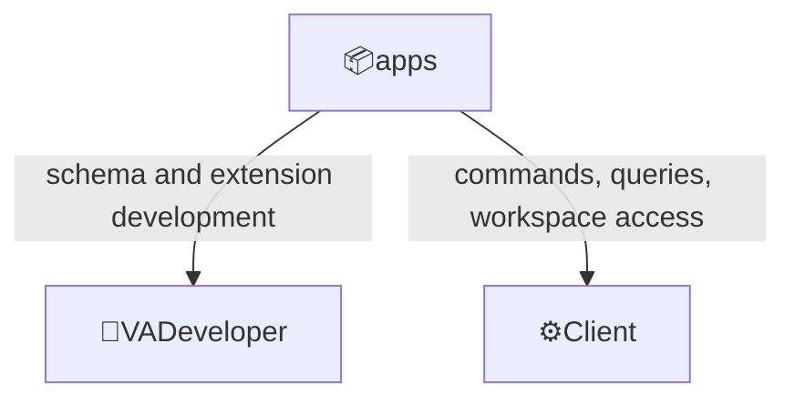
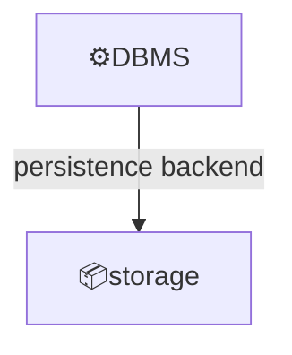
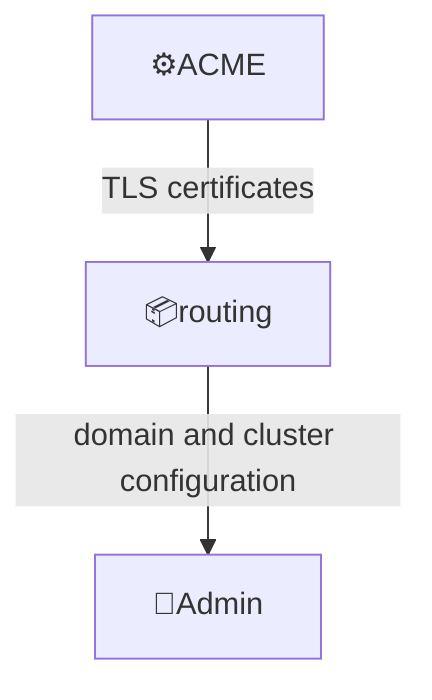
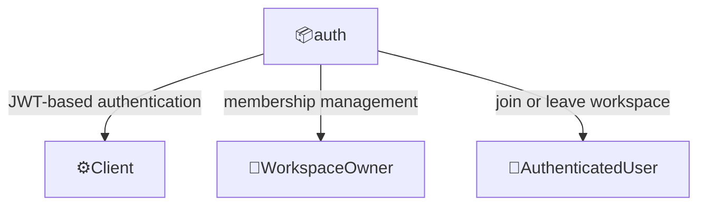
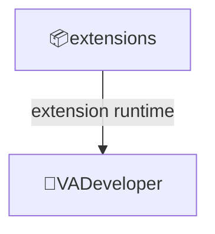
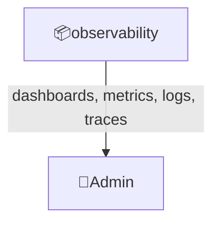
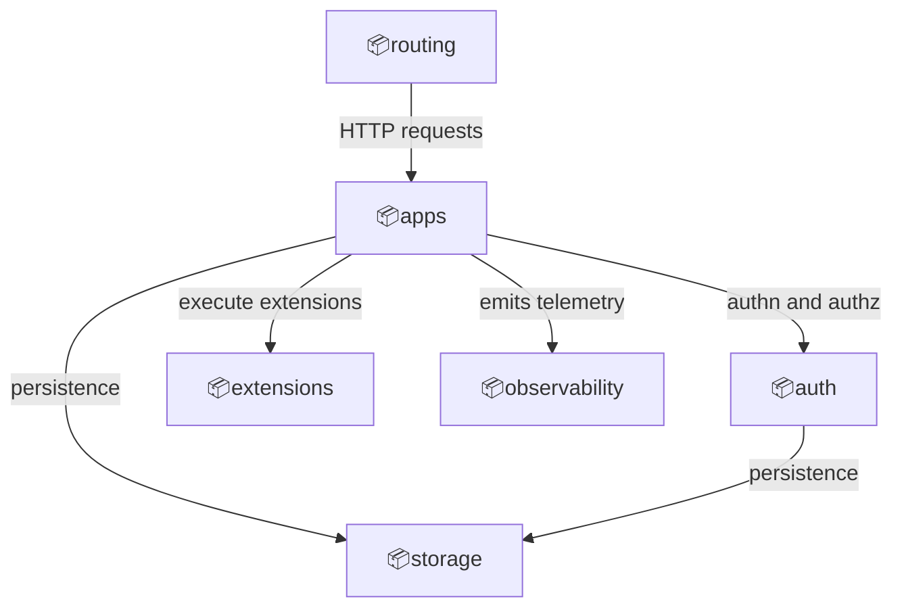

# Domain: Voedger application platform

## System

Scope:

- All-in-one server platform for development and operation of specialized applications distributed worldwide
- Customer-facing capabilities exposed via HTTP/HTTPS APIs

Key features:

- VSQL-based schema definitions and WASM extensions
- Workspace-scoped data and membership
- Event-sourced storage with CQRS over pluggable backends
- HTTPS routing with automated ACME certificates
- JWT-based authentication and authorization
- Built-in observability (metrics, logs, traces)

## External actors

Roles:

- 👤VADeveloper
  - Develops Voedger applications using VSQL and WASM extensions
- 👤Admin
  - Deploys and manages Voedger clusters and infrastructure
- 👤WorkspaceOwner
  - Manages workspace content, invitations, and member roles
- 👤AuthenticatedUser
  - Any user with a valid auth token, can join or leave workspaces

Systems:

- ⚙️Client
  - External application that interacts with Voedger platform via HTTP/HTTPS APIs
- ⚙️DBMS
  - Database management system for data persistence (ScyllaDB, BBolt, Amazon DynamoDB)
- ⚙️ACME
  - Automated certificate management and provisioning service

## Concepts

- `Application`
  - A Voedger application defined by VSQL schemas and WASM extensions

- `Workspace`
  - An isolated scope of data and membership within an Application

- `Cluster`
  - A deployment unit of Voedger nodes serving Applications

- `VSQL`
  - Voedger SQL dialect for defining schemas, commands, queries, and projections

- `WASM Extension`
  - Sandboxed extension binary implementing application logic

- `Event Sourcing`
  - Persistence model where state changes are stored as an append-only event log

- `CQRS`
  - Separation of write side (commands) from read side (queries and projections)

---

## Contexts

### apps

Application lifecycle management including deployment, versioning, and workspace management.

Relationships:

### storage

Data persistence and retrieval with event sourcing, CQRS, and multi-backend support.

Relationships:

### routing

Request routing, domain management, and HTTPS certificate provisioning.

Relationships:

### auth

Authentication, authorization, token management, and workspace membership.

Relationships:

### extensions

WASM extension runtime and lifecycle management.

Relationships:

### observability

System metrics, logs, traces, and insights for understanding system behavior and performance.

Relationships:

---

## Context map

