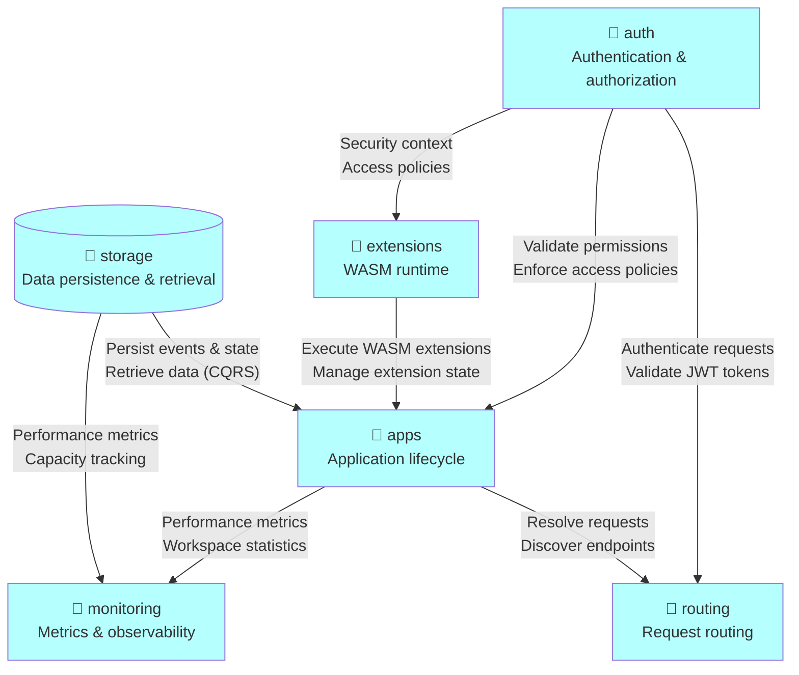

# Domain: prod

## System

All-in-one server platform for development and operation of specialized applications distributed worldwide.

## External actors

Roles:

- 👤VADeveloper
  - Develops Voedger applications using VSQL and WASM extensions
- 👤Admin
  - Deploys and manages Voedger clusters and infrastructure

Systems:

- ⚙️Client
  - External application that interacts with Voedger platform via HTTP/HTTPS APIs
- ⚙️DBMS
  - Database management system for data persistence
  - Implementations: ScyllaDB, BBolt, Amazon DynamoDB
- ⚙️ACME
  - Automated certificate management and provisioning service

## Context map

Detailed relationships between contexts:

- 🎯storage -> |supplier-customer| 🎯apps
  - Persist application events and state
  - Retrieve application data with CQRS patterns
- 🎯extensions -> |supplier-customer| 🎯apps
  - Execute WASM extensions for commands and queries
  - Manage extension state and resources
- 🎯auth -> |supplier-customer| 🎯apps
  - Validate user permissions for application operations
  - Enforce workspace-level access policies
- 🎯apps -> |supplier-customer| 🎯routing
  - Resolve incoming requests to target applications
  - Discover application endpoints and workspaces
- 🎯auth -> |supplier-customer| 🎯routing
  - Authenticate incoming requests
  - Validate JWT tokens
- 🎯storage -> |supplier-customer| 🎯monitoring
  - Provide storage performance and health metrics
  - Track storage capacity and usage
- 🎯apps -> |supplier-customer| 🎯monitoring
  - Collect application performance metrics
  - Track workspace and partition statistics
- 🎯auth -> |supplier-customer| 🎯extensions
  - Provide security context for extension execution
  - Enforce access policies within extensions

## Contexts

### apps

Application lifecycle management including deployment, versioning, and workspace management.

Relationships with external actors:

- 🎯apps -> |supplier-customer| 👤VADeveloper
  - Define data schemas using VSQL
  - Develop WASM extensions
  - Deploy applications to Voedger platform
- 🎯apps -> |supplier-customer| ⚙️Client
  - Execute commands and queries
  - Access workspace data
  - Interact with application features via HTTP/HTTPS APIs

### storage

Data persistence and retrieval with event sourcing, CQRS, and multi-backend support.

Relationships with external actors:

- ⚙️DBMS -> |supplier-customer| 🎯storage
  - Store and retrieve data with consistency guarantees
  - Support multiple backend implementations (ScyllaDB, BBolt, DynamoDB)

### routing

Request routing, domain management, and HTTPS certificate provisioning.

Relationships with external actors:

- 🎯routing -> |supplier-customer| 👤Admin
  - Configure domain routing and certificates
  - Deploy Voedger clusters
  - Manage infrastructure settings
- ⚙️ACME -> |supplier-customer| 🎯routing
  - Obtain SSL/TLS certificates for configured domains
  - Handle ACME HTTP-01 challenges
  - Renew certificates automatically

### auth

Authentication, authorization, and token management.

### extensions

WASM extension runtime and lifecycle management.

### monitoring

System metrics, application monitoring, and observability.

Relationships with external actors:

- 🎯monitoring -> |supplier-customer| 👤Admin
  - Access monitoring dashboards
  - View system metrics and logs
  - Configure alerts and thresholds
