# Context subsystem architecture: Application TTL storage

## Overview

Application TTL Storage provides a per-application key-value storage mechanism with automatic expiration (TTL - Time-To-Live) capabilities. It is designed for storing temporary data that should automatically expire after a specified duration, such as device authorization codes, temporary tokens, and other transient application state.

Key characteristics:

- Workspace-agnostic storage (application-level isolation)
- Automatic expiration with TTL support
- Atomic operations (InsertIfNotExists, CompareAndSwap, CompareAndDelete)
- Accessible via `IAppStructs.AppTTLStorage()` method

## Architecture

### Component hierarchy

```text
Application Layer (air.ACDeviceAuthorizationRequest, etc.)
    |
    v
IAppStructs (pkg/istructs)
    |
    +-- IAppTTLStorage
    |
    v
implAppTTLStorage (pkg/vvm/storage)
    |
    v
ISysVvmStorage (pkg/vvm/storage)
    |
    v
cachedAppStorage (pkg/istoragecache) - LRU cache layer
    |
    v
IAppStorage (pkg/istorage) - sys/vvm application storage
    |
    v
Storage Backends
    +-- Cassandra/ScyllaDB (atomic LWT, server-side TTL)
    +-- BBolt (manual TTL check on read)
    +-- In-Memory (manual TTL check on read)
    +-- DynamoDB (server-side TTL)
```

Note: ISysVvmStorage is obtained from `iAppStorageProvider.AppStorage(istructs.AppQName_sys_vvm)` which returns a cached IAppStorage instance wrapping the underlying backend.

### Key components

Feature components:

- [IAppTTLStorage: interface](../../../../pkg/istructs/interface.go)
  - Application-level TTL storage interface with TTLGet, InsertIfNotExists, CompareAndSwap, CompareAndDelete methods
  - Method on IAppStructs: `AppTTLStorage() IAppTTLStorage`

- [implAppTTLStorage: struct](../../../../pkg/vvm/storage/impl_appttl.go)
  - Implements IAppTTLStorage by wrapping ISysVvmStorage
  - Prepends app-specific prefix to partition key: `[pKeyPrefix_AppTTL][ClusterAppID]`
  - Uses user key as clustering columns

External components:

- [ISysVvmStorage: interface](../../../../pkg/vvm/storage/interface.go)
  - Low-level VVM storage interface with TTL support
  - Used by: implAppTTLStorage, implIElectionsTTLStorage, implVVMSeqStorageAdapter

- [cachedAppStorage: struct](../../../../pkg/istoragecache/impl.go)
  - LRU cache layer wrapping IAppStorage
  - Caches TTLGet results, invalidates on Put/CompareAndSwap
  - Used by: ISysVvmStorage (as IAppStorage for sys/vvm)

- [IAppStorage: interface](../../../../pkg/istorage/interface.go)
  - Storage backend interface
  - Used by: cachedAppStorage (underlying storage)

## Key data models

### IAppTTLStorage interface

```go
type IAppTTLStorage interface {
    // TTLGet retrieves value by key considering its TTL
    // Returns: value, exists, error
    // Errors: ErrKeyEmpty, ErrKeyTooLong
    TTLGet(key string) (value string, ok bool, err error)

    // InsertIfNotExists inserts only if key doesn't exist
    // Returns: true if inserted, false if key already exists
    // Errors: ErrKeyEmpty, ErrKeyTooLong, ErrValueTooLong, ErrInvalidTTL
    InsertIfNotExists(key, value string, ttlSeconds int) (ok bool, err error)

    // CompareAndSwap performs atomic update with TTL reset
    // Returns: true if swapped, false if current value != expectedValue
    // Errors: ErrKeyEmpty, ErrKeyTooLong, ErrValueTooLong, ErrInvalidTTL
    CompareAndSwap(key, expectedValue, newValue string, ttlSeconds int) (ok bool, err error)

    // CompareAndDelete performs atomic deletion with value verification
    // Returns: true if deleted, false if current value != expectedValue
    // Errors: ErrKeyEmpty, ErrKeyTooLong, ErrValueTooLong
    CompareAndDelete(key, expectedValue string) (ok bool, err error)
}
```

### Storage key structure

**Partition key (8 bytes):**

```text
[0-3]    uint32   pKeyPrefix_AppTTL (constant = 4)
[4-7]    uint32   ClusterAppID (application identifier)
```

**Clustering columns (variable length):**

```text
[0...]   string   User-provided key (UTF-8 bytes)
```

**Value (variable length):**

```text
[0...]   string   User-provided value (UTF-8 bytes)
```

### Key prefix constants

```go
// pkg/vvm/storage/consts.go
const (
    pKeyPrefix_null           pKeyPrefix = iota // 0
    pKeyPrefix_VVMLeader                        // 1 - Elections
    pKeyPrefix_SeqStorage_Part                  // 2 - Sequencer partition
    pKeyPrefix_SeqStorage_WS                    // 3 - Sequencer workspace
    pKeyPrefix_AppTTL                           // 4 - Application TTL storage
)
```

## Key flows

### InsertIfNotExists flow



### TTLGet flow



## Backend-specific behavior

### Atomicity guarantees

| Operation         | Scylla/Cassandra | BBolt       | In-Memory      | DynamoDB    |
| ----------------- | ---------------- | ----------- | -------------- | ----------- |
| InsertIfNotExists | Atomic (LWT)     | Race window | Atomic (mutex) | Race window |
| CompareAndSwap    | Atomic (LWT)     | Race window | Atomic (mutex) | Race window |
| CompareAndDelete  | Atomic (LWT)     | Race window | Atomic (mutex) | Race window |

**Scylla/Cassandra**: Uses Lightweight Transactions (LWT) with `IF NOT EXISTS` and `IF value = ?` clauses.

**BBolt**: Has a race window between View (read) and Update (write) transactions. Acceptable for testing, not recommended for production with high concurrency.

**In-Memory**: Uses mutex for thread-safety. Full atomicity guaranteed.

**DynamoDB**: Uses read-then-write pattern without conditional expressions. Has race window between GetItem and PutItem/DeleteItem. Not recommended for production with high concurrency.

### TTL handling

| Backend          | TTL Mechanism                     | Cleanup                            |
| ---------------- | --------------------------------- | ---------------------------------- |
| Scylla/Cassandra | Server-side TTL                   | Automatic compaction               |
| BBolt            | Checked on read                   | Background goroutine cleanup       |
| In-Memory        | Checked on read                   | Not cleaned (memory leak in tests) |
| DynamoDB         | Server-side TTL + checked on read | Automatic (up to 48h delay)        |

## Wiring and integration

### Dependency injection

Application TTL storage is wired through the VVM dependency injection:

```text
provideIVVMAppTTLStorage (pkg/vvm/provide.go)
    |
    v
ISysVvmStorage (from sys/vvm IAppStorage)
    |
    +-- cachedAppStorage (pkg/istoragecache) - LRU cache layer
    |       |
    |       v
    |   IAppStorage (storage backend)
    |
    v
provideIAppStructsProvider (pkg/vvm/provide.go)
    |
    v
istructsmem.Provide (pkg/istructsmem/provide.go)
    |
    v
appStructsProviderType.sysVvmStorage field
    |
    v
newAppStructs creates implAppTTLStorage with ClusterAppID
    |
    v
appStructsType.AppTTLStorage() returns IAppTTLStorage
```

### Usage example

```go
// In a command processor or projector
appStructs := appParts.AppStructs()
ttlStorage := appStructs.AppTTLStorage()

// Store alpha code -> device code mapping (expires in 15 minutes)
ok, err := ttlStorage.InsertIfNotExists("alpha:ABC123", "device:XYZ789", 900)
if err != nil {
    return err
}
if !ok {
    // Key already exists
}

// Retrieve mapping
value, exists, err := ttlStorage.TTLGet("alpha:ABC123")
if err != nil {
    return err
}
if exists {
    // Use value
}

// Atomic update with new TTL
ok, err = ttlStorage.CompareAndSwap("alpha:ABC123", "device:XYZ789", "device:NEW123", 900)

// Atomic delete
ok, err = ttlStorage.CompareAndDelete("alpha:ABC123", "device:NEW123")
```

## Validation rules

### Key validation

- Key must not be empty
- Key maximum length: 1024 bytes (UTF-8 encoded)
- Key must contain only valid UTF-8 characters

### Value validation

- Value maximum length: 65536 bytes (64 KB, UTF-8 encoded)

### TTL validation

- TTL must be greater than 0 seconds
- TTL maximum: 31536000 seconds (365 days)

### Error handling

Validation errors are returned immediately without accessing storage. The following errors can be returned:

- `ErrKeyEmpty` - key is empty string
- `ErrKeyTooLong` - key exceeds 1024 bytes
- `ErrValueTooLong` - value exceeds 65536 bytes
- `ErrInvalidTTL` - ttlSeconds <= 0 or > 31536000

### Why explicit validation is necessary

The normal `IAppStorage` interface has no explicit validation for key/value sizes. Storage backends enforce their own limits at write time:

- Cassandra/Scylla enforces 65535 bytes (64 KB) limit for keys due to 2-byte length field in serialization format
- BBolt and In-Memory backends have no inherent size limits

`IAppTTLStorage` uses explicit validation for several reasons:

1. **Early error detection** - fail fast before network round-trip to storage
2. **Consistent behavior** - same limits across all backends regardless of their inherent capabilities
3. **Clear error messages** - application-level errors (`ErrKeyTooLong`) vs cryptic storage errors
4. **Conservative limits** - 1024 bytes for keys is practical for typical use cases (device codes, tokens) while staying well under Cassandra's 64 KB limit

## Limitations

1. **Partition overflow risk**: Each `[pKeyPrefix_AppTTL][ClusterAppID]` combination is a single partition. If too many keys are stored (>100K), consider bucket spreading.

2. **Memory leak in in-memory backend**: In-memory backend does not clean up expired records. Acceptable for tests, not for long-running processes.

3. **BBolt and DynamoDB atomicity**: BBolt and DynamoDB have race conditions in atomic operations. Use Scylla/Cassandra for production.

4. **No range queries**: The interface only supports point lookups by exact key. No prefix scans or range queries.
