# Templates for Architecture and Technical Design files

## Overview

Structure:

```markdown
# Title
## Key components
## Key flows
## Key data models
```

## Title

- Domain Architecture
  - `# Domain architecture: {domain}`
- Domain Subsystem Architecture
  - `# Domain subsystem architecture: {subsystem}`
- Context Architecture
  - `# Context architecture: {domain}/{context}`
- Context Subsystem Architecture
  - `# Context subsystem architecture: {subsystem}`
- Feature Technical Design
  - `# Feature technical design: {feature}`
- Change Technical Design
  - `# Technical design: {change-title}`

## Key components

Format: `- [ ] [ComponentName: Type](path)` with one-line description.

Categories:

- Feature components - designed specifically for this feature
- Utility components - reusable utilities, include "Used by:" list
- External components - code in codebase but outside this feature, include "Used by:" list
- External systems - third-party services, APIs, databases (not in codebase), include "Used by:" list

Example:

```markdown
## Key components

Feature components:

- [ ] [OrderSummary: Widget](../../../lib/ui/checkout/order_summary.dart)
  - Displays order items and total price

- [ ] [ItemList: Widget](../../../lib/ui/checkout/item_list.dart)
  - Lists order items with quantities

Utility components:

- [ ] [TotalCalculator: class](../../../lib/utils/total_calculator.dart)
  - Add tax calculation for order totals
  - Used by: OrderSummary

- [ ] [PaymentValidator: class](../../../lib/utils/payment_validator.dart)
  - Add card expiry validation
  - Used by: PaymentForm

External components:

- [ ] update: [CheckoutScreen: StatefulWidget](../../../lib/ui/checkout/checkout_screen.dart)
  - Add OrderSummary section
  - Used by: CheckoutFlow

External systems:

- [Stripe API: REST API](https://stripe.com/docs/api)
  - Payment processing
  - Used by: PaymentService

## UI hierarchy

When to include: feature implemented using UI components.

UI component hierarchy shall be shown as ASCII tree with emojis:

- 🎯 Feature components
- 🔧 Utility components
- No emoji for external/framework components
- Use `...` to omit irrelevant parts

Example:

```text
CheckoutScreen
├── Header
│   └── ...
├── PaymentForm
│   ├── CardInput
│   └── PaymentValidator 🔧
└── OrderSummary 🎯
    ├── ItemList 🎯
    └── TotalCalculator 🔧
```

## Key flows

When to include: To describe user/component interactions, control flow.

Format: `- [ ] Flow name` followed by Mermaid sequence diagram

Rules:

- Use sequenceDiagram ONLY
- Use actor keyword for roles
- Annotate diagrams with emojis:
  - 🎯 Feature components - designed specifically for this feature
  - 🔧 Utility components - reusable utilities
  - 📦 External components - code in codebase but outside this feature
  - ⚙️ External systems - third-party services, APIs, databases (not in codebase)

Example:

```markdown
## Key flows

- [ ] User submits transaction

```mermaid
sequenceDiagram
    actor 👤User
    participant 🎯FormScreen
    participant 🎯FormViewModel
    participant 📦Repository
    participant ⚙️GitHubAPI

    👤User->>🎯FormScreen: clicks Submit
    🎯FormScreen->>🎯FormViewModel: submit()
    🎯FormViewModel->>📦Repository: save(data)
    📦Repository->>⚙️GitHubAPI: PUT file
    ⚙️GitHubAPI-->>📦Repository: 200 OK
    📦Repository-->>🎯FormViewModel: success
    🎯FormViewModel-->>🎯FormScreen: update state
```



---

## Key data models

When to include: New models, 3+ related entities, non-trivial API contracts.

Format: `- [ ] action: [ModelName: Type](path) - key fields: field (type, constraints)`

Use Mermaid ERD for 3+ related models with complex relationships.

Example:

```markdown
## Key data models

**Domain layer:**

- [ ] create: [Review: model](internal/domain/review.go)
  - id (uuid), productId (uuid), rating (int, 1-5), status (enum: PENDING|APPROVED|REJECTED)

- [ ] update: [Product: model](internal/domain/product.go)
  - Add reviewCount (int) and avgRating (decimal) fields

**API layer:**

- [ ] create: [CreateReviewRequest: DTO](internal/api/requests.go)
  - rating (int, 1-5), comment (string, max: 500), imageUrls (string[], max: 3)
```
